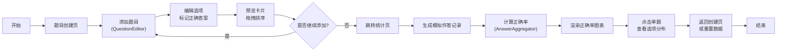

## 1. 产品概述
本产品是一个在线教育平台的互动式练习题管理与作答统计系统，专为教师设计，用于创建多选题并实时查看学生作答数据。
- 核心价值：帮助教师高效创建互动式练习题，通过可视化统计数据实时掌握学生学习情况
- 目标用户：在线教育平台的教师群体

## 2. 核心功能

### 2.1 用户角色
| 角色 | 核心权限 |
|------|----------|
| 教师 | 创建、编辑、删除题目，查看作答统计，重置所有数据 |
| 学生 | 作答练习题（模拟实现） |

### 2.2 功能模块
1. **题目创建页（BuilderPage）**：题目表单编辑、选项管理、预览卡片列表、拖拽排序、一键重置
2. **统计页（StatsPage）**：正确率竖条形图、单题选项分布柱状图、模拟作答记录生成

### 2.3 页面详情
| 页面名称 | 模块名称 | 功能描述 |
|-----------|-------------|---------------------|
| 题目创建页 | 题目编辑器（QuestionEditor） | 编辑题目文本、添加/删除选项（2-6个）、标记正确答案 |
| 题目创建页 | 预览卡片列表 | 以卡片形式展示已创建题目，支持拖拽重新排序 |
| 题目创建页 | 重置功能 | 清空所有题目和模拟数据，带确认对话框 |
| 统计页 | 正确率图表 | 竖条形图展示每题正确率，0-100%，顶部标注百分比 |
| 统计页 | 选项分布面板 | 点击单题条形时展示各选项被选次数柱状图 |

## 3. 核心流程
教师在题目创建页添加至少3道题目，每道题设置2-6个选项并标记正确答案，题目实时预览并支持拖拽排序。完成后跳转至统计页，系统自动为每道题生成10-20条模拟作答记录，计算并可视化展示正确率统计。教师可点击单题查看详细选项分布，也可一键重置所有数据。

## 4. 用户界面设计

### 4.1 设计风格
- 主色调：深蓝色 #1a237e
- 背景色：浅灰色 #f5f5f5
- 正确率颜色：>80% 绿色 #4caf50，50-80% 橙色 #ff9800，<50% 红色 #e53935
- 字体：Roboto，选项文本14px
- 卡片：圆角阴影一致，滚动时保持样式
- 动画：页面切换从左向右滑入（400ms，ease-out），面板切换淡入（0.3s），拖拽半透明阴影，重置确认微震动

### 4.2 页面设计概述
| 页面名称 | 模块名称 | UI 元素 |
|-----------|-------------|-------------|
| 题目创建页 | 顶部导航 | Logo、页面切换按钮、深蓝色背景 |
| 题目创建页 | 编辑器左栏 | 题目输入框、选项列表、添加/删除按钮、正确答案单选标记 |
| 题目创建页 | 预览右栏 | 卡片网格、拖拽手柄、绿色高亮正确答案、重置按钮 |
| 统计页 | 主图表区 | 竖条形图、颜色渐变、顶部百分比标签、悬停提示 |
| 统计页 | 右侧面板 | 选项分布柱状图、星号标记正确答案、淡入动画 |

### 4.3 响应式
- 桌面端：BuilderPage 两栏布局（编辑器左栏、预览右栏）
- 平板及以下：单栏上下排列
- 所有交互响应时间 ≤ 60ms，图表渲染 ≤ 100ms
