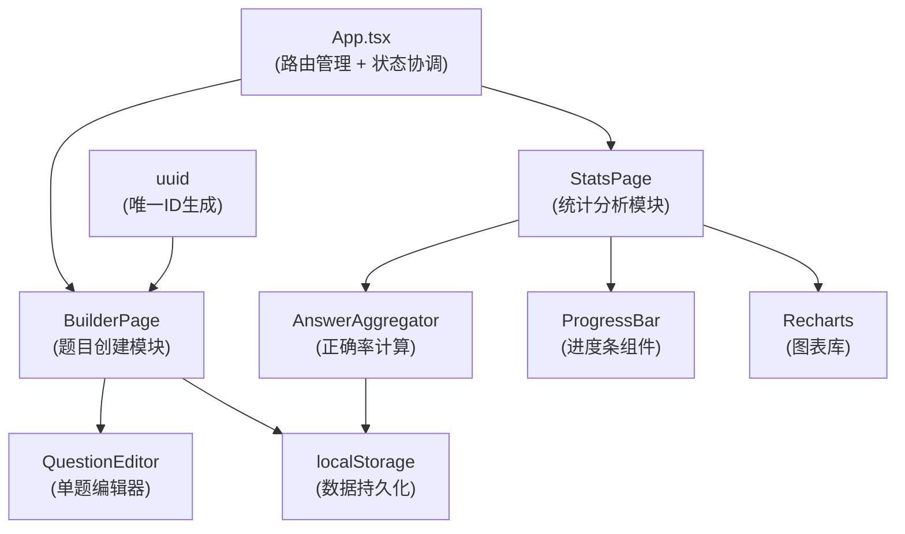
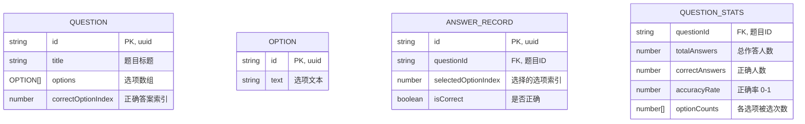

## 1. 架构设计



**数据流向**：
1. 用户在 QuestionEditor 输入题目数据 → BuilderPage 组装题目对象 → localStorage 持久化
2. StatsPage 从 localStorage 读取题目 → 生成模拟作答记录 → AnswerAggregator 计算统计数据
3. 统计数据 → ProgressBar 和 Recharts 组件 → 可视化渲染

## 2. 技术描述
- 前端：React@18 + TypeScript@5 + Vite@5
- 构建工具：Vite + @vitejs/plugin-react
- 图表库：recharts@2
- 唯一ID：uuid@9
- 数据存储：浏览器 localStorage（纯前端模拟后端）
- 类型定义：严格模式 strict: true，target: ESNext，jsx: react-jsx

## 3. 路由定义
| 路由 | 组件 | 用途 |
|-------|---------|---------|
| /builder | BuilderPage | 题目创建与预览页面 |
| /stats | StatsPage | 作答统计与可视化页面 |
| * | BuilderPage | 默认路由重定向到创建页 |

## 4. 数据模型

### 4.1 数据模型定义



### 4.2 TypeScript 类型定义

```typescript
interface Option {
  id: string;
  text: string;
}

interface Question {
  id: string;
  title: string;
  options: Option[];
  correctOptionIndex: number;
}

interface AnswerRecord {
  id: string;
  questionId: string;
  selectedOptionIndex: number;
  isCorrect: boolean;
}

interface QuestionStats {
  questionId: string;
  totalAnswers: number;
  correctAnswers: number;
  accuracyRate: number;
  optionCounts: number[];
}
```

### 4.3 localStorage 键定义
- `quiz_questions`: 存储所有题目数组
- `quiz_answer_records`: 存储模拟作答记录
