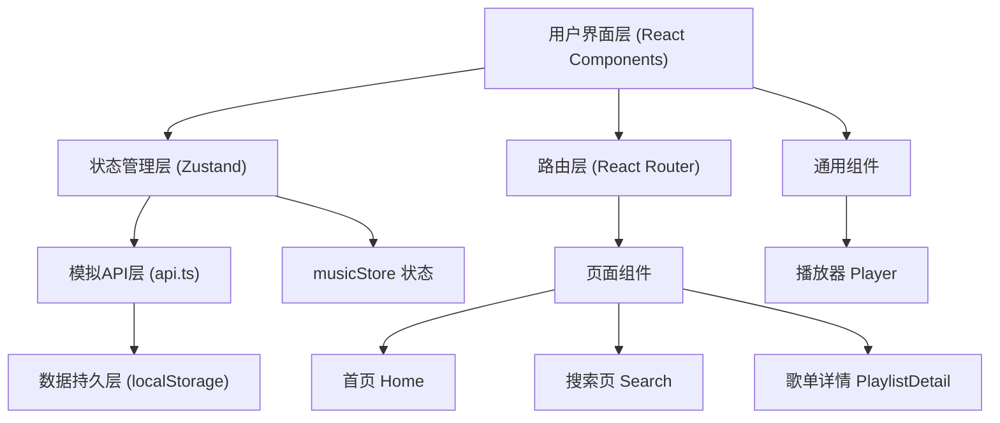
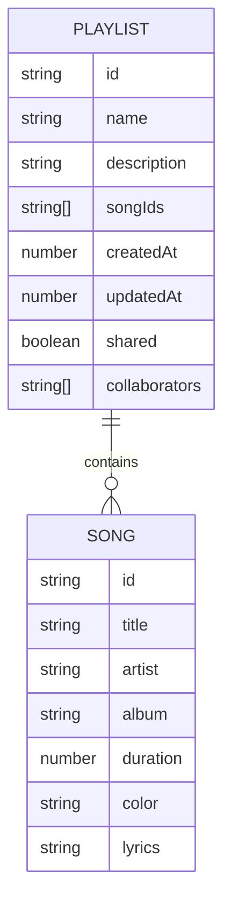

## 1. 架构设计



## 2. 技术描述
- **前端框架**：React 18 + TypeScript
- **构建工具**：Vite
- **状态管理**：Zustand
- **路由**：React Router DOM
- **样式方案**：CSS Modules / 内联样式
- **数据存储**：localStorage（纯前端模拟）
- **其他依赖**：axios（预留）、uuid、@vitejs/plugin-react

## 3. 路由定义
| 路由 | 页面组件 | 用途 |
|------|----------|------|
| / | Home | 首页，展示推荐歌单和热门歌曲 |
| /search | Search | 搜索页，搜索和展示歌曲 |
| /playlist/:id | PlaylistDetail | 歌单详情页，展示和编辑歌单 |
| /shared/:id | PlaylistDetail | 分享链接入口，协作编辑歌单 |

## 4. 数据类型定义

```typescript
// 歌曲类型
interface Song {
  id: string;
  title: string;
  artist: string;
  album: string;
  duration: number; // 秒
  color: string; // 随机生成的封面颜色
  lyrics: string;
}

// 歌单类型
interface Playlist {
  id: string;
  name: string;
  description: string;
  songIds: string[];
  createdAt: number;
  updatedAt: number;
  shared: boolean;
  collaborators: string[]; // 协作者ID列表
}

// 播放状态
interface PlayerState {
  isPlaying: boolean;
  currentTime: number;
  duration: number;
  volume: number;
  loopMode: 'single' | 'list' | 'shuffle';
  currentSong: Song | null;
  playlist: Song[];
  currentIndex: number;
}

// 应用状态
interface MusicStore {
  songs: Song[];
  playlists: Playlist[];
  player: PlayerState;
  searchResults: Song[];
  // 操作方法
  searchSongs: (keyword: string) => void;
  playSong: (song: Song) => void;
  togglePlay: () => void;
  nextSong: () => void;
  prevSong: () => void;
  setVolume: (volume: number) => void;
  setCurrentTime: (time: number) => void;
  toggleLoopMode: () => void;
  createPlaylist: (name: string, description: string) => Playlist;
  addSongToPlaylist: (playlistId: string, songId: string) => void;
  removeSongFromPlaylist: (playlistId: string, songId: string) => void;
  getPlaylist: (id: string) => Playlist | undefined;
  sharePlaylist: (playlistId: string) => string;
}
```

## 5. 数据模型

### 5.1 实体关系



### 5.2 初始数据
- 预设推荐歌单数据（6-8个）
- 预设热门歌曲数据（20-30首）
- 数据存储在 localStorage 的 `music_app_data` 键下

## 6. 目录结构

```
auto13/
├── package.json
├── index.html
├── tsconfig.json
├── vite.config.js
├── .trae/
│   └── documents/
│       ├── PRD.md
│       └── TechArch.md
└── src/
    ├── App.tsx
    ├── main.tsx
    ├── pages/
    │   ├── Home.tsx
    │   ├── Search.tsx
    │   └── PlaylistDetail.tsx
    ├── components/
    │   ├── Player.tsx
    │   ├── Navbar.tsx
    │   ├── SongCard.tsx
    │   ├── PlaylistCard.tsx
    │   └── HamburgerMenu.tsx
    ├── store/
    │   └── musicStore.ts
    ├── utils/
    │   ├── api.ts
    │   ├── mockData.ts
    │   └── helpers.ts
    ├── types/
    │   └── index.ts
    └── styles/
        └── global.css
```

## 7. 性能优化点
- 搜索输入防抖（200ms延迟）
- 歌曲预加载
- 列表虚拟化（如数据量大）
- CSS动画使用 transform 和 opacity 避免重排
- localStorage 读写缓存
- React.memo 优化组件渲染
