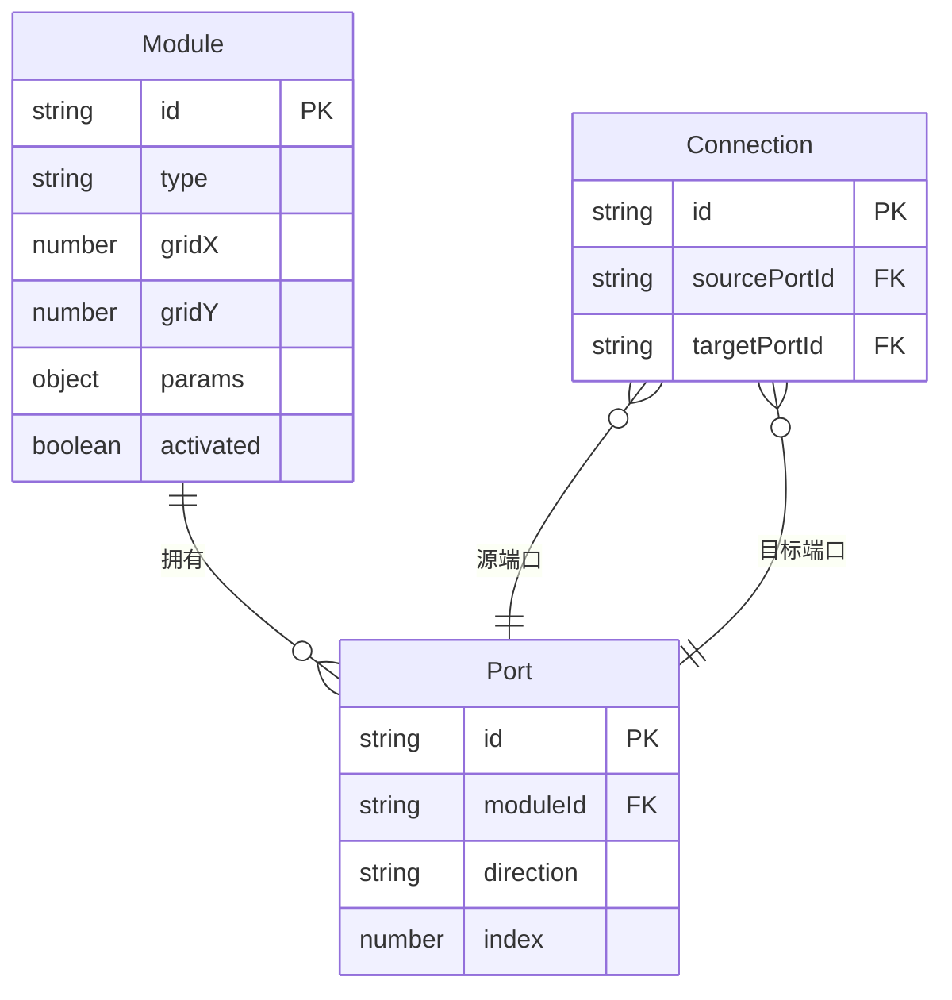

## 1. 架构设计

```mermaid
graph TB
    subgraph "前端层"
        "App.tsx 主组件" --> "ModuleCard.tsx 模块卡片"
        "App.tsx 主组件" --> "WirePanel.tsx 连线面板"
        "App.tsx 主组件" --> "波形可视化"
    end
    subgraph "状态管理层"
        "moduleStore.ts Zustand" --> "模块列表状态"
        "moduleStore.ts Zustand" --> "连线关系状态"
        "moduleStore.ts Zustand" --> "激活链路状态"
    end
    subgraph "音频引擎层"
        "audioEngine.ts Web Audio API" --> "振荡器节点"
        "audioEngine.ts Web Audio API" --> "滤波器节点"
        "audioEngine.ts Web Audio API" --> "包络发生器"
        "audioEngine.ts Web Audio API" --> "延迟效果器节点"
    end
    "前端层" --> "状态管理层"
    "状态管理层" --> "音频引擎层"
```

## 2. 技术说明

- **前端**：React@18 + TypeScript + Vite
- **状态管理**：Zustand
- **样式方案**：Tailwind CSS + CSS Modules（发光动画等复杂效果）
- **音频处理**：Web Audio API（浏览器原生，无需后端）
- **唯一标识**：uuid
- **构建工具**：Vite（支持热更新）
- **无后端**：纯前端项目，所有音频合成在浏览器端完成

## 3. 路由定义

| 路由 | 用途 |
|------|------|
| / | 单页应用主界面，包含模块库、连线面板、波形可视化和播放控制 |

## 4. 数据模型

### 4.1 数据模型定义



### 4.2 核心类型定义

```typescript
type ModuleType = 'oscillator' | 'filter' | 'envelope' | 'delay';

interface SynthModule {
  id: string;
  type: ModuleType;
  gridX: number;
  gridY: number;
  params: Record<string, number>;
  activated: boolean;
}

interface Port {
  id: string;
  moduleId: string;
  direction: 'input' | 'output';
  index: number;
}

interface Connection {
  id: string;
  sourcePortId: string;
  targetPortId: string;
}
```

## 5. 文件结构

```
├── package.json
├── index.html
├── tsconfig.json
├── vite.config.js
└── src/
    ├── App.tsx
    ├── components/
    │   ├── ModuleCard.tsx
    │   └── WirePanel.tsx
    ├── store/
    │   └── moduleStore.ts
    └── utils/
        └── audioEngine.ts
```

## 6. 性能要求

- 拖拽和连线操作响应时间 ≤ 50ms
- 波形绘制稳定 60fps，使用 requestAnimationFrame + Canvas
- 连线绘制使用 Canvas 而非 DOM 元素，避免重绘性能瓶颈
- Zustand 状态更新使用 selector 精确订阅，避免不必要的重渲染
