## 1. 产品概述

FitPlan Pro 是一款面向健身爱好者的个人训练规划与追踪Web应用，致力于解决训练动作记录分散、进度难以可视化、重量和组数缺乏系统管理的核心痛点。

- 核心目标：让用户高效管理每周训练计划，实时追踪训练完成度，通过数据可视化持续激励进步
- 目标用户：有固定训练习惯的健身人群，从初学者到进阶训练者
- 市场价值：填补轻量化健身追踪工具的空白，提供流畅直观的纯前端体验

## 2. 核心功能

### 2.1 用户角色

| 角色 | 注册方式 | 核心权限 |
|------|---------|---------|
| 普通用户 | 无需注册（localStorage存储） | 浏览动作库、管理训练计划、记录训练日志、查看训练趋势 |

### 2.2 功能模块

1. **动作库面板**：预设训练动作卡片列表、按肌群/关键词筛选、拖拽源
2. **周训练计划表格**：周一至周日分组网格、拖拽放置动作、目标参数输入编辑
3. **训练日志与进度**：实际完成数据录入、完成百分比进度条、训练量自动计算
4. **周训练量趋势图**：柱状图展示周训练量、周切换动画、数据趋势可视化

### 2.3 页面详情

| 页面名称 | 模块名称 | 功能描述 |
|---------|---------|---------|
| 主页面 | 动作库面板 | 卡片展示（名称/肌群/示范图占位）、肌群色块标签、肌群+关键词双维度筛选、筛选弹性缩放动画、拖拽源配置 |
| 主页面 | 周计划表格 | 7列星期分组表头（sticky固定）、蓝白条纹行、单元格多动作支持、拖拽落点高亮、目标组/次/重量编辑、弹跳落位动画 |
| 主页面 | 训练日志面板 | 实际完成组/次/重量输入、总训练量自动计算（组×次×重）、目标对比、渐变进度条+脉冲光效、数据变化平滑过渡 |
| 主页面 | 趋势图表区 | Recharts柱状图渲染、X轴日期/Y轴训练量、周切换按钮、平滑滑动过渡动画、坐标轴标签样式定制 |

## 3. 核心流程

用户主使用流程：浏览动作库 → 筛选目标动作 → 拖拽至周计划 → 设定训练参数 → 训练时记录实际数据 → 查看完成进度 → 周末回顾趋势图表

```mermaid
flowchart LR
    A["打开应用"] --> B["localStorage加载数据"]
    B --> C["浏览动作库面板"]
    C --> D["按肌群/关键词筛选"]
    D --> E["拖拽动作卡片"]
    E --> F["放置至周计划单元格"]
    F --> G["设定目标组/次/重量"]
    G --> H["训练日记录实际数据"]
    H --> I["系统计算完成百分比"]
    I --> J["进度条动画展示"]
    J --> K["查看周训练量趋势图"]
    K --> L["数据自动持久化"]
```

## 4. 用户界面设计

### 4.1 设计风格

- **主背景色**：#f5f5f5 浅灰色基底，营造明亮清新的运动感
- **动作卡片**：白色底 + 12px圆角 + 浅阴影（0 2px 8px rgba(0,0,0,0.06)）
- **肌群色板**：
  - 胸部：#ff6b6b 珊瑚红
  - 背部：#45b7d1 天空蓝
  - 腿部：#4ecdc4 青碧色
  - 肩部：#96ceb4 薄荷绿
  - 手臂：#ffeaa7 柠檬黄
  - 核心：#dda0dd 薰衣草紫
- **表格样式**：表头sticky固定、蓝白（#f0f8ff/#ffffff）交替条纹行、边框浅灰
- **字体层级**：
  - 页面标题：20px / 600字重
  - 模块标题：16px / 600字重
  - 卡片名称：14px / 500字重
  - 正文/标签：12-13px / 400字重
- **布局结构**：顶部标题栏 + 左右双栏（左侧动作库，右侧周计划表格）+ 下方日志与趋势区
- **图标风格**：Lucide React线性图标，统一尺寸18px

### 4.2 页面设计概览

| 模块名称 | UI元素 | 动画与交互 |
|---------|-------|-----------|
| 动作库面板 | 筛选输入框、肌群标签按钮、卡片网格、示范图占位 | 筛选时卡片scale弹性过渡（300ms cubic-bezier(0.34, 1.56, 0.64, 1)）、hover阴影加深+微上移 |
| 周计划表格 | 固定表头、条纹行、单元格动作卡片、数字输入框 | 拖拽时半透明卡片跟随鼠标（opacity 0.7）、松开后translateY弹跳过渡、输入框focus边框高亮 |
| 训练日志面板 | 进度条容器、百分比数字、实际值输入框 | 进度条宽度transition（500ms ease-out）、渐变填充（#4ecdc4→#45b7d1）、脉冲光效（box-shadow @keyframes pulse） |
| 趋势图表 | 柱状图容器、周切换按钮、坐标轴标签 | 周切换时translateX滑动过渡（400ms ease-in-out）、柱子hover高亮、渐变色柱体 |

### 4.3 响应式

- **桌面端（≥1024px）**：左右双栏布局 + 下方日志与趋势区并排
- **平板端（768-1023px）**：动作库与周计划上下堆叠，日志与趋势区并排
- **移动端（≤767px，最低320px）**：全单列布局，各模块垂直堆叠，表格横向滚动，卡片和输入框自动撑满宽度，触控热区≥44px
- **触控优化**：拖拽操作适配pointer事件，按钮最小尺寸44×44px

### 4.4 性能指标

- 所有交互响应时间 ≤ 50ms
- 拖拽、筛选、数据更新帧率 ≥ 55fps
- 图表渲染时间 ≤ 500ms
- CSS过渡时长范围：300-500ms
