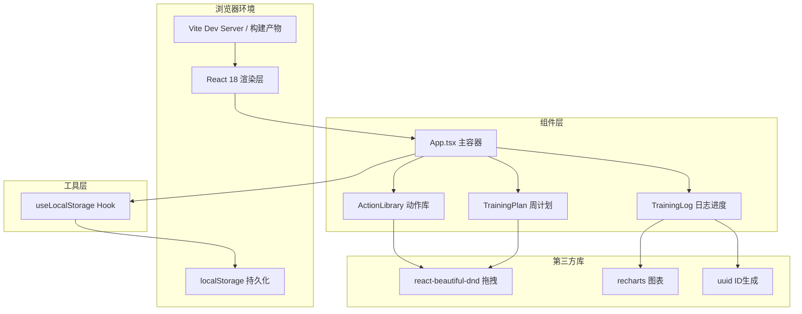
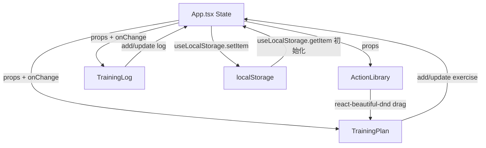

## 1. 架构设计



## 2. 技术说明

- **前端框架**：React 18 + TypeScript 5
- **构建工具**：Vite 5 + @vitejs/plugin-react（热更新HMR）
- **状态管理**：React useState + useLocalStorage 自定义Hook（Props单向数据流）
- **拖拽库**：react-beautiful-dnd（可访问性良好的拖拽方案）
- **图表库**：recharts（基于React/D3的声明式图表）
- **样式方案**：原生CSS + CSS Modules（BEM命名）+ CSS变量主题
- **ID生成**：uuid
- **数据存储**：localStorage（模拟后端，无真实网络请求）
- **初始化工具**：vite-init（react-ts模板）

## 3. 路由定义

本应用为单页面无路由应用（SPA，单视图），所有功能模块集成于主页面。

## 4. 数据模型

### 4.1 类型定义

```typescript
type MuscleGroup = 'chest' | 'back' | 'legs' | 'shoulders' | 'arms' | 'core';
type DayOfWeek = 'monday' | 'tuesday' | 'wednesday' | 'thursday' | 'friday' | 'saturday' | 'sunday';

interface ExerciseAction {
  id: string;
  name: string;
  muscleGroup: MuscleGroup;
  imagePlaceholder: string;
}

interface PlannedExercise {
  planId: string;
  actionId: string;
  name: string;
  muscleGroup: MuscleGroup;
  targetSets: number;
  targetReps: number;
  targetWeight: number;
}

interface LoggedSet {
  setNumber: number;
  actualReps: number;
  actualWeight: number;
}

interface TrainingLogEntry {
  logId: string;
  planId: string;
  actionId: string;
  day: DayOfWeek;
  weekKey: string;
  loggedSets: LoggedSet[];
  completedAt?: string;
}

interface WeeklyPlan {
  weekKey: string;
  days: Record<DayOfWeek, PlannedExercise[]>;
}
```

### 4.2 localStorage 键名

| Key | 数据类型 | 说明 |
|-----|---------|------|
| `fitplan:actions` | `ExerciseAction[]` | 预设动作库（首次初始化写入） |
| `fitplan:weeklyPlans` | `WeeklyPlan[]` | 周训练计划列表 |
| `fitplan:trainingLogs` | `TrainingLogEntry[]` | 训练日志记录 |
| `fitplan:currentWeek` | `string` | 当前选中的周标识（YYYY-MM-DD格式周一日期） |

### 4.3 数据流



## 5. 文件结构

```
auto15/
├── index.html
├── package.json
├── tsconfig.json
├── vite.config.js
└── src/
    ├── main.tsx           [Vite入口，React渲染挂载]
    ├── App.tsx            [主组件：状态管理、布局、数据流编排]
    ├── App.css            [全局样式与主题变量]
    ├── index.css          [Vite默认全局重置样式]
    ├── components/
    │   ├── ActionLibrary.tsx    [动作库面板+筛选+拖拽源]
    │   ├── ActionLibrary.css
    │   ├── TrainingPlan.tsx     [周计划表格+拖拽目标+参数编辑]
    │   ├── TrainingPlan.css
    │   ├── TrainingLog.tsx      [训练日志+进度条+趋势柱状图]
    │   └── TrainingLog.css
    └── hooks/
        └── useLocalStorage.ts   [封装localStorage读写Hook]
```

## 6. 关键实现要点

### 6.1 拖拽实现
- 使用`DragDropContext`包裹整个应用
- `Droppable` 7个单元格对应周一至周日
- `Draggable` 动作卡片支持从动作库→计划、计划内跨日移动
- onDragEnd回调中进行state更新，拖拽失败自动回滚

### 6.2 动画策略
- **筛选动画**：CSS transform: scale() + transition，cubic-bezier弹性曲线
- **落位动画**：keyframes bounce-in（translateY + scale组合）
- **进度条动画**：width transition + 渐变linear-gradient + ::after伪元素pulse光晕
- **图表切换**：key属性驱动Recharts重渲染，外层容器translateX过渡

### 6.3 性能优化
- 列表渲染使用稳定key（actionId/planId）
- 重计算逻辑（训练量汇总）用useMemo缓存
- 拖拽使用虚拟DOM patch，避免全列表重绘
- Recharts数据量限制在最近8周，多余数据仅存储不渲染

### 6.4 响应式断点
- `@media (max-width: 1023px)` 切换双栏→单栏
- `@media (max-width: 767px)` 表格容器overflow-x:auto，卡片grid列数2→1
- `@media (max-width: 480px)` 输入框字号、间距等比缩小
