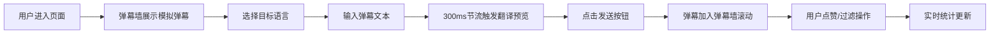

## 1. 产品概述

跨语言弹幕翻译与实时互动墙应用，为观看外语视频直播的用户提供实时弹幕翻译服务，打破语言障碍，让全球观众能够自由互动交流。

- 解决外语直播观众因语言不通无法参与弹幕互动的痛点，支持多语言双向翻译
- 目标市场为跨境直播平台、国际赛事直播、多语言在线教育场景

## 2. 核心功能

### 2.1 用户角色

| 角色 | 注册方式 | 核心权限 |
|------|----------|----------|
| 普通观众 | 无需注册，直接使用 | 发送弹幕、查看翻译、点赞弹幕、切换语言、关键词过滤 |

### 2.2 功能模块

1. **弹幕渲染模块**：全屏视频背景弹幕墙，支持水平滚动弹幕、随机颜色、位置防重叠、速度调节
2. **翻译引擎模块**：模拟翻译API调用、实时翻译预览、300ms节流控制、多语言切换与平滑过渡
3. **语言检测模块**：自动识别弹幕源语言、语言频率统计
4. **弹幕输入模块**：文本输入框、实时翻译预览区、目标语言选择器、发送按钮
5. **互动功能模块**：弹幕点赞（心形动画）、关键词过滤（高亮+淡出）
6. **统计展示模块**：实时在线人数、总弹幕数、翻译请求次数数字跳动动画

### 2.3 页面详情

| 页面名称 | 模块名称 | 功能描述 |
|-----------|-------------|---------------------|
| 主页面 | 弹幕墙区域 | 全屏灰色渐变视频占位背景，弹幕从右向左滚动，200条上限，随机8种亮色+发光边框，高度位置不重叠 |
| 主页面 | 翻译预览区 | 输入框右侧实时显示翻译结果，300ms更新，延迟<500ms |
| 主页面 | 语言选择器 | 下拉切换目标语言：中/英/日/韩/法，切换后1秒内平滑更新所有已发布弹幕翻译 |
| 主页面 | 弹幕输入区 | 底部固定80px高度，毛玻璃半透明效果，左侧语言选择，右侧渐变发送按钮 |
| 主页面 | 关键词过滤 | 输入关键词后仅显示匹配弹幕（原始或翻译文本），非匹配淡出，匹配闪烁高亮 |
| 主页面 | 点赞功能 | 每条弹幕带心形点赞图标，点击+1，灰色变红色+放大弹跳动画 |
| 主页面 | 统计条 | 三个等宽卡片，背景#1a1a3a，边框#4fc3f7圆角8px，数字跳动动画 |

## 3. 核心流程

用户进入应用 → 查看模拟视频直播背景及已有弹幕滚动 → 选择目标翻译语言 → 在底部输入框输入弹幕 → 右侧实时预览翻译 → 点击发送 → 弹幕显示原始文本+翻译文本 → 用户可为喜欢的弹幕点赞 → 输入关键词过滤弹幕 → 查看实时统计数据

## 4. 用户界面设计

### 4.1 设计风格
- **主色调**：深科技风，背景#0a0a1a，主强调色#4fc3f7（亮青蓝），辅助渐变#7c4dff（紫色）
- **按钮风格**：发送按钮使用线性渐变(#4fc3f7 → #7c4dff)，圆角设计，悬停轻微放大
- **字体**：使用现代无衬线字体，弹幕翻译文本加粗主色，原始文本小字号半透明
- **布局风格**：全屏沉浸式弹幕墙，底部固定输入区毛玻璃效果，统计卡片悬浮排列
- **动效风格**：弹幕水平滚动CSS动画，点赞弹跳关键帧，数字跳动过渡，语言切换淡入淡出

### 4.2 页面设计概述

| 页面名称 | 模块名称 | UI元素 |
|-----------|-------------|-------------|
| 主页面 | 弹幕墙 | 全屏灰渐变背景，8种预设弹幕色随机分配，1px发光边框，三档滚动速度 |
| 主页面 | 弹幕内容 | 原始文本（小字号、半透明、上方）+ 翻译文本（加粗#4fc3f7、下方）+ 点赞心形 |
| 主页面 | 输入区 | 固定底部80px，backdrop-filter: blur(10px)半透明，语言下拉+输入框+渐变按钮 |
| 主页面 | 统计卡片 | 三栏等宽，#1a1a3a背景，#4fc3f7边框8px圆角，数字跳动+图标 |
| 主页面 | 过滤模式 | 关键词输入框，匹配弹幕闪烁边框，非匹配淡出opacity过渡 |

### 4.3 响应式
- 桌面端优先设计，移动端自适应
- 移动端弹幕墙字体缩小30%
- 移动端输入区高度增加至100px，适配虚拟键盘
- 统计卡片移动端改为垂直堆叠

### 4.4 性能优化
- 弹幕上限200条，超出自动移除最早弹幕，避免内存溢出
- 翻译请求300ms节流，防止频繁调用
- CSS动画替代JS动画，保持55fps以上帧率
- 使用transform和opacity做动画，触发GPU加速
