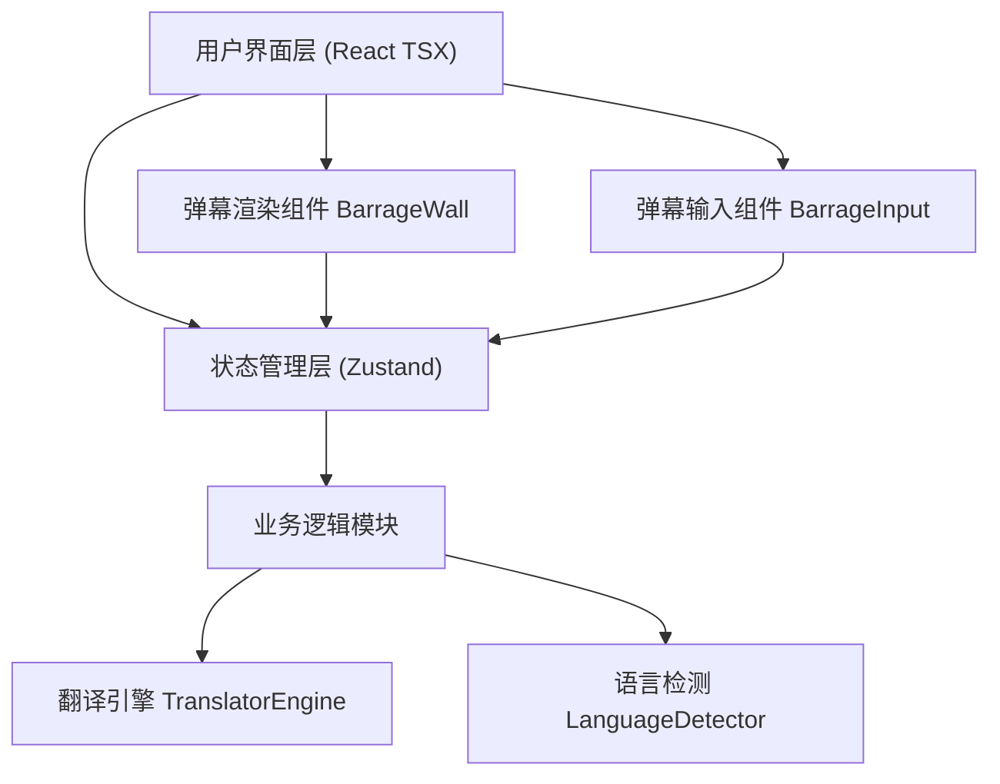

## 1. 架构设计



## 2. 技术说明

- **前端框架**：React 18 + TypeScript（严格模式）
- **构建工具**：Vite 5 + @vitejs/plugin-react（热更新HMR）
- **状态管理**：Zustand（轻量全局状态，弹幕列表、用户设置、翻译配置）
- **国际化框架**：i18next（UI文案多语言支持）
- **工具库**：uuid（弹幕唯一ID生成）
- **样式方案**：原生CSS + CSS Modules（无需Tailwind，用户未指定，按需求文件结构实现）

## 3. 文件结构定义

| 文件路径 | 职责 |
|----------|------|
| package.json | 依赖管理：react, react-dom, typescript, vite, uuid, zustand, i18next 及对应类型，启动脚本 npm run dev |
| index.html | Vite 入口HTML文件，挂载点 #root |
| tsconfig.json | TypeScript严格模式配置，strict: true |
| vite.config.js | Vite构建配置，启用React插件和热更新 |
| src/App.tsx | 主入口组件，整合弹幕墙、输入区、统计条，整体布局容器 |
| src/types/index.ts | 类型定义：BarrageItem, TranslationResult, LanguageOption, UserSettings, FilterState, SpeedLevel |
| src/stores/useBarrageStore.ts | Zustand全局Store：弹幕数组CRUD、目标语言、过滤关键词、速度档位、统计数据、点赞操作 |
| src/modules/translator/TranslatorEngine.ts | 翻译引擎：mock翻译API，setTimeout模拟延迟<500ms，支持5种目标语言互译，300ms节流包装 |
| src/modules/translator/LanguageDetector.ts | 语言检测：基于字符特征简单分类（中日韩英文字符正则），记录各语言出现频率Map |
| src/modules/barrage/BarrageWall.tsx | 弹幕墙组件：全屏容器，CSS动画滚动，随机轨道分配防重叠，弹幕卡片渲染（原始+翻译+点赞），关键词过滤高亮 |
| src/modules/barrage/BarrageInput.tsx | 输入组件：毛玻璃容器，语言下拉，输入框，300ms防抖翻译预览，渐变发送按钮 |

## 4. 核心类型定义

```typescript
// src/types/index.ts
type LanguageCode = 'zh' | 'en' | 'ja' | 'ko' | 'fr';
type SpeedLevel = 'slow' | 'normal' | 'fast';

interface LanguageOption {
  code: LanguageCode;
  label: string;
  flag: string;
}

interface TranslationResult {
  sourceText: string;
  translatedText: string;
  sourceLang: LanguageCode;
  targetLang: LanguageCode;
  timestamp: number;
}

interface BarrageItem {
  id: string;
  originalText: string;
  translations: Partial<Record<LanguageCode, string>>;
  sourceLang: LanguageCode;
  color: string;
  top: number;          // 垂直位置百分比
  speed: SpeedLevel;
  likes: number;
  likedByCurrentUser: boolean;
  createdAt: number;
}

interface UserSettings {
  targetLanguage: LanguageCode;
  speedLevel: SpeedLevel;
  filterKeyword: string;
}

interface Statistics {
  onlineUsers: number;
  totalBarrages: number;
  translationRequests: number;
}
```

## 5. 关键算法设计

### 5.1 弹幕轨道分配算法
- 将弹幕墙高度按行分割为10-15条轨道
- 每条弹幕分配时检测该轨道最近一条弹幕是否已滚动出足够距离（>弹幕宽度+间距）
- 使用Set维护当前占用轨道，FIFO释放
- 若所有轨道繁忙，延迟分配或跳过

### 5.2 翻译节流与缓存
- Lodash式throttle实现，leading:false, trailing:true，300ms窗口
- 使用LRU缓存Map（最近50条），相同文本+语言对直接命中
- 模拟API调用：Promise + setTimeout(100~400ms随机)

### 5.3 性能优化策略
- CSS `will-change: transform` 提示GPU合成层
- 使用requestAnimationFrame驱动进度更新（或纯CSS animation-duration）
- 弹幕容器使用position: fixed + transform避免重排
- React.memo包裹弹幕项组件，浅层比较props

### 5.4 平滑过渡实现
- 目标语言切换时，遍历弹幕列表调用翻译引擎批量重新翻译
- 每条弹幕翻译文本更新使用CSS transition: opacity 0.3s，先淡出后淡入
- 使用requestAnimationFrame分帧处理批量翻译，避免主线程阻塞超过16ms
