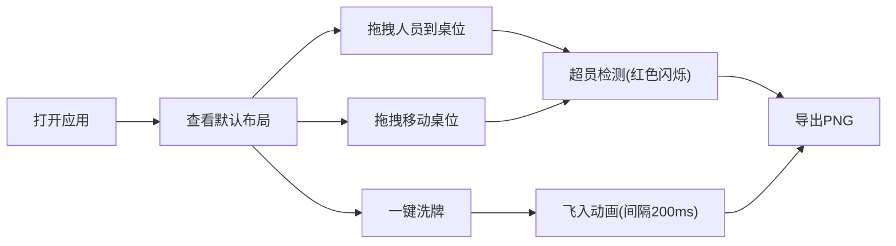

## 1. 产品概述

座位安排可视化应用，帮助用户在线策划和预览线下聚会、会议或婚礼等场景的座位布局，解决手动排座混乱、无法预视最终效果的问题。

- 核心价值：直观的可视化拖拽排座体验，一键随机分配，导出高清布局图
- 目标用户：活动策划者、婚礼司仪、会议组织者、HR 等

## 2. 核心功能

### 2.1 用户角色

| 角色 | 注册方式 | 核心权限 |
|------|----------|----------|
| 普通用户 | 无需注册，纯前端使用 | 创建桌位、安排人员、导出布局 |

### 2.2 功能模块

1. **画布区域**：桌位展示、拖拽移动、缩放平移
2. **座位池**：人员卡片列表、拖拽到座位
3. **工具栏**：撤销、重做、重置、一键洗牌、导出PNG
4. **桌位管理**：创建桌位（圆形/矩形）、设置名称和人数上限、超员检测

### 2.3 页面详情

| 页面名称 | 模块名称 | 功能描述 |
|----------|----------|----------|
| 主页面 | 顶部工具栏 | 撤销、重做、重置、一键洗牌、导出PNG按钮，线性风格图标 |
| 主页面 | 左侧座位池 | 可滚动人员列表，圆形头像卡片，支持拖拽源 |
| 主页面 | 右侧画布 | 可缩放平移的桌位布局区，桌位可拖拽，座位可高亮 |
| 主页面 | 桌位卡片 | 显示桌名、座位数、超员红色脉冲闪烁，支持拖拽放置 |

## 3. 核心流程

用户打开应用 → 查看默认桌位和人员 → 从左侧座位池拖拽人员到桌位 → 可拖拽移动桌位位置 → 可点击一键洗牌随机分配 → 满意后导出PNG图片

## 4. 用户界面设计

### 4.1 设计风格

- 主色调：温暖米白色 `#faf3e0`（背景）
- 桌位色：柔和蓝绿色 `#8ecae6`
- 强调色：超员红色脉冲 `#ef4444`
- 卡片：圆形头像 + 浅灰色阴影
- 字体：优雅的衬线/无衬线组合，标题使用有设计感的字体
- 按钮：圆角、柔和阴影、悬停微放大效果
- 图标：线性风格（lucide-react）

### 4.2 页面设计概览

| 页面名称 | 模块名称 | UI元素 |
|----------|----------|--------|
| 主页面 | 工具栏 | 横向排列、线性图标、米白背景、细分割线 |
| 主页面 | 座位池 | 固定高度、可滚动、网格布局卡片、拖拽时40%透明 |
| 主页面 | 画布区域 | 米白背景、可缩放平移、桌位阴影提示、缓动归位 |
| 主页面 | 桌位卡片 | 蓝绿色块、圆形/矩形、座位环绕排列、超员红边脉冲 |

### 4.3 响应式

- 桌面端优先，左右分栏布局
- 画布区域占主要空间，支持鼠标滚轮缩放和拖拽平移
- 座位池固定宽度，内部滚动

### 4.4 动效设计

- 桌位拖拽：半透明阴影跟随，松开缓动归位（ease-out）
- 人员拖拽：40%透明度跟随鼠标，目标座位高亮发光
- 一键洗牌：逐个飞入动画（间隔200ms），动画期间按钮禁用
- 超员提示：红色边框脉冲闪烁动画
- 导出：清晰无锯齿的高清PNG
