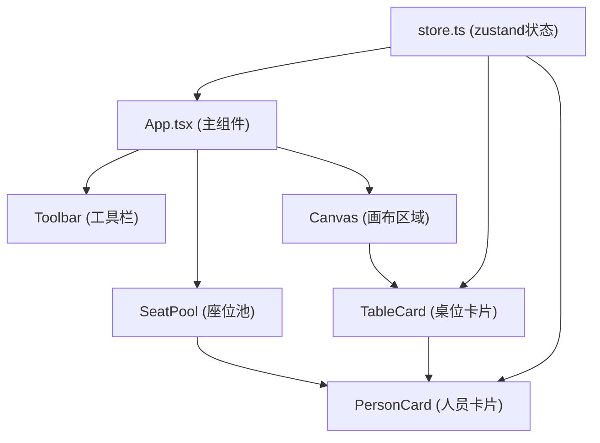

## 1. 架构设计

纯前端单页应用，采用 React + TypeScript + Vite 技术栈，使用 zustand 进行状态管理。



## 2. 技术描述

- 前端框架：React 18 + TypeScript
- 构建工具：Vite 5 + @vitejs/plugin-react
- 状态管理：zustand 4
- 唯一ID：uuid
- 图标库：lucide-react
- 样式方案：原生 CSS + CSS Modules / styled-components（使用纯CSS）
- 导出功能：html2canvas（用于PNG导出）

## 3. 文件结构

```
src/
├── App.tsx              # 主组件，布局和画布缩放
├── store.ts             # zustand 状态管理（桌位、座位、人员、撤销重做）
├── components/
│   ├── Toolbar.tsx      # 顶部工具栏
│   ├── SeatPool.tsx     # 左侧座位池
│   ├── TableCard.tsx    # 桌位卡片组件
│   ├── PersonCard.tsx   # 人员卡片组件
│   └── Canvas.tsx       # 画布容器（缩放平移）
├── hooks/
│   └── useDragDrop.ts   # 拖拽逻辑自定义hook
├── utils/
│   └── exportPng.ts     # 导出PNG工具函数
└── types/
    └── index.ts         # 类型定义
```

## 4. 数据模型

### 4.1 类型定义

```typescript
interface Person {
  id: string;
  name: string;
  avatar: string; // 预设头像索引或颜色
}

interface Seat {
  id: string;
  personId: string | null;
  angle?: number; // 圆形桌位的角度位置
  position?: { x: number; y: number }; // 相对桌位的位置
}

interface Table {
  id: string;
  name: string;
  shape: 'round' | 'rectangle';
  capacity: number; // 默认8
  x: number; // 画布上的x坐标
  y: number; // 画布上的y坐标
  seats: Seat[];
}

interface AppState {
  tables: Table[];
  people: Person[];
  history: { past: AppState[]; future: AppState[] };
  canvasScale: number;
  canvasOffset: { x: number; y: number };
  isShuffling: boolean;
}
```

## 5. 核心功能实现方案

### 5.1 拖拽系统

使用原生 HTML5 Drag and Drop API 或自定义鼠标事件实现：
- 桌位拖拽：mousedown → mousemove → mouseup，带半透明阴影
- 人员拖拽：从座位池拖到桌位座位，目标座位高亮
- 拖拽响应优化：使用 requestAnimationFrame 确保 < 50ms 响应

### 5.2 撤销重做

使用 zustand 的中间件或手动实现 history 栈：
- 每次状态变更前 push 到 past
- 撤销：从 past 弹出，当前状态 push 到 future
- 重做：从 future 弹出，当前状态 push 到 past

### 5.3 一键洗牌

1. 收集所有未分配人员和空座位
2. 随机打乱人员顺序
3. 逐个分配座位，每个间隔 200ms
4. 使用 requestAnimationFrame 确保 40fps 以上

### 5.4 导出PNG

使用 html2canvas 或 dom-to-image 库：
- 捕获画布区域 DOM
- 设置高清 scale（2x）确保无锯齿
- 触发下载

### 5.5 性能优化

- 使用 React.memo 避免不必要重渲染
- 拖拽时使用 transform 而非 top/left
- 使用 will-change 提升动画性能
- 状态更新批量处理
