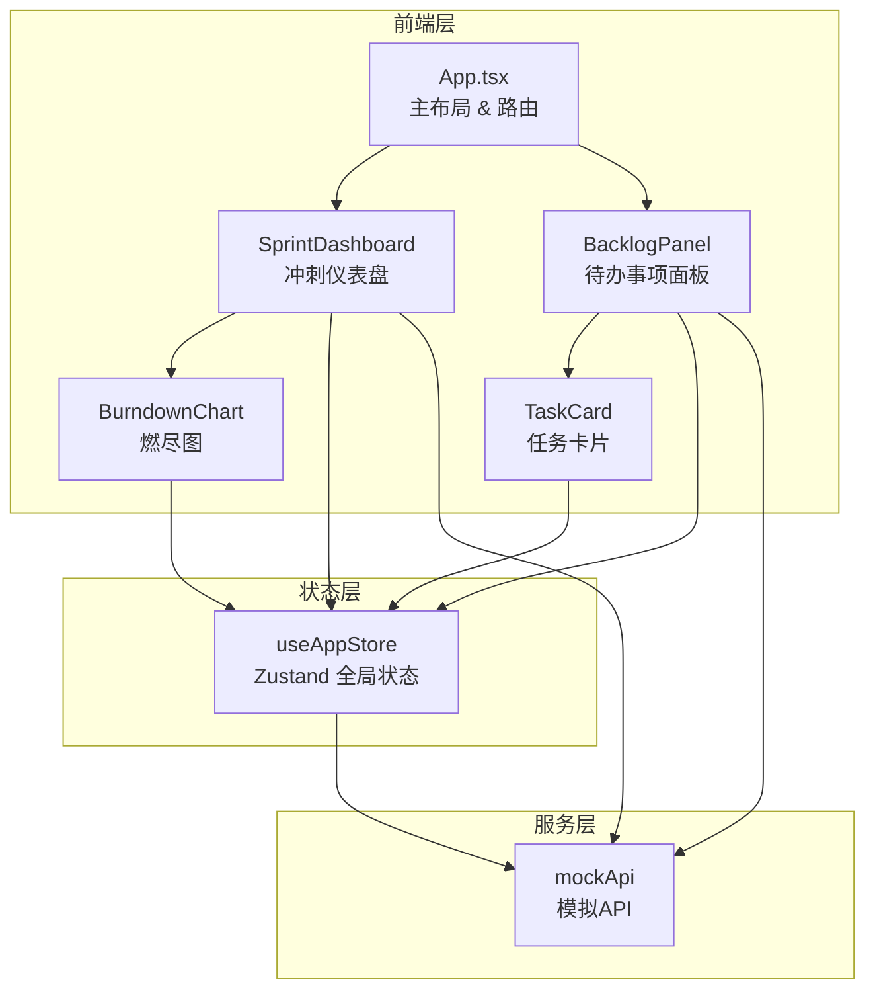
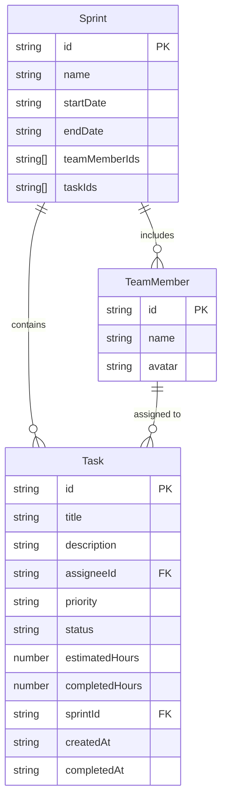

## 1. 架构设计



## 2. 技术说明

- 前端：React 18 + TypeScript + Vite
- 初始化工具：vite-init（react-ts 模板）
- 状态管理：Zustand
- 图表：Chart.js + react-chartjs-2
- 拖拽：@dnd-kit/core + @dnd-kit/sortable
- 样式：Tailwind CSS
- 后端：无（纯前端模拟 API 层）
- 数据库：无（内存 + localStorage 持久化）

## 3. 路由定义

| 路由 | 用途 |
|------|------|
| / | 主页面，包含待办面板和冲刺仪表盘 |

## 4. API 定义（模拟层）

### 4.1 任务相关

| 接口 | 方法 | 请求参数 | 响应数据 |
|------|------|----------|----------|
| getTasks | GET | filters?: { priority, assignee, status } | Task[] |
| createTask | POST | Omit<Task, 'id'> | Task |
| updateTask | PUT | { id, ...partial } | Task |
| deleteTask | DELETE | { id } | { success: boolean } |

### 4.2 冲刺相关

| 接口 | 方法 | 请求参数 | 响应数据 |
|------|------|----------|----------|
| getSprints | GET | - | Sprint[] |
| createSprint | POST | Omit<Sprint, 'id'> | Sprint |
| updateSprint | PUT | { id, ...partial } | Sprint |
| addTaskToSprint | POST | { sprintId, taskId } | Sprint |
| removeTaskFromSprint | DELETE | { sprintId, taskId } | Sprint |

### 4.3 数据类型定义

```typescript
interface Task {
  id: string;
  title: string;
  description: string;
  assignee: string;
  priority: 'high' | 'medium' | 'low';
  status: 'todo' | 'in-progress' | 'done';
  estimatedHours: number;
  completedHours: number;
  sprintId: string | null;
  createdAt: string;
  completedAt: string | null;
}

interface Sprint {
  id: string;
  name: string;
  startDate: string;
  endDate: string;
  teamMembers: string[];
  taskIds: string[];
}

interface TeamMember {
  id: string;
  name: string;
  avatar: string;
}

interface DailyProgress {
  date: string;
  remainingHours: number;
}
```

## 5. 服务器架构图

无后端服务器，使用纯前端模拟 API 层（mockApi.ts），通过 Promise + setTimeout 模拟网络延迟（200-500ms）。

## 6. 数据模型

### 6.1 数据模型定义



### 6.2 数据持久化

使用 Zustand + localStorage 实现数据持久化。应用启动时从 localStorage 加载数据，状态变更时自动同步。模拟 API 层操作 Zustand store，确保数据流向统一。

## 7. 文件结构与调用关系

```
src/
├── App.tsx                          # 主布局，调用 SprintDashboard & BacklogPanel
├── main.tsx                         # 入口，挂载 App
├── index.css                        # 全局样式 & Tailwind
├── modules/
│   ├── sprint/
│   │   ├── SprintDashboard.tsx      # 冲刺仪表盘，从 store 读取冲刺/任务数据，调用 BurndownChart
│   │   └── BurndownChart.tsx        # 燃尽图，接收 SprintDashboard 过滤后的任务数据
│   └── backlog/
│       ├── BacklogPanel.tsx         # 待办面板，管理筛选逻辑，输出任务列表到 sprint 模块
│       └── TaskCard.tsx             # 任务卡片，状态由 BacklogPanel 管理
├── services/
│   └── mockApi.ts                   # 模拟 API，被 backlog 和 sprint 模块调用
└── store/
    └── useAppStore.ts               # Zustand 全局状态，被各模块读写
```

### 数据流向

1. **用户操作** → 组件调用 `mockApi` 方法 → `mockApi` 更新 `useAppStore` → 组件响应式更新
2. **拖拽分配** → BacklogPanel 拖拽事件 → 调用 `addTaskToSprint` API → store 更新 task.sprintId → SprintDashboard 自动刷新
3. **燃尽图更新** → SprintDashboard 从 store 读取冲刺任务 → 计算每日工时 → 传递数据给 BurndownChart → Chart.js 重绘
4. **筛选切换** → BacklogPanel 更新本地筛选状态 → 过滤任务列表 → TaskCard 淡入淡出过渡
