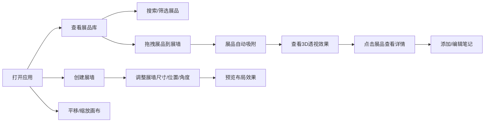

## 1. 产品概述

展览布局策划Web应用是一款面向画廊、博物馆、展会策划人员的在线工具，解决线下展览中展品排布混乱、空间利用率低、无法预览最终效果的痛点问题。用户可通过直观的拖拽式界面快速规划展墙布局、放置展品并实时预览3D透视效果，提升展览策划效率和空间利用率。

## 2. 核心功能

### 2.1 功能模块
1. **展品库面板**：预设展品列表、搜索过滤、拖拽源
2. **画布编辑区**：展墙创建与编辑、展品放置、平移缩放
3. **展品详情浮层**：展品信息展示、笔记功能

### 2.2 功能详情

| 模块名称 | 功能点 | 功能描述 |
|---------|--------|----------|
| 展品库面板 | 展品卡片 | 展示展品名称、缩略图占位、尺寸和方向标签 |
| 展品库面板 | 搜索过滤 | 实时搜索筛选展品，响应时间≤100ms |
| 展品库面板 | 拖拽源 | 拖拽时卡片跟随鼠标，45%透明度显示 |
| 画布编辑区 | 展墙创建 | 支持矩形和L型展墙，可设置宽高和位置 |
| 画布编辑区 | 展墙操作 | 鼠标拖拽移动、旋转（几何中心为原点）、缩放（四角均匀缩放） |
| 画布编辑区 | 辅助线 | 操作时显示蓝色半透明辅助线和对齐网格 |
| 画布编辑区 | 展品吸附 | 拖拽到展墙时吸附点高亮发光，松开后自动吸附 |
| 画布编辑区 | 3D透视效果 | 展品在墙上显示为3D倾斜透视效果 |
| 画布编辑区 | 间距自动分布 | 展品在展墙上自动均匀分布 |
| 画布编辑区 | 画布平移 | 鼠标拖拽平移画布，边界限制在可视区域内 |
| 画布编辑区 | 画布缩放 | 滚轮缩放25%-300%，以鼠标位置为中心，响应延迟≤50ms |
| 展品详情浮层 | 信息展示 | 展品描述、创建日期、标签 |
| 展品详情浮层 | 笔记功能 | 可添加和编辑笔记 |
| 展品详情浮层 | 动画效果 | 由下向上滑入/滑出，300ms时长，背景模糊遮罩 |

## 3. 核心流程

用户从左侧展品库拖拽展品卡片到画布中的展墙上，展品自动吸附并3D展示；用户可创建和编辑展墙的位置、尺寸和角度；点击展品查看详情并添加笔记；画布支持平移和缩放以浏览整体布局。

## 4. 用户界面设计

### 4.1 设计风格
- **主色调**：深灰 #2A2A2A（背景）、浅灰 #E0E0E0（内容）
- **强调色**：靛蓝 #4A90D9（按钮、高亮边框、链接）
- **展墙填充**：浅灰 #C8C8C8，细边框
- **展品卡片**：白色半透明 #FFFFFF 90%，深灰文字
- **字体**：系统无衬线字体
- **交互反馈**：拖拽时光标grabbing，按钮悬停提升阴影，焦点状态靛蓝色边框脉动发光

### 4.2 页面设计概览

| 区域 | 模块 | UI元素 |
|------|------|--------|
| 左侧面板 | 展品库 | 220px宽度，背景#3A3A3A，搜索框，卡片列表（间距12px，圆角8px，浅色阴影） |
| 中央区域 | 画布 | 深灰背景，展墙（浅灰填充），展品（白色半透明卡片，3D倾斜），网格辅助线 |
| 浮层 | 详情弹窗 | 由下向上滑入动画，半透明模糊遮罩，展品信息，笔记编辑区 |

### 4.3 响应式
- 桌面优先设计，1024px及以上屏幕正常工作
- 左侧面板固定宽度220px，画布区域自适应

### 4.4 动效规范
- 展品详情浮层：滑入/滑出动画 300ms
- 拖拽状态：半透明、光标变化
- 焦点状态：靛蓝色边框脉动发光
- 悬停效果：提升阴影
- 性能目标：拖动和动画稳定60fps
