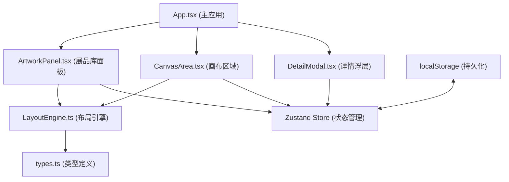

## 1. 架构设计



## 2. 技术描述

- **前端框架**：React@18 + TypeScript
- **构建工具**：Vite
- **状态管理**：Zustand
- **唯一标识**：uuid
- **数据持久化**：localStorage 模拟后端存储
- **样式方案**：CSS Modules / 内联样式（按需求使用CSS变量）

## 3. 文件结构

```
src/
├── modules/
│   ├── layout/
│   │   ├── types.ts          # 展墙和展品数据接口类型
│   │   └── LayoutEngine.ts   # 核心布局引擎
│   └── ui/
│       ├── ArtworkPanel.tsx  # 左侧展品库面板
│       ├── CanvasArea.tsx    # 中央画布组件
│       └── DetailModal.tsx   # 展品详情浮层
├── App.tsx                   # 主应用组件
└── main.tsx                  # 入口文件
```

## 4. 核心数据模型

### 4.1 类型定义 (types.ts)

```typescript
interface Wall {
  id: string;
  type: 'rectangle' | 'L-shape';
  x: number;
  y: number;
  width: number;
  height: number;
  rotation: number;
  artworks: ArtworkOnWall[];
}

interface Artwork {
  id: string;
  name: string;
  thumbnail: string;
  width: number;
  height: number;
  orientation: 'portrait' | 'landscape' | 'square';
  description: string;
  createdAt: string;
  tags: string[];
  notes: string;
}

interface ArtworkOnWall {
  artworkId: string;
  positionOnWall: number;
}
```

### 4.2 布局引擎 (LayoutEngine.ts)

核心方法：
- `addWall(type, x, y, width, height)` - 创建展墙
- `moveWall(id, x, y)` - 移动展墙
- `resizeWall(id, corner, deltaX, deltaY)` - 缩放展墙
- `rotateWall(id, angle)` - 旋转展墙
- `adhereArtwork(wallId, artworkId, position)` - 展品吸附到展墙
- `calculateSpacing(wallId)` - 计算展品均匀间距
- `getSnapPoints(wallId)` - 获取吸附点位置

## 5. 状态管理

使用 Zustand 管理全局状态：
- 展墙列表
- 展品库数据
- 当前选中的展品/展墙
- 画布视口（偏移量、缩放比例）
- 详情浮层状态

状态通过 localStorage 持久化，初始化时从存储中加载。

## 6. 性能优化策略

1. **画布渲染**：使用 CSS transform 进行平移和缩放，确保GPU加速
2. **拖拽优化**：使用 requestAnimationFrame 节流，保证60fps
3. **搜索过滤**：展品库搜索使用内存过滤，响应≤100ms
4. **重绘优化**：组件合理拆分，避免不必要的重渲染
5. **事件委托**：画布鼠标事件统一处理
