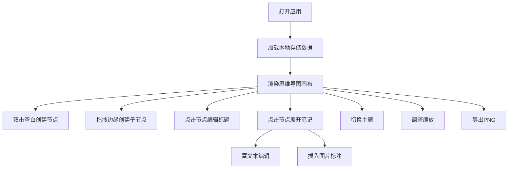

## 1. 产品概述

MindFlow 是一款在线协作思维导图与实时笔记标注应用，支持多用户在同一画布上共同编辑思维导图节点，同时可在节点上附加富文本笔记和图片标注。产品采用纯前端架构，通过 localStorage 模拟后端持久化，提供流畅的交互体验和精美的视觉设计。

- 核心价值：将思维导图可视化思考、结构化笔记与知识管理
- 目标用户：学生、产品经理、知识工作者
- 市场定位：轻量级、高效率的思维工具

## 2. 核心功能

### 2.1 用户角色
| 角色 | 注册方式 | 核心权限 |
|------|----------|----------|
| 普通用户 | 无需注册，本地使用 | 创建编辑思维导图、笔记标注、主题切换、导出 |

### 2.2 功能模块
1. **思维导图画布：节点CRUD、拖拽连线、缩放平移
2. **笔记编辑器**：富文本编辑、图片上传、实时同步
3. **控制面板**：主题切换、缩放滑块、导出PNG
4. **缩略图导航**：快速定位画布区域

### 2.3 页面详情
| 页面名称 | 模块名称 | 功能描述 |
|----------|----------|----------|
| 主界面 | 思维导图画布 | 双击创建节点、拖拽生成子节点、选中编辑节点标题
| 主界面 | 笔记编辑器 | 富文本编辑、图片标注、实时同步
| 主界面 | 控制面板 | 三种主题切换、缩放滑块、导出按钮
| 主界面 | 缩略图导航 | 实时缩略图、视口指示、快速定位

## 3. 核心流程

用户打开应用 → 查看初始画布（空或上次保存的思维导图）→ 双击空白创建中心节点 → 拖拽节点边缘拖出子节点 → 点击节点编辑标题 → 点击节点展开笔记面板 → 编辑富文本笔记/插入图片 → 切换主题 → 调整缩放 → 导出PNG

## 4. 用户界面设计

### 4.1 设计风格
- **主色调**：清爽蓝 #4A90D9
- **辅助色**：暖阳橙 #FF9F43、暗夜紫 #9B59B6
- **节点样式**：圆角矩形、浅灰背景、深色文字
- **按钮样式**：柔和阴影、圆角过渡
- **字体**：现代无衬线字体
- **布局风格**：三栏布局（左10%、中65%、右25%）
- **动效**：弹性放大动画、淡入淡出过渡、平滑缩放

### 4.2 页面设计概述
| 页面名称 | 模块名称 | UI元素 |
|----------|----------|--------|
| 主界面 | 左侧控制面板 | 主题下拉菜单、缩放滑块、导出按钮 |
| 主界面 | 中间画布 | 网格背景、节点、连线、缩略图 |
| 主界面 | 右侧笔记 | 富文本编辑器、工具栏、图片区域 |

### 4.3 响应性
- 桌面端优先，固定三栏布局
- 画布区域支持缩放和平移
- 笔记面板可展开收起

### 4.4 视觉细节
- 网格背景：间距20px，颜色#E0E0E0
- 节点选中：发光描边，强度10px
- 拖拽状态：其他节点透明度30%
- 连线：带箭头，渐变描边
- 主题切换：0.6秒渐变过渡
