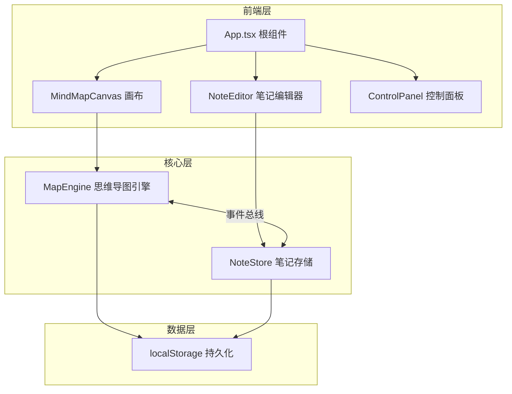

## 1. 架构设计



## 2. 技术描述

- 前端框架：React 18 + TypeScript
- 构建工具：Vite
- 状态管理：zustand
- 拖拽库：react-beautiful-dnd
- 唯一ID：uuid
- 持久化：localStorage
- 样式方案：CSS Modules / CSS Variables

## 3. 核心模块说明

### 3.1 MapEngine (src/core/MapEngine.ts)
- 管理思维导图节点树结构
- 节点CRUD操作
- 连线数据管理
- 事件总线通信
- 撤销/重做（可选）

### 3.2 NoteStore (src/core/NoteStore.ts)
- 管理节点关联的富文本笔记
- 图片标注存储
- 与MapEngine事件总线通信
- localStorage持久化

### 3.3 MindMapCanvas (src/ui/MindMapCanvas.tsx)
- 画布渲染节点和连线
- 拖拽交互处理
- 缩放和平移
- 缩略图导航
- 主题适配

### 3.4 NoteEditor (src/ui/NoteEditor.tsx)
- 富文本编辑
- 图片上传
- 实时同步
- 淡入淡出过渡

### 3.5 ControlPanel (src/ui/ControlPanel.tsx)
- 主题切换
- 缩放滑块
- 导出PNG

## 4. 数据模型

### 4.1 节点数据结构
```typescript
interface MindMapNode {
  id: string;
  title: string;
  x: number;
  y: number;
  parentId: string | null;
  children: string[];
}
```

### 4.2 笔记数据结构
```typescript
interface NoteData {
  nodeId: string;
  content: string;
  images: ImageAnnotation[];
  updatedAt: number;
}

interface ImageAnnotation {
  id: string;
  src: string;
  caption?: string;
}
```

### 4.3 主题数据结构
```typescript
interface Theme {
  name: string;
  background: string;
  nodeFill: string;
  nodeText: string;
  lineColor: string;
  gridColor: string;
  glowColor: string;
}
```

## 5. 性能要求

- 最多200个节点 + 500条连线
- 交互帧率不低于30fps
- 节点拖拽响应延迟不超过50ms
- 笔记面板更新延迟不超过100ms
- 缩放动画帧率不低于30fps
