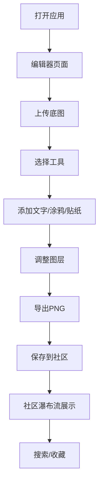

## 1. 产品概述
Meme Studio 是一款用户自定义表情包创作与分享平台，提供简洁直观的画布编辑工具，让用户可以上传图片、添加文字/涂鸦/贴纸，快速生成个性化表情包，并在社区中浏览、搜索和收藏他人作品。

- **核心价值**：降低表情包创作门槛，让每个人都能快速制作专属表情包
- **目标用户**：喜欢社交分享、追求个性化表达的年轻用户群体
- **市场定位**：轻量级、趣味化的在线表情包创作工具

## 2. 核心功能

### 2.1 用户角色
| 角色 | 注册方式 | 核心权限 |
|------|----------|----------|
| 普通用户 | 无需注册，本地存储 | 创作表情包、浏览社区、收藏作品 |

### 2.2 功能模块
1. **编辑器页面**：画布编辑、工具栏、图层面板、导出功能
2. **社区页面**：瀑布流展示、搜索、收藏功能
3. **收藏页面**：查看已收藏的表情包

### 2.3 页面详情
| 页面名称 | 模块名称 | 功能描述 |
|----------|----------|----------|
| 编辑器 | 主画布 | 图片上传、拖拽缩放平移、元素渲染 |
| 编辑器 | 工具栏 | 矩形选区、文字、画笔、贴纸四种工具 |
| 编辑器 | 图层面板 | 图层列表、拖拽排序、删除、高亮提示 |
| 编辑器 | 导出功能 | 300x300 PNG格式下载 |
| 社区 | 瀑布流 | 两列布局、淡入上移动画、响应式适配 |
| 社区 | 搜索栏 | 按关键词搜索表情包 |
| 社区 | 收藏按钮 | 收藏/取消收藏表情包 |
| 收藏页 | 收藏列表 | 展示用户收藏的表情包 |

## 3. 核心流程
用户打开应用 → 进入编辑器页面 → 上传底图 → 选择工具添加元素 → 调整图层顺序 → 导出表情包 → 自动保存到社区 → 浏览/搜索/收藏社区作品

## 4. 用户界面设计

### 4.1 设计风格
- **主题**：深色霓虹风格
- **背景**：深灰渐变背景
- **毛玻璃效果**：工具栏和面板使用半透明毛玻璃
- **主色调**：蓝紫色渐变（#6366f1 → #a855f7）
- **描边**：文字和贴纸默认白色描边
- **画布**：微弱发光边框

### 4.2 页面设计概述
| 页面名称 | 模块名称 | UI元素 |
|----------|----------|--------|
| 编辑器 | 主画布 | 居中画布、发光边框、支持缩放平移 |
| 编辑器 | 工具栏 | 顶部横向排列、发光选中态、滑动过渡 |
| 编辑器 | 图层面板 | 右侧垂直列表、拖拽排序、按压反馈 |
| 社区 | 瀑布流 | 两列网格、卡片淡入、悬停效果 |

### 4.3 响应式
- 桌面端优先，自适应移动端
- 支持触摸设备手指拖拽和缩放
- 工具栏和面板在小屏上折叠/调整位置

### 4.4 动效设计
- 工具切换：滑动过渡动画
- 文本框：弹性定焦动画
- 图层高亮：闪烁提示效果
- 卡片加载：淡入上移，逐个出现
- 按钮按压：缩放反馈效果
