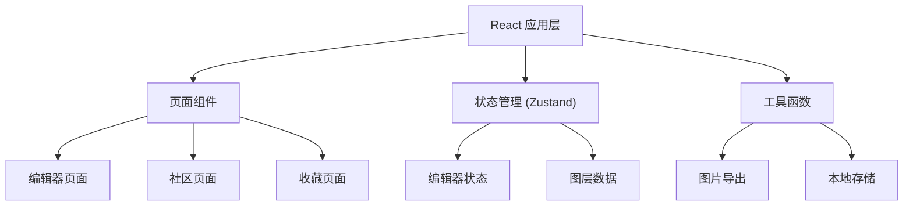

## 1. 架构设计



## 2. 技术描述
- **前端框架**：React 18 + TypeScript
- **构建工具**：Vite
- **状态管理**：Zustand
- **样式方案**：CSS Modules + 内联样式（画布元素）
- **路由**：React Router DOM
- **图标**：Lucide React
- **ID生成**：UUID

## 3. 路由定义
| 路由 | 用途 |
|------|------|
| / | 编辑器主页 |
| /community | 社区页面 |
| /favorites | 收藏页面 |

## 4. 数据模型

### 4.1 图层类型定义
```typescript
type LayerType = 'image' | 'text' | 'draw' | 'sticker';

interface BaseLayer {
  id: string;
  type: LayerType;
  name: string;
  x: number;
  y: number;
  rotation: number;
  scale: number;
  visible: boolean;
}

interface ImageLayer extends BaseLayer {
  type: 'image';
  src: string;
  width: number;
  height: number;
}

interface TextLayer extends BaseLayer {
  type: 'text';
  text: string;
  fontSize: number;
  fontFamily: string;
  color: string;
  maxLength: number;
}

interface DrawLayer extends BaseLayer {
  type: 'draw';
  points: { x: number; y: number }[];
  strokeWidth: number;
  color: string;
}

interface StickerLayer extends BaseLayer {
  type: 'sticker';
  emoji: string;
  size: number;
}
```

### 4.2 社区卡片数据
```typescript
interface MemeCard {
  id: string;
  imageUrl: string;
  creatorName: string;
  createdAt: number;
  isFavorite: boolean;
}
```

## 5. 项目结构

```
src/
├── main.tsx              # 入口文件
├── App.tsx               # 顶层组件，路由管理
├── store/
│   └── editorStore.ts    # Zustand 状态管理
├── components/
│   ├── EditorCanvas.tsx  # 主画布组件
│   ├── ToolBar.tsx       # 工具栏组件
│   └── LayerPanel.tsx    # 图层面板组件
├── pages/
│   ├── Editor.tsx        # 编辑器页面
│   ├── Community.tsx     # 社区页面
│   └── Favorites.tsx     # 收藏页面
└── utils/
    └── exportImage.ts    # 图片导出工具
```

## 6. 性能要求
- 画布交互响应时间 ≤ 200ms
- 社区页面滚动帧率 ≥ 30fps
- 使用 CSS transform 进行拖拽和缩放，避免重排
- 列表渲染使用 key 优化
