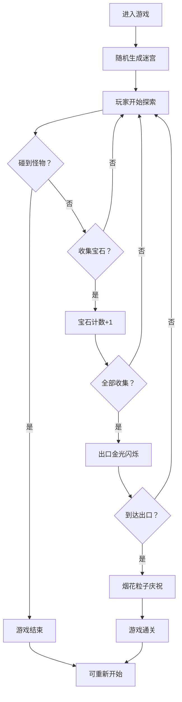

## 1. 产品概述
像素勇者地牢是一款2D俯视角的复古像素风格小游戏，玩家控制像素小人在随机生成的地牢迷宫中探索，收集散落的宝石，同时躲避随机游走的怪物，最终到达出口通关。

- 核心玩法：迷宫探索 + 宝石收集 + 怪物躲避
- 目标用户：休闲游戏玩家、像素风格爱好者
- 产品价值：每次游戏随机生成全新迷宫，提供无限重玩性；简洁易上手的操作带来快节奏的游戏体验

## 2. 核心功能

### 2.1 用户角色
| 角色 | 注册方式 | 核心权限 |
|------|----------|----------|
| 玩家 | 无需注册 | 完整游戏体验，包括迷宫探索、宝石收集、通关等 |

### 2.2 功能模块
1. **迷宫生成系统**：随机生成连通地牢迷宫，包含起点、出口、宝石分布
2. **玩家控制系统**：键盘方向键控制角色移动，带缓动插值动画
3. **怪物AI系统**：固定路线巡逻 + 3格范围内追踪追击玩家
4. **宝石收集系统**：收集所有宝石触发出口激活效果
5. **通关判定系统**：宝石全收集后出口金光闪烁，到达出口触发烟花粒子庆祝

### 2.3 页面详情
| 页面名称 | 模块名称 | 功能描述 |
|----------|----------|----------|
| 游戏主界面 | 迷宫渲染 | Canvas 2D绘制暗紫色墙壁地砖、网格线、宝石、出口、玩家、怪物 |
| 游戏主界面 | HUD信息栏 | 顶部显示已收集宝石数量/总数、游戏状态提示 |
| 游戏主界面 | 烟花粒子特效 | 通关时触发彩色烟花粒子动画 |
| 游戏主界面 | 游戏结束/通关弹窗 | 显示"游戏结束"或"恭喜通关"，提供重新开始按钮 |

## 3. 核心流程

玩家进入游戏 → 随机生成连通迷宫（起点、出口、宝石随机分布）→ 玩家使用方向键移动探索 → 收集宝石（数量实时更新）→ 躲避巡逻/追击的怪物 → 收集全部宝石后出口金光闪烁 → 玩家到达出口 → 烟花粒子庆祝动画 → 游戏通关 → 可重新开始

## 4. 用户界面设计

### 4.1 设计风格
- **主色调**：暗紫色（#2d1b4e）作为背景和墙壁
- **强调色**：明亮黄色（#ffd700）用于宝石和交互元素
- **功能色**：绿色（#4caf50）用于出口区域
- **辅助色**：红色/橙色用于怪物，浅蓝色用于玩家
- **风格**：复古像素风，网格线条清晰，像素化精灵
- **动画**：移动缓动插值（非瞬间跳跃），出口闪烁，烟花粒子

### 4.2 页面设计概述
| 页面名称 | 模块名称 | UI元素 |
|----------|----------|--------|
| 游戏主界面 | 迷宫区域 | 暗紫色地砖、墙壁网格，每格32px像素化渲染 |
| 游戏主界面 | 玩家精灵 | 浅蓝色像素小人，4方向朝向，移动插值动画 |
| 游戏主界面 | 怪物精灵 | 红/橙色像素怪物，巡逻/追击状态视觉区分 |
| 游戏主界面 | 宝石 | 黄色菱形像素宝石，悬浮微动画 |
| 游戏主界面 | 出口 | 绿色地砖，激活后金光闪烁边框 |
| 游戏主界面 | HUD | 顶部半透明栏，白色像素字体显示宝石计数 |
| 游戏主界面 | 弹窗 | 居中半透明黑底弹窗，像素字体大标题，黄色重新开始按钮 |

### 4.3 响应式
- Canvas全屏自适应，保持游戏区域比例
- 移动端：支持虚拟方向键触摸操作，目标60fps
- 桌面端：键盘方向键/WASD控制，帧率不限制

### 4.4 性能要求
- 地图生成和怪物寻路计算：每帧2ms以内
- 移动端稳定60fps，桌面端不限制
