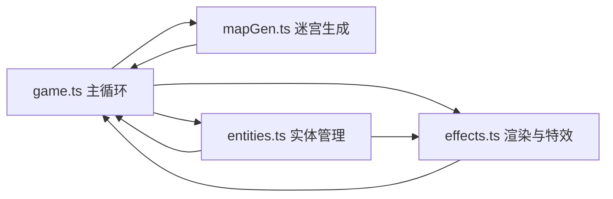

## 1. 架构设计



纯前端架构，无后端。游戏主循环（game.ts）作为驱动核心，每帧依次调用：
1. 迷宫生成模块（首次或重置时）
2. 实体状态更新（玩家、怪物位置与AI）
3. 渲染与特效绘制

## 2. 技术描述

- **前端框架**：无外部UI框架，纯TypeScript + Canvas 2D
- **构建工具**：Vite（支持TypeScript）
- **语言标准**：TypeScript严格模式，target ES2020
- **外部依赖**：无任何第三方库
- **启动方式**：`npm run dev` 启动Vite本地开发服务器

## 3. 文件结构定义

| 文件路径 | 职责 |
|----------|------|
| `package.json` | 项目配置，dev脚本使用vite，无外部依赖 |
| `index.html` | 入口HTML，全屏黑色背景，包含canvas画布 |
| `tsconfig.json` | TS严格模式配置，target ES2020 |
| `vite.config.js` | 基础Vite配置，支持TypeScript |
| `src/game.ts` | 游戏主循环，canvas初始化，requestAnimationFrame驱动update/render |
| `src/mapGen.ts` | 随机地牢迷宫生成算法，输出二维网格，返回起点出口坐标 |
| `src/entities.ts` | 实体基类，玩家/怪物继承，位置、速度、动画状态、碰撞检测 |
| `src/effects.ts` | 地形绘制、精灵渲染、怪物寻路、宝石收集、烟花粒子特效 |

## 4. 核心数据模型

### 4.1 迷宫网格
```typescript
// 格子类型
enum TileType {
  WALL = 0,      // 墙壁
  FLOOR = 1,     // 地板
  START = 2,     // 起点
  EXIT = 3,      // 出口
  GEM = 4,       // 宝石（地板上）
}

interface MapData {
  grid: TileType[][];      // 二维网格 [y][x]
  width: number;           // 迷宫宽度（格子数）
  height: number;          // 迷宫高度（格子数）
  startPos: { x: number; y: number };
  exitPos: { x: number; y: number };
  gemPositions: { x: number; y: number }[];
}
```

### 4.2 实体系统
```typescript
class Entity {
  gridX: number;           // 格子坐标X
  gridY: number;           // 格子坐标Y
  renderX: number;         // 渲染坐标（插值用）
  renderY: number;         // 渲染坐标（插值用）
  targetX: number;         // 目标格子X（移动动画）
  targetY: number;         // 目标格子Y
  isMoving: boolean;
  moveProgress: number;    // 0~1 移动插值进度
  speed: number;           // 移动速度（格/秒）
}

class Player extends Entity {
  // 玩家特有属性
}

class Monster extends Entity {
  patrolPath: { x: number; y: number }[];  // 巡逻路线
  patrolIndex: number;                     // 当前巡逻点索引
  isChasing: boolean;                      // 是否在追击
  chaseTarget: { x: number; y: number };   // 追击目标
}
```

### 4.3 粒子系统
```typescript
interface Particle {
  x: number;
  y: number;
  vx: number;
  vy: number;
  life: number;         // 剩余生命
  maxLife: number;      // 最大生命
  color: string;
  size: number;
}
```

## 5. 核心算法

### 5.1 迷宫生成
使用**递归回溯法（Recursive Backtracker）**生成完美迷宫：
- 从随机起点开始，深度优先搜索
- 每次随机选择未访问的相邻格子，打通墙壁
- 无路可走时回溯
- 保证所有格子连通
- 生成后随机放置宝石和出口

### 5.2 怪物寻路
- **巡逻模式**：沿预设巡逻路线逐格移动
- **追击模式**：使用**曼哈顿距离贪心**每步选择靠近玩家的可走方向（控制在2ms内）
- 检测范围：切比雪夫距离 ≤ 3 格时触发追击

### 5.3 移动插值
- 每格移动时间约 150ms
- 使用 easeOutQuad 缓动函数：`t => 1 - (1-t)*(1-t)`
- 渲染坐标 = 起始格 + (目标格 - 起始格) × 缓动进度

## 6. 性能优化
- 迷宫生成仅在游戏开始/重置时执行一次
- 怪物寻路每步最多检查4个方向，O(1)复杂度
- Canvas使用整数像素渲染避免抗锯齿开销
- 粒子数量上限控制（烟花最多200个粒子）
- 固定时间步长更新，渲染与逻辑分离
