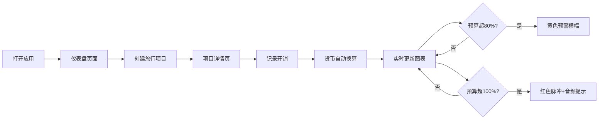

## 1. 产品概述

旅行开销管家是一款帮助旅行者快速整理和可视化旅行开销与预算的 Web 应用，解决旅行中记账混乱、汇率换算麻烦、预算超支难以及时发现的痛点。

- 主要用途：旅行预算管理、多币种开销记录、实时预算可视化
- 目标用户：经常旅行爱好者、商务出行人士、预算敏感型旅行者
- 产品价值：让旅行财务管理更简单、更直观、更可控

## 2. 核心功能

### 2.1 用户角色

| 角色 | 注册方式 | 核心权限 |
|------|----------|----------|
| 普通用户 | 无需注册（本地存储 | 创建旅行项目、记录开销、查看统计图表

### 2.2 功能模块

1. **仪表盘页面：旅行项目列表、项目创建表单、预算总览卡片
2. **旅行详情页**：开销记录表单、开销列表、统计图表、预算预警

### 2.3 页面详情

| 页面名称 | 模块名称 | 功能描述 |
|-----------|----------|----------|
| 仪表盘 | 项目列表 | 卡片网格展示所有旅行项目，悬浮上浮阴影效果
| 仪表盘 | 创建项目表单 | 目的地、货币、总预算、日期范围，表单焦点放大和验证提示动画
| 仪表盘 | 预算总览 | 超出预算时卡片边框橙色渐变闪烁警告
| 旅行详情 | 开销记录表单 | 毛玻璃浮动表单，类别/金额/备注/时间，按压反馈
| 旅行详情 | 开销列表 | 按时间倒序，新增高亮闪烁，自动滚动
| 旅行详情 | 图表面板 | 饼图（类别占比）、折线图（累计花费vs预算
| 旅行详情 | 货币换算 | 多币种支持，滚轮翻转动画
| 旅行详情 | 预算预警 | 80%黄色横幅、100%红色脉冲+音频提示

## 3. 核心流程

用户打开应用 → 在仪表盘创建旅行项目 → 进入项目详情 → 记录开销（支持多币种） → 实时查看预算统计 → 接收预算预警

## 4. 用户界面设计

### 4.1 设计风格

- **主色调**：深蓝灰（#1a1a2e）深色背景
- **强调色**：薄荷绿（#00d2ff）、珊瑚橙（#ff6b6b）
- **字体**：Google Fonts Inter
- **卡片风格**：微弱发光边框 + 悬浮上浮阴影（提升4px + 阴影扩散）
- **动画曲线**：300ms ease-out
- **玻璃质感**：毛玻璃效果表单、半透明玻璃图表容器

### 4.2 页面设计概览

| 页面名称 | 模块名称 | UI元素 |
|-----------|----------|--------|
| 仪表盘 | 项目卡片 | 发光边框、进度条、状态指示、悬浮上浮 |
| 仪表盘 | 创建表单 | 焦点放大、验证提示动画 |
| 旅行详情 | 记账表单 | 毛玻璃浮动、按压反馈 |
| 旅行详情 | 开销条目 | 高亮闪烁、时间倒序 |
| 旅行详情 | 图表 | 饼图旋转弹入、折线图十字准线 |

### 4.3 响应式

- **桌面端（>1024px）：三列网格布局（左侧导航、中间内容、右侧统计面板）
- **平板端（≤1024px）：两列布局（导航折叠为汉堡菜单，统计面板嵌入下方）
- **手机端（≤600px）：单列纵向滚动

### 4.4 动效设计

- 表单字段焦点放大动画
- 预算超支橙色渐变闪烁警告
- 新增条目高亮闪烁2秒
- 饼图扇形旋转弹入动画
- 折线图拖动十字准线和数值提示
- 货币换算滚轮翻转动画
- 预警横幅滑动进入动画
- 100%超支红色脉冲闪烁
- 所有过渡 300ms ease-out
