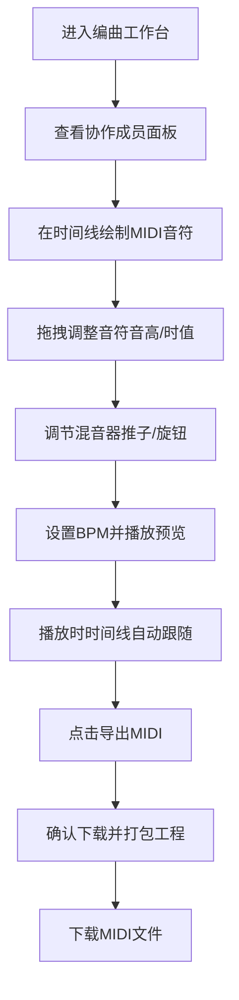

## 1. 产品概述
一个基于浏览器的实时多人协作编曲工作站，支持多位音乐人同时编辑多轨编曲工程，提供虚拟乐器、MIDI音符编辑、实时音量自动化和MIDI导出功能。
- 主要用途：让音乐创作者能够跨设备实时协作编曲，解决远程音乐制作的协作难题
- 目标用户：音乐制作人、编曲师、乐队成员、音乐教育工作者
- 产品价值：提供零安装的Web端DAW体验，降低协作门槛，提升远程音乐创作效率

## 2. 核心功能

### 2.1 用户角色
| 角色 | 注册方式 | 核心权限 |
|------|----------|----------|
| 协作音乐人 | 匿名进入（预设5个虚拟用户） | 编辑音符、调节推子、播放工程、导出MIDI |

### 2.2 功能模块
1. **多轨时间线面板**：轨道管理、MIDI音符绘制与编辑、网格吸附、播放光标
2. **混音器面板**：主输出推子、轨道音量推子、辅助发送旋钮、削波提示
3. **协作成员面板**：在线用户列表、远程光标追踪、操作闪烁提示
4. **顶部工具栏**：播放控制、BPM调节、MIDI导出

### 2.3 页面详情
| 页面名称 | 模块名称 | 功能描述 |
|----------|----------|----------|
| 编曲工作台 | 多轨时间线面板 | 8条音轨，每条高度可拖拽调整（弹性动画），鼠标绘制MIDI音符（半透明预览+网格磁性吸附），音符按音高映射HSL渐变色，点击音符可上下拖拽改音高/左右拖拽改时值，实时显示位置信息 |
| 编曲工作台 | 混音器面板 | 主输出推子，每轨辅助发送旋钮（圆环进度条+缓动动画），推子阴影深度反馈，超0dB红色边框提示削波 |
| 编曲工作台 | 协作成员面板 | 5个虚拟用户头像，彩色光标追踪，操作位置闪烁+用户名标签，光标平滑过渡动画（≤100ms延迟） |
| 编曲工作台 | 顶部工具栏 | 播放/暂停/停止按钮，BPM旋钮（60-200，默认120），导出MIDI按钮（下载确认对话框+进度条动画），播放时时间线自动跟随居中 |

## 3. 核心流程
用户进入编曲工作台 → 查看在线协作者 → 在时间线上绘制/编辑MIDI音符 → 调节各轨道音量和辅助发送 → 设置BPM并播放预览 → 导出MIDI文件。

## 4. 用户界面设计

### 4.1 设计风格
- **主色调**：深色主题，背景#1a1a2e，控件#16213e，高亮#0f3460
- **按钮风格**：圆角矩形，悬停时微妙box-shadow发光，点击时transition过渡
- **字体**：使用现代几何无衬线字体，标题粗体，内容常规
- **布局风格**：三栏布局（左混音器 + 中时间线 + 右协作面板），顶部工具栏
- **图标风格**：线性简约图标，配合主题色系

### 4.2 页面设计概述
| 页面名称 | 模块名称 | UI元素 |
|----------|----------|--------|
| 编曲工作台 | 整体布局 | 深色沉浸式布局，三栏弹性布局，顶部工具栏固定 |
| 编曲工作台 | 时间线面板 | 半透明网格线（随缩放切换密度），音符HSL渐变填充，轨道高度调整弹性动画 |
| 编曲工作台 | 混音器面板 | 推子物理阴影深度，旋钮圆环进度，0dB以上红色边框警告 |
| 编曲工作台 | 协作面板 | 头像列表，彩色光标平滑移动动画，操作闪烁提示 |
| 编曲工作台 | 工具栏 | 播放按钮状态切换动画，BPM旋钮圆环，导出对话框进度条 |

### 4.3 响应式
- 桌面端优先设计，最小宽度1024px
- 浏览器窗口大小改变时自动适配
- 三栏布局宽度可自适应调整

### 4.4 性能要求
- 最多8条音轨，每轨最多128个音符
- 绘制和播放帧率≥30fps
- 音符拖拽和推子响应延迟<50ms
- 协作光标过渡延迟≤100ms
