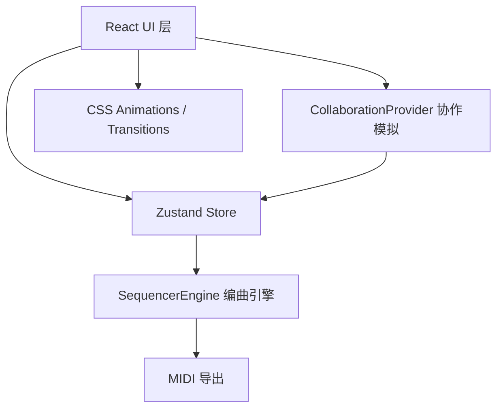

## 1. 架构设计



## 2. 技术描述
- **前端**：React 18 + TypeScript + Vite
- **状态管理**：zustand
- **构建工具**：Vite + @vitejs/plugin-react
- **工具库**：uuid
- **后端**：无（纯前端，协作使用定时广播模拟）
- **数据**：zustand store 管理内存状态

## 3. 目录结构
```
src/
├── main.tsx                 # React应用入口
├── types.ts                 # 全局TypeScript类型定义
├── store/
│   └── useSequencerStore.ts # zustand全局状态
├── modules/
│   ├── sequencer/
│   │   ├── SequencerEngine.ts    # 编曲引擎核心
│   │   └── SequencerPanel.tsx   # 时间线UI
│   ├── mixer/
│   │   └── MixerPanel.tsx     # 混音器UI
│   └── collaboration/
│       ├── CollaborationProvider.tsx  # 协作状态提供者
│       └── CollaboratorCursor.tsx # 协作光标组件
└── components/
    └── TopToolbar.tsx        # 顶部工具栏
```

## 4. 数据模型

### 4.1 类型定义

```typescript
interface Track {
  id: string;
  name: string;
  volume: number;      // 0-1
  muted: boolean;
  solo: boolean;
  height: number;     // px
  auxSend: number;  // 0-1
}

interface Note {
  id: string;
  trackId: string;
  pitch: number;    // MIDI音高 0-127
  start: number;   // 起始时间（beat
  duration: number; // 时值（beat）
  velocity: number; // 力度 0-127
}

interface Collaborator {
  id: string;
  name: string;
  avatar: string;
  color: string;
  cursorX: number;
  cursorY: number;
  isActive: boolean;
  activeElement?: string;
}
```

### 4.2 Store 状态
- tracks: Track[]
- notes: Note[]
- cursorPosition: number (beat
- isPlaying: boolean
- bpm: number
- collaborators: Collaborator[]
- zoomLevel: number

## 5. 核心模块说明

### 5.1 SequencerEngine
- 管理音符、轨道、播放状态
- 方法：addNote、removeNote、moveNote、play、stop、exportMIDI
- 通过zustand store与UI通信

### 5.2 SequencerPanel
- Canvas/DOM绘制网格、音符方块
- 处理鼠标交互（绘制、拖拽音符
- 网格磁性吸附

### 5.3 MixerPanel
- 推子和旋钮交互
- 更新轨道音量状态
- 削波检测与提示

### 5.4 CollaborationProvider
- 模拟5个虚拟用户
- 定时广播光标位置
- 模拟操作事件

### 5.5 CollaboratorCursor
- 根据位置动画过渡
- 闪烁提示
