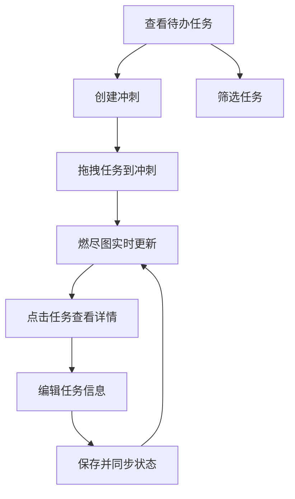

## 1. 产品概述
面向中小型团队的敏捷项目管理工具，提供轻量化的冲刺规划与燃尽图追踪功能，帮助Scrum Master高效管理冲刺进度和任务分配。
- 核心价值：通过可视化燃尽图和拖拽式任务管理，提升冲刺规划效率和团队协作体验
- 目标用户：Scrum Master、敏捷开发团队、项目管理人员

## 2. 核心功能

### 2.1 用户角色
| 角色 | 注册方式 | 核心权限 |
|------|----------|----------|
| Scrum Master | 无需注册（本地应用） | 创建冲刺、管理任务、分配成员、查看燃尽图 |
| 团队成员 | 无需注册（本地应用） | 查看任务、更新状态 |

### 2.2 功能模块
1. **待办事项面板**：任务CRUD、多条件筛选、优先级标记
2. **冲刺仪表盘**：冲刺概览、燃尽图展示、任务列表
3. **任务详情**：模态窗编辑、字段修改、状态同步
4. **拖拽分配**：任务卡片拖拽、冲刺区域高亮、弹性动画

### 2.3 页面详情
| 页面名称 | 模块名称 | 功能描述 |
|----------|----------|----------|
| 主页面 | 待办事项面板 | 任务列表展示、优先级筛选、负责人筛选、状态筛选、任务创建 |
| 主页面 | 冲刺仪表盘 | 冲刺信息展示、燃尽图、冲刺内任务列表、冲刺创建 |
| 模态窗 | 任务详情 | 任务标题/描述/负责人/优先级/工时编辑、保存同步 |

## 3. 核心流程
用户从待办事项面板中查看任务列表，通过筛选条件快速定位任务。创建冲刺后，将任务从待办事项拖拽到冲刺中进行分配。系统实时根据任务完成情况更新燃尽图，展示冲刺进度。点击任务卡片可查看详情并进行编辑。

## 4. 用户界面设计

### 4.1 设计风格
- 主色调：#1a1a2e（深色背景）
- 辅助色：#16213e（面板背景）
- 强调色：#e94560（高亮/按钮）
- 按钮风格：圆角渐变按钮，按压凹陷反馈
- 字体：现代无衬线字体，层级分明
- 布局风格：左右分栏，卡片式设计
- 动效：ease-out 300ms过渡，拖拽半透明跟随，弹性动画

### 4.2 页面设计概述
| 页面名称 | 模块名称 | UI元素 |
|----------|----------|--------|
| 主页面 | 待办事项面板 | 磨砂半透明背景、300px固定宽度、筛选器区域、任务卡片列表 |
| 主页面 | 冲刺仪表盘 | 60%高度燃尽图区域、任务卡片列表、创建冲刺按钮 |
| 模态窗 | 任务详情 | 表单字段、放大焦点动画、保存按钮按压反馈 |

### 4.3 响应式
桌面优先设计，屏幕宽度小于768px时左侧面板折叠为可滑出侧栏，支持触控操作。

### 4.4 性能指标
- 拖拽交互帧率 ≥ 50fps
- 燃尽图重绘时间 ≤ 100ms
- 筛选切换过渡 ≤ 200ms
