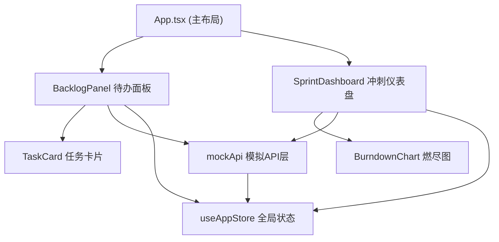

## 1. 架构设计
采用纯前端单页应用架构，基于React + TypeScript + Vite构建，使用Zustand进行全局状态管理，通过模拟API层处理数据逻辑。



## 2. 技术栈说明
- 前端框架：React 18 + TypeScript
- 构建工具：Vite 5
- 状态管理：Zustand
- 图表库：Chart.js + react-chartjs-2
- 拖拽库：原生HTML5拖拽API + 自定义动画
- 唯一ID：uuid
- 样式方案：CSS Modules + CSS变量

## 3. 目录结构
```
src/
├── App.tsx                    # 主布局组件
├── main.tsx                   # 入口文件
├── modules/
│   ├── sprint/
│   │   ├── SprintDashboard.tsx   # 冲刺仪表盘组件
│   │   └── BurndownChart.tsx     # 燃尽图组件
│   └── backlog/
│       ├── BacklogPanel.tsx      # 待办事项面板组件
│       └── TaskCard.tsx          # 任务卡片组件
├── services/
│   └── mockApi.ts                # 模拟API层
└── store/
    └── useAppStore.ts            # 全局状态管理
```

## 4. 数据模型

### 4.1 类型定义
```typescript
interface Task {
  id: string;
  title: string;
  description: string;
  priority: 'high' | 'medium' | 'low';
  status: 'todo' | 'in-progress' | 'done';
  assignee: string | null;
  estimate: number;
  sprintId: string | null;
  createdAt: string;
}

interface Sprint {
  id: string;
  name: string;
  startDate: string;
  endDate: string;
  teamMembers: string[];
}

interface TeamMember {
  id: string;
  name: string;
  avatar?: string;
}

interface BurndownPoint {
  date: string;
  ideal: number;
  actual: number;
}
```

## 5. 状态管理
使用Zustand管理全局状态，包含：
- tasks: 任务列表
- sprints: 冲刺列表
- currentSprintId: 当前选中冲刺ID
- teamMembers: 团队成员列表
- 对应的CRUD操作方法

## 6. 性能优化策略
- 列表渲染使用React.memo优化
- 拖拽使用transform而非top/left
- 燃尽图数据使用useMemo缓存计算
- 筛选结果使用useMemo缓存
- CSS动画优先使用transform和opacity
