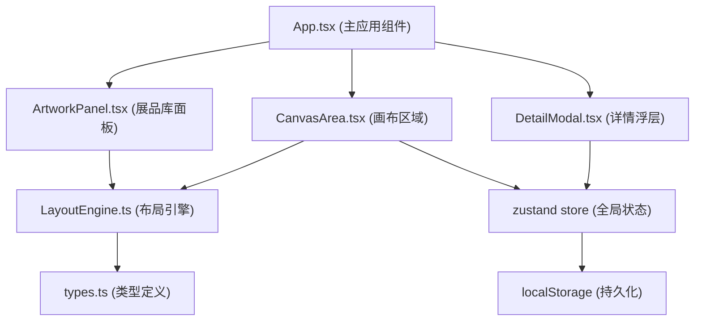

## 1. 架构设计



## 2. 技术描述

- 前端框架：React 18 + TypeScript
- 构建工具：Vite
- 状态管理：zustand
- 唯一ID生成：uuid
- 数据持久化：localStorage 模拟后端存储
- 样式方案：原生 CSS（不使用 Tailwind CSS，按用户指定色值自定义CSS）

## 3. 目录结构

```
src/
├── modules/
│   ├── layout/
│   │   ├── types.ts          # 展墙和展品数据接口类型
│   │   └── LayoutEngine.ts   # 核心布局引擎
│   └── ui/
│       ├── ArtworkPanel.tsx  # 左侧展品库面板
│       ├── CanvasArea.tsx    # 中央画布组件
│       └── DetailModal.tsx     # 展品详情浮层
├── store/
│   └── useStore.ts            # zustand 全局状态
├── App.tsx                   # 主应用组件
├── main.tsx                  # 入口文件
└── index.css                 # 全局样式
```

## 4. 数据模型

### 4.1 类型定义

```typescript
// 展墙类型
interface Wall {
  id: string;
  type: 'rectangle' | 'l-shape';
  x: number;      // 中心X坐标
  y: number;      // 中心Y坐标
  width: number;  // 宽度
  height: number; // 高度
  rotation: number;  // 旋转角度（弧度）
  artworks: ArtworkOnWall[];
}

// 墙上展品
interface ArtworkOnWall {
  id: string;
  artworkId: string;
  positionOnWall: number; // 在墙上的位置比例 0-1
}

// 展品定义
interface Artwork {
  id: string;
  name: string;
  thumbnail: string; // 缩略图
  width: number;
  height: number;
  orientation: 'portrait' | 'landscape' | 'square';
  description: string;
  createdAt: string;
  tags: string[];
  note: string;
}
```

## 5. 核心模块说明

### 5.1 LayoutEngine
- `addWall(type, x, y, width, height)`: 创建展墙
- `moveWall(id, x, y)`: 移动展墙
- `resizeWall(id, corner, deltaX, deltaY)`: 缩放展墙
- `rotateWall(id, angle)`: 旋转展墙
- `adhereArtwork(wallId, artworkId, position)`: 展品吸附到墙
- `distributeArtworks(wallId)`: 均匀分布展品
- `getWallBoundingBox(wall)`: 计算展墙包围盒

### 5.2 CanvasArea
- 鼠标平移：按住空白处拖拽平移画布
- 滚轮缩放：以鼠标位置为中心缩放（25%-300%）
- 展墙拖拽：选中展墙后可拖拽移动
- 展墙缩放：四角缩放手柄
- 展墙旋转：旋转手柄

### 5.3 ArtworkPanel
- 展品列表渲染
- 搜索过滤（响应时间 < 100ms
- HTML5 拖拽 API
- 拖拽时半透明跟随效果

### 5.4 DetailModal
- 由下向上滑入/滑出动画
- 背景半透明模糊遮罩
- 展品详情展示
- 笔记编辑功能
