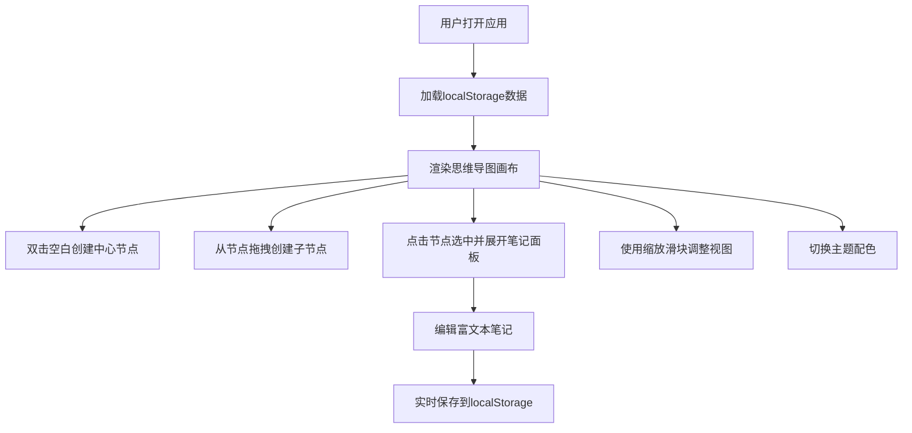

## 1. 产品概述

在线协作思维导图与实时笔记标注应用，支持多用户在同一画布上共同编辑思维导图节点，同时可在节点上附加富文本笔记和图片标注。采用纯前端架构，数据通过localStorage模拟持久化。

- **主要目标**：提供一个轻量级、可视化的思维导图编辑工具，支持节点拖拽、连线、富文本笔记和多主题切换
- **目标用户**：需要快速整理思路、协作脑暴的知识工作者和学生群体
- **核心价值**：无需安装、即开即用的思维导图编辑体验，结合笔记功能实现知识结构化管理

## 2. 核心功能

### 2.1 用户角色
| 角色 | 注册方式 | 核心权限 |
|------|----------|----------|
| 普通用户 | 无需注册 | 完整使用所有思维导图编辑和笔记功能 |

### 2.2 功能模块
1. **思维导图画布**：节点创建、拖拽、连线、缩放、缩略图导航
2. **笔记编辑器**：富文本编辑、图片上传、实时同步
3. **控制面板**：主题切换、缩放控制、导出功能

### 2.3 功能详情
| 模块名称 | 子功能 | 功能描述 |
|----------|--------|----------|
| 思维导图画布 | 节点创建 | 双击空白区域创建中心主题节点，弹性放大动画出现 |
| 思维导图画布 | 节点编辑 | 点击节点弹出编辑框，最多50字，回车或点击空白确认，更新时边框淡蓝色闪烁 |
| 思维导图画布 | 子节点拖拽 | 从节点边缘拖拽生成子节点，半透明辅助线跟随鼠标，松开生成带箭头连线 |
| 思维导图画布 | 节点选中 | 选中节点出现主题色发光描边（10px强度） |
| 思维导图画布 | 节点拖拽 | 拖拽时其他节点和连线透明度降至30%，目标位置显示吸附指示圆点 |
| 思维导图画布 | 缩放控制 | 左下角滑块50%-200%，平滑缩放，帧率≥30fps |
| 思维导图画布 | 缩略图导航 | 右下角缩略图窗口，半透明矩形指示当前视口，实时更新 |
| 笔记编辑器 | 富文本编辑 | 支持加粗、斜体、下划线、列表、插入图片 |
| 笔记编辑器 | 实时同步 | 每处修改实时同步到NoteStore并持久化到localStorage |
| 笔记编辑器 | 切换过渡 | 切换节点时淡入淡出300ms，内容显示延迟≤100ms |
| 控制面板 | 主题切换 | 三种主题（清爽蓝、暖阳橙、暗夜紫），0.6秒渐变过渡 |
| 控制面板 | 导出PNG | 将画布导出为PNG图片 |

## 3. 核心流程

## 4. 用户界面设计

### 4.1 设计风格
- **主色调**：清爽蓝（#4A90D9）、暖阳橙（#FF8C42）、暗夜紫（#7B68EE）
- **节点样式**：圆角矩形，浅灰背景，深色文字，柔和阴影
- **字体**：现代无衬线字体，层级清晰
- **布局**：左中右三栏布局，左侧控制面板10%、中间画布65%、右侧笔记25%
- **动效**：平滑过渡动画，弹性缓动效果

### 4.2 页面设计
| 区域 | 模块 | UI元素 |
|------|------|--------|
| 左侧栏 | 迷你控制面板 | 主题下拉菜单、缩放滑块、导出按钮 |
| 中间区域 | 画布 | 网格背景、节点、连线、选中发光效果 |
| 右侧栏 | 笔记编辑器 | 富文本工具栏、编辑区、图片上传 |
| 右下角 | 缩略图 | 迷你画布、视口指示矩形 |

### 4.3 响应式
- 桌面端优先设计，固定三栏布局
- 画布区域自适应剩余空间
- 笔记面板宽度固定，支持内容滚动

### 4.4 视觉细节
- 画布背景：浅网格辅助线（20px间距，#E0E0E0）
- 节点圆角：统一圆角设计
- 阴影：柔和投影效果
- 连线：带箭头渐变描边，默认#4A90D9
- 选中效果：主题色发光描边，10px模糊半径
