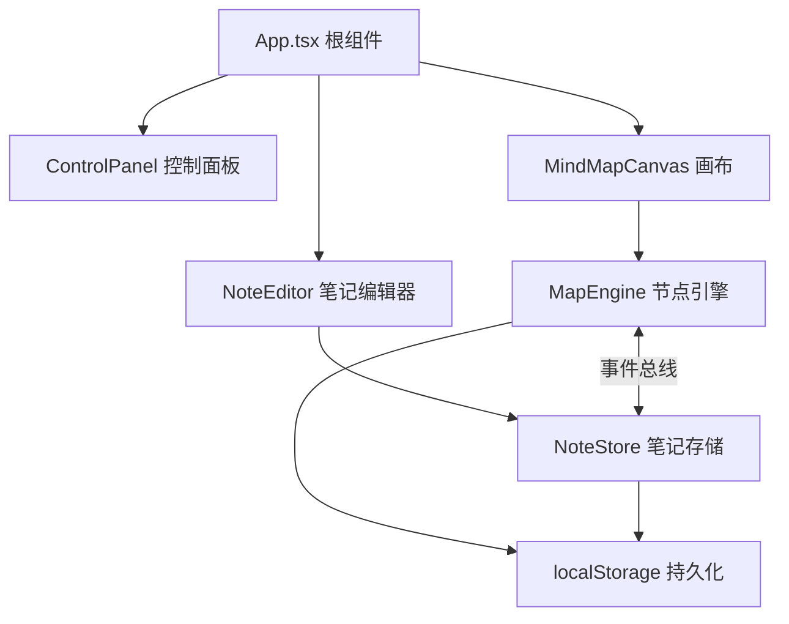

## 1. 架构设计



## 2. 技术描述

- **前端框架**：React 18 + TypeScript
- **构建工具**：Vite
- **状态管理**：Zustand
- **唯一ID生成**：uuid
- **拖拽库**：react-beautiful-dnd（辅助拖拽排序）
- **画布渲染**：SVG + HTML混合方案
- **富文本**：contentEditable + document.execCommand
- **数据持久化**：localStorage

## 3. 文件结构

```
src/
├── App.tsx                 # 根组件，布局管理和模块协调
├── core/
│   ├── MapEngine.ts        # 核心引擎，节点树结构、CRUD、连线数据
│   └── NoteStore.ts        # 笔记存储，富文本笔记和图片标注
├── ui/
│   ├── MindMapCanvas.tsx   # 画布渲染，可拖拽节点和连线
│   ├── NoteEditor.tsx      # 笔记编辑器，富文本编辑和图片上传
│   └── ControlPanel.tsx    # 控制面板，主题切换、缩放、导出
└── types/
    └── index.ts            # 类型定义
```

## 4. 数据模型

### 4.1 节点数据结构
```typescript
interface MindMapNode {
  id: string;
  title: string;
  x: number;
  y: number;
  parentId: string | null;
  children: string[];
  width: number;
  height: number;
}
```

### 4.2 笔记数据结构
```typescript
interface NoteData {
  nodeId: string;
  content: string;        // HTML格式富文本
  images: NoteImage[];
  updatedAt: number;
}

interface NoteImage {
  id: string;
  dataUrl: string;        // base64图片数据
  width: number;
  height: number;
}
```

### 4.3 主题数据结构
```typescript
interface Theme {
  id: string;
  name: string;
  background: string;
  gridColor: string;
  nodeFill: string;
  nodeText: string;
  nodeStroke: string;
  lineColor: string;
  glowColor: string;
  panelBg: string;
  panelText: string;
}
```

## 5. 核心模块设计

### 5.1 MapEngine
- 管理节点树结构
- 提供节点CRUD方法
- 管理连线数据
- 事件总线（EventEmitter）与NoteStore通信
- localStorage持久化

### 5.2 NoteStore
- 管理节点关联的笔记数据
- 提供笔记增删改查方法
- 图片处理（压缩、存储）
- 实时同步到localStorage

### 5.3 MindMapCanvas
- SVG渲染节点和连线
- 处理节点拖拽交互
- 处理缩放和平移
- 缩略图导航
- 动画效果

### 5.4 NoteEditor
- contentEditable富文本编辑
- 工具栏：加粗、斜体、下划线、列表、图片
- 图片上传和预览
- 实时保存

## 6. 性能优化

- **虚拟渲染**：视口外节点简化渲染
- **节流防抖**：缩放、拖拽操作节流处理
- **CSS transforms**：使用transform实现高性能动画
- **requestAnimationFrame**：确保动画帧率≥30fps
- **图片压缩**：上传图片自动压缩，减少存储占用

## 7. 主题系统

使用CSS变量实现主题切换，通过transition实现0.6秒平滑过渡：
- --bg-color: 背景色
- --grid-color: 网格线颜色
- --node-fill: 节点填充色
- --node-text: 节点文字色
- --line-color: 连线颜色
- --glow-color: 发光颜色
- --panel-bg: 面板背景色
- --panel-text: 面板文字色
