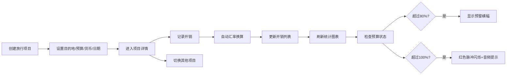

## 1. 产品概述

旅行开销管理应用，帮助旅行者快速整理和可视化旅行开销与预算，解决旅行中记账混乱、汇率换算麻烦、预算超支难以及时发现的问题。目标用户为经常出国旅行的背包客、家庭旅行者和商务出差人员。产品价值在于提供一站式的旅行财务管理，实时监控预算状态，自动换算多币种开销，让用户轻松掌控旅行花费。

## 2. 核心功能

### 2.1 用户角色
| 角色 | 注册方式 | 核心权限 |
|------|----------|----------|
| 普通用户 | 无需注册，本地存储 | 创建旅行项目、记录开销、查看统计图表、接收预算预警 |

### 2.2 功能模块
1. **旅行项目管理**：创建和展示旅行项目卡片列表，项目详情页
2. **开销记录管理**：多币种开销录入、自动汇率换算、开销列表展示
3. **数据可视化统计**：饼图展示类别占比、折线图展示累计花费与预算对比
4. **预算预警系统**：80%预警横幅、100%超支红色脉冲闪烁+音频提示

### 2.3 页面详情
| 页面名称 | 模块名称 | 功能描述 |
|---------|----------|----------|
| 仪表盘 | 项目列表 | 卡片网格展示所有旅行项目，支持创建新项目，超支警告边框闪烁 |
| 仪表盘 | 预算预警横幅 | 超预算80%/100%时顶部滑动提示，100%时红色脉冲闪烁 |
| 项目详情页 | 开销表单 | 毛玻璃效果浮动表单，类别选择、多币种输入、自动换算 |
| 项目详情页 | 开销列表 | 时间倒序排列，新增条目高亮闪烁，支持滚动定位 |
| 项目详情页 | 图表面板 | 饼图+折线图双图表，扇形旋转弹入动画，折线图十字准线提示 |

## 3. 核心流程

用户创建旅行项目→设置预算和货币→进入项目详情→记录开销（自动换算）→查看实时统计图表→接收预算预警→管理多个旅行项目

## 4. 用户界面设计

### 4.1 设计风格
- **主色调**：深蓝灰背景 #1a1a2e，搭配薄荷绿 #00d2ff 和珊瑚橙 #ff6b6b 作为强调色
- **卡片风格**：微弱发光边框，悬浮时提升4px并增加阴影扩散
- **容器风格**：图表区域使用半透明玻璃质感容器（backdrop-filter）
- **字体**：Google Fonts Inter 字体，现代无衬线风格
- **动画**：所有过渡使用300ms ease-out缓动曲线，表单焦点放大、按钮按压反馈、数字滚轮翻转动画、横幅滑动进入

### 4.2 页面设计概述
| 页面名称 | 模块名称 | UI元素 |
|---------|----------|--------|
| 仪表盘 | 项目卡片网格 | 三列网格布局，卡片含发光边框、悬浮阴影、进度条、状态指示 |
| 仪表盘 | 预警横幅 | 顶部固定位置，滑动进入动画，超支时红色脉冲闪烁 |
| 项目详情 | 开销表单 | 毛玻璃浮动层，类别标签页切换，数字滚轮换算动画 |
| 项目详情 | 开销列表 | 时间倒序，新增条目2秒高亮闪烁，自动滚动 |
| 项目详情 | 图表面板 | 玻璃质感容器，饼图扇形旋转弹入，折线图十字准线提示 |

### 4.3 响应式
- **桌面端（>1024px）**：三列网格布局 - 左侧导航栏、中间内容区、右侧统计面板
- **平板端（≤1024px）**：两列布局 - 导航折叠为汉堡菜单，统计面板嵌入内容区下方
- **手机端（≤600px）**：单列纵向滚动布局，所有区域垂直堆叠
- 触摸优化：按钮最小尺寸44x44px，手势友好

### 4.4 性能指标
- 页面初始加载时间 ≤ 2秒（50条模拟开销数据）
- 图表数据更新响应 ≤ 200ms
- 图表帧率 ≥ 30fps
