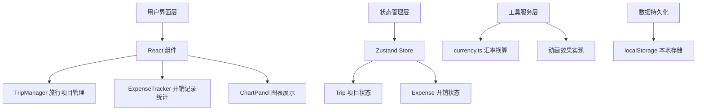
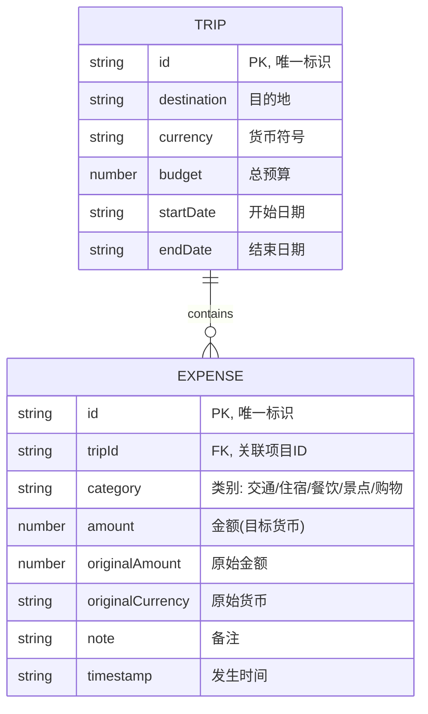

## 1. 架构设计



## 2. 技术描述

- **前端框架**：React@18 + TypeScript@5
- **构建工具**：Vite@5
- **状态管理**：Zustand@4
- **图表库**：Chart.js@4 + react-chartjs-2@5
- **唯一ID生成**：uuid@9
- **样式方案**：原生 CSS + CSS 变量
- **数据存储**：localStorage 本地持久化

## 3. 模块划分

| 模块 | 文件路径 | 职责 |
|------|----------|------|
| 旅行项目管理 | src/modules/trip/ | Trip接口定义、TripManager主组件、TripCard卡片组件 |
| 开销记录与统计 | src/modules/expense/ | Zustand状态管理、开销记录表单、ChartPanel图表组件 |
| 工具函数 | src/utils/ | 货币换算工具函数 |
| 全局样式 | src/styles/ | 全局CSS变量、主题定义、响应式布局 |

## 4. 数据模型

### 4.1 数据模型定义



### 4.2 类型定义

```typescript
// Trip 接口
interface Trip {
  id: string;
  destination: string;
  currency: 'USD' | 'EUR' | 'CNY' | 'JPY' | 'GBP';
  budget: number;
  startDate: string;
  endDate: string;
}

// Expense 接口
interface Expense {
  id: string;
  tripId: string;
  category: '交通' | '住宿' | '餐饮' | '景点' | '购物';
  amount: number;
  originalAmount: number;
  originalCurrency: string;
  note: string;
  timestamp: string;
}

// Store 状态
interface AppState {
  trips: Trip[];
  expenses: Expense[];
  currentTripId: string | null;
  addTrip: (trip: Omit<Trip, 'id'>) => void;
  addExpense: (expense: Omit<Expense, 'id'>) => void;
  switchTrip: (tripId: string) => void;
  getTotalExpenses: (tripId: string) => number;
  getExpensesByTrip: (tripId: string) => Expense[];
}
```

## 5. 汇率表（预设）

| 货币 | 对USD汇率 | 符号 |
|------|-----------|------|
| USD | 1.00 | $ |
| EUR | 0.92 | € |
| CNY | 7.24 | ¥ |
| JPY | 149.50 | ¥ |
| GBP | 0.79 | £ |

## 6. 性能优化策略

1. **按需渲染**：使用 React.memo 优化组件重渲染
2. **状态分片**：Zustand 状态选择器避免不必要重渲染
3. **图表优化**：Chart.js 配置 animation 优化帧率
4. **本地缓存**：localStorage 持久化减少初始化时间
5. **CSS 动画**：使用 transform 和 opacity 实现硬件加速

## 7. 文件组织结构

```
d:\P\tasks\auto38\
├── package.json
├── index.html
├── tsconfig.json
├── vite.config.js
├── src/
│   ├── main.tsx
│   ├── App.tsx
│   ├── modules/
│   │   ├── trip/
│   │   │   ├── types.ts
│   │   │   ├── TripManager.tsx
│   │   │   └── TripCard.tsx
│   │   └── expense/
│   │       ├── store.ts
│   │       ├── types.ts
│   │       ├── ExpenseTracker.tsx
│   │       └── ChartPanel.tsx
│   ├── utils/
│   │   └── currency.ts
│   └── styles/
│       └── global.css
```
