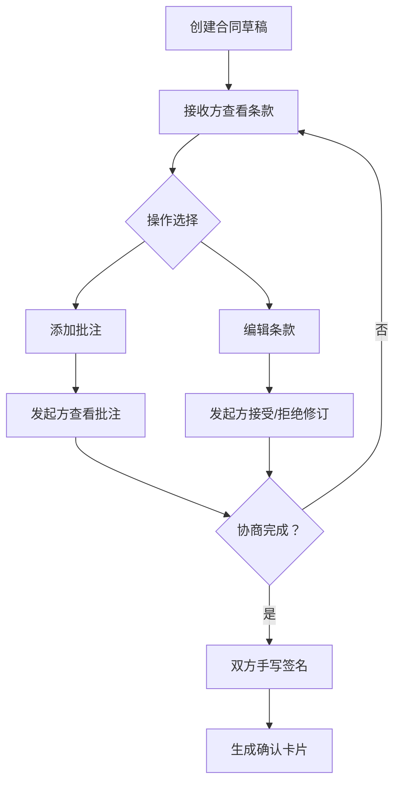

## 1. 产品概述

在线合同条款协商与签名模拟应用，允许合同发起方和接收方在同一页面上对合同条款进行逐项批注、修改和最终模拟签名。

- 核心目标：提供一个纯前端的合同协商模拟平台，支持双方在线协作修订合同条款，最终完成电子签名确认。
- 目标用户：需要进行合同协商的双方（发起方和接收方）。

## 2. 核心功能

### 2.1 用户角色

| 角色 | 核心权限 |
|------|----------|
| 合同发起方 | 创建合同草稿、查看批注、接受/拒绝修订、签署合同 |
| 合同接收方 | 添加批注、编辑条款内容、签署合同 |

### 2.2 功能模块

1. **合同条款展示区**：分块展示合同条款，支持编辑模式和阅读模式
2. **批注系统**：内联批注输入、批注列表管理、状态筛选
3. **修订系统**：条款文本编辑、修订对比展示、接受/拒绝操作
4. **签名系统**：Canvas手写签名、签名预览确认
5. **最终确认**：生成合同摘要、双方签名确认卡片

### 2.3 页面详情

| 页面名称 | 模块名称 | 功能描述 |
|-----------|-------------|---------------------|
| 主应用页 | 合同条款区块 | 渲染单个条款、批注气泡、修改输入框 |
| 主应用页 | 批注与修订面板 | 按时间倒序显示批注、状态筛选、标记已解决/删除 |
| 主应用页 | 签名区域 | Canvas手写签名、笔触颜色/粗细选择、签名确认 |
| 主应用页 | 确认弹窗 | 毛玻璃效果模态框、合同摘要、签名展示 |

## 3. 核心流程

1. 发起方创建包含5个条款的合同草稿
2. 接收方查看合同条款，可添加批注或直接编辑条款
3. 发起方查看批注和修订，可接受或拒绝修订
4. 双方协商完成后，各自进行手写签名
5. 系统生成最终确认卡片，展示合同摘要和双方签名

## 4. 用户界面设计

### 4.1 设计风格

- 主色调：#2c3e50（深蓝灰）
- 辅色调：#3498db（蓝色）
- 背景色：#f5f6fa（浅灰）
- 卡片阴影：box-shadow: 0 2px 8px rgba(0,0,0,0.1)
- 按钮风格：圆角、悬停上浮效果（transform: translateY(-2px)）
- 字体：现代无衬线字体，清晰易读
- 布局：左侧合同内容区 + 右侧固定批注面板
- 动画：平滑过渡、300ms缓动函数

### 4.2 页面设计概览

| 页面名称 | 模块名称 | UI元素 |
|-----------|-------------|----------|
| 主应用页 | 合同条款区块 | 白色卡片、分割线、粗体标题、批注图标、彩色状态点 |
| 主应用页 | 批注面板 | 固定右侧320px宽、状态筛选标签、滑动动画 |
| 主应用页 | 签名区域 | Canvas画布、虚线圈、颜色/粗细选择、确认按钮 |
| 主应用页 | 确认弹窗 | 毛玻璃背景、缩放动画、合同摘要卡片 |

### 4.3 响应式

- 桌面端优先设计
- 批注面板在小屏幕上可折叠
- 触摸优化：支持触屏签名

### 4.4 动画效果

- 按钮悬停：轻微上浮（transform: translateY(-2px)）
- 模态弹窗：从中心缩放出现（0.7到1.0，300ms cubic-bezier）
- 批注筛选：列表项滑动切换（300ms缓动）
- 条款高亮：放大至1.02倍2秒后恢复
- 批注图标：悬停旋转变色
