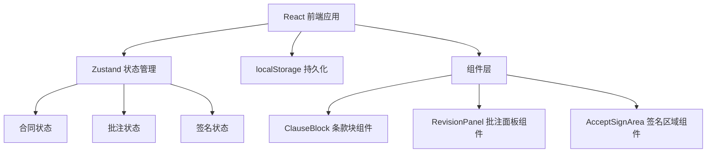
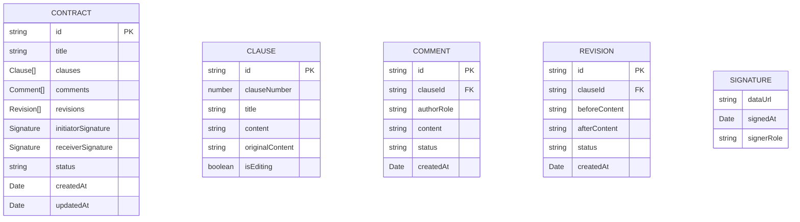

## 1. 架构设计



## 2. 技术描述

- 前端框架：React 18 + TypeScript
- 构建工具：Vite
- 状态管理：Zustand
- 唯一ID生成：uuid
- 数据持久化：localStorage
- 样式方案：原生CSS + CSS Modules

## 3. 项目结构

```
.
├── package.json
├── index.html
├── tsconfig.json
├── vite.config.js
└── src/
    ├── App.tsx              # 主应用组件
    ├── store/
    │   └── useContractStore.ts  # Zustand状态管理
    ├── types/
    │   └── index.ts         # TypeScript类型定义
    ├── components/
    │   ├── ClauseBlock.tsx       # 合同条款块组件
    │   ├── RevisionPanel.tsx     # 批注与修订面板组件
    │   └── AcceptSignArea.tsx    # 签名区域组件
    └── utils/
        └── storage.ts       # localStorage工具函数
```

## 4. 数据模型

### 4.1 数据模型定义



### 4.2 类型定义

```typescript
type Role = 'initiator' | 'receiver';
type CommentStatus = 'unresolved' | 'resolved';
type RevisionStatus = 'pending' | 'accepted' | 'rejected';
type ContractStatus = 'draft' | 'negotiating' | 'signed';

interface Clause {
  id: string;
  clauseNumber: number;
  title: string;
  content: string;
  originalContent: string;
}

interface Comment {
  id: string;
  clauseId: string;
  authorRole: Role;
  content: string;
  status: CommentStatus;
  createdAt: number;
}

interface Revision {
  id: string;
  clauseId: string;
  beforeContent: string;
  afterContent: string;
  status: RevisionStatus;
  createdAt: number;
}

interface Signature {
  dataUrl: string;
  signedAt: number;
  signerRole: Role;
}

interface Contract {
  id: string;
  title: string;
  clauses: Clause[];
  comments: Comment[];
  revisions: Revision[];
  initiatorSignature: Signature | null;
  receiverSignature: Signature | null;
  status: ContractStatus;
  createdAt: number;
  updatedAt: number;
}
```

## 5. 状态管理

使用 Zustand 管理全局状态，包括：
- 合同条款数据
- 批注列表
- 修订记录
- 签名数据
- 当前用户角色
- 高亮条款ID
- 筛选状态

状态变更时自动同步到 localStorage

## 6. 性能优化

- 条款区块使用 React.memo 优化重渲染
- 批注列表使用虚拟滚动（如数据量不大可跳过）
- Canvas 签名使用 requestAnimationFrame 优化笔触流畅度
- localStorage 读写使用 debounce 优化性能
