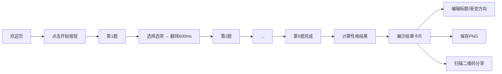

## 1. 产品概述
趣味性格测试卡片生成与分享Web应用，解决传统测试流程冗长、结果分享不直观的痛点。
- 面向年轻用户群体，提供快速、有趣的性格测试体验
- 支持个性化编辑结果卡片并一键分享，打造社交传播属性

## 2. 核心功能

### 2.1 用户角色
| 角色 | 注册方式 | 核心权限 |
|------|----------|----------|
| 普通用户 | 无需注册 | 进行测试、编辑结果卡片、保存/分享图片 |

### 2.2 功能模块
1. **欢迎页**：品牌展示、开始测试按钮
2. **答题页**：5道选择题卡片、翻转动画、进度指示
3. **结果页**：结果卡片展示、个性化编辑、二维码分享、图片保存

### 2.3 页面详情
| 页面名称 | 模块名称 | 功能描述 |
|----------|----------|----------|
| 欢迎页 | 主视觉区 | 应用名称、简介、悬浮渐变开始按钮、气泡粒子背景 |
| 答题页 | 题目卡片 | 题号进度、题目文字、2个选项按钮、600ms翻转切换动画 |
| 结果页 | 结果卡片 | 结果标题、描述文字、渐变背景、分享二维码 |
| 结果页 | 编辑面板 | 标题输入框、渐变方向选择器（4种预设）、实时预览 |
| 结果页 | 操作按钮 | 保存为PNG图片、返回重测 |

## 3. 核心流程
用户进入应用 → 欢迎页点击开始 → 依次回答5道选择题（每题卡片翻转）→ 系统根据答案组合计算性格类型 → 展示结果卡片 → 用户可编辑标题/渐变方向 → 保存图片或分享二维码

## 4. 用户界面设计

### 4.1 设计风格
- **主色调**：蓝紫渐变 `#667eea → #764ba2`
- **毛玻璃效果**：背景模糊15px，透明底色 `rgba(255,255,255,0.15)`
- **按钮风格**：悬浮渐变 + 柔和投影
- **圆角**：统一12px
- **字体**：无衬线体
- **动画**：卡片翻转600ms、缩放+透明度切换、气泡粒子飘浮

### 4.2 页面设计概览
| 页面名称 | 模块名称 | UI元素 |
|----------|----------|--------|
| 欢迎页 | 主视觉区 | 居中卡片布局、大标题、副标题、渐变按钮、浮动气泡粒子背景 |
| 答题页 | 题目卡片 | 毛玻璃卡片、题号指示器、题目文字、两个选项按钮、翻转动画 |
| 结果页 | 结果卡片 | 渐变背景（可编辑方向）、标题（可编辑）、描述文字、二维码、操作按钮 |

### 4.3 响应式设计
- **手机竖屏**：卡片宽度为屏幕90%
- **桌面宽屏**：卡片宽度固定400px，居中展示
- 所有过渡和反馈响应时间不超过100ms

## 5. 性能指标
- 从点击开始到第一题显示 ≤ 800ms
- 全流程动画帧率稳定 ≥ 55fps
- 图片保存功能响应迅速
