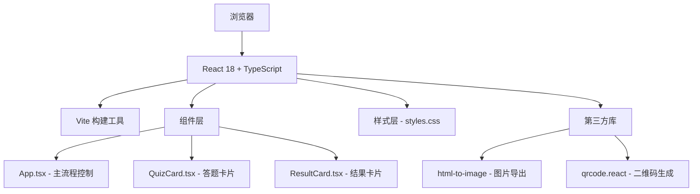

## 1. 架构设计



## 2. 技术描述
- **前端框架**：React 18 + TypeScript
- **构建工具**：Vite（支持热更新）
- **UI样式**：原生CSS（毛玻璃、渐变、动画、响应式）
- **第三方依赖**：
  - `react` / `react-dom` - 核心框架
  - `html-to-image` - 将DOM导出为PNG图片
  - `qrcode.react` - 生成分享二维码
- **无后端**：纯前端应用，所有逻辑在浏览器端完成

## 3. 文件结构
```
/
├── package.json          # 依赖配置与启动脚本
├── index.html            # 入口HTML，#root容器
├── tsconfig.json         # TypeScript严格模式配置
├── vite.config.js        # Vite构建配置
└── src/
    ├── main.tsx          # 应用入口，挂载组件与样式
    ├── App.tsx           # 主组件，状态管理与流程控制
    ├── QuizCard.tsx      # 答题卡片组件（翻转动画）
    ├── ResultCard.tsx    # 结果卡片组件（编辑/二维码/导出）
    └── styles.css        # 全局样式（毛玻璃/渐变/动画/响应式）
```

## 4. 组件状态设计

### App.tsx 状态
| 状态 | 类型 | 说明 |
|------|------|------|
| `stage` | `'welcome' \| 'quiz' \| 'result'` | 当前阶段 |
| `currentQuestion` | `number` | 当前题目索引（0-4） |
| `answers` | `number[]` | 用户选择的答案数组（0或1） |
| `resultTitle` | `string` | 结果标题（可编辑） |
| `gradientDirection` | `number` | 渐变方向索引（0-3） |
| `isFlipping` | `boolean` | 卡片是否正在翻转 |

### 数据结构
```typescript
interface Question {
  id: number;
  text: string;
  options: { text: string; weight: number }[];
}

interface PersonalityResult {
  title: string;
  description: string;
  gradientColors: string[];
}
```

## 5. 核心算法

### 5.1 性格结果计算
根据5道题的答案组合（共32种可能），映射到预设的性格类型，每种类型包含标题、描述和专属渐变配色。

### 5.2 渐变色方案
根据答案选择模式生成独特的颜色组合，从预设调色板中选取2种颜色形成渐变。

### 5.3 渐变方向预设
```typescript
const GRADIENT_DIRECTIONS = [
  'to right',      // 左→右
  'to bottom',     // 上→下
  'to bottom right', // 左上→右下
  'to top right',  // 左下→右上
];
```

## 6. 动画实现方案
- **卡片翻转**：CSS `transform: perspective + rotateY`，600ms过渡
- **切换过渡**：缩放(0.95→1) + 透明度(0→1)，100ms过渡
- **气泡粒子**：CSS `@keyframes float` 动画，随机位置、大小、延迟
- **按钮悬浮**：渐变位移 + box-shadow 增强

## 7. 性能优化
- 使用 CSS transform/opacity 触发 GPU 合成层，保证 55fps+
- 组件拆分减少不必要的重渲染
- 使用 `useCallback` / `useMemo` 优化性能
- 图片导出前先压缩画布尺寸
