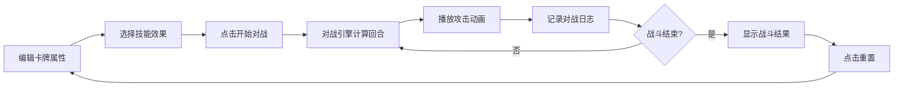

## 1. 产品概述

数字卡牌对战游戏编辑器，让玩家自定义红蓝双方卡牌属性并实时查看对战模拟效果。

- 主要用途：卡牌属性编辑、技能选择、对战模拟与日志记录
- 目标用户：卡牌游戏玩家、卡牌设计爱好者
- 产品价值：提供直观的卡牌编辑与对战预览体验，辅助卡牌平衡设计

## 2. 核心功能

### 2.1 用户角色

| 角色 | 注册方式 | 核心权限 |
|------|----------|----------|
| 普通玩家 | 无需注册 | 编辑卡牌、开始对战、查看日志、重置 |

### 2.2 功能模块

1. **卡牌编辑区**：红蓝双方卡牌属性编辑、技能选择、数值动画
2. **对战模拟区**：回合制对战展示、攻击动画、粒子爆炸效果
3. **对战日志**：逐回合详细记录、渐入动画、一键清除
4. **控制区**：开始对战按钮、重置按钮

### 2.3 页面详情

| 页面名称 | 模块名称 | 功能描述 |
|----------|----------|----------|
| 主页 | 卡牌编辑区 | 左侧分栏，编辑红蓝双方卡牌的名称、生命值、攻击力、技能 |
| 主页 | 对战模拟区 | 右侧分栏，展示双方卡牌对战动画与回合结果 |
| 主页 | 对战日志 | 对战面板下方，滚动显示逐回合战斗数据 |
| 主页 | 控制按钮 | 开始对战、重置功能 |

## 3. 核心流程

用户打开应用 → 编辑红蓝双方卡牌属性（名称/生命值/攻击力/技能）→ 点击"开始对战" → 对战引擎逐回合计算 → 对战面板播放攻击动画与粒子效果 → 对战日志逐行记录 → 战斗结束显示结果 → 可点击重置恢复初始状态

## 4. 用户界面设计

### 4.1 设计风格

- **主色调**：靛蓝（#0d1b2a）背景 + 金色（#ffd700）点缀
- **卡牌风格**：玻璃拟态毛玻璃效果（背景模糊15px，边框半透明白色）
- **按钮风格**：圆角矩形，hover发光边框效果
- **字体**：使用 Orbitron（标题）搭配 Roboto（正文），体现科幻感
- **布局风格**：左右分栏布局，中间垂直渐变分隔线
- **图标风格**：Lucide React 图标库

### 4.2 页面设计概览

| 页面名称 | 模块名称 | UI 元素 |
|----------|----------|---------|
| 主页 | 卡牌编辑区 | 玻璃拟态卡牌、数值输入框、技能选择器、流光特效 |
| 主页 | 对战模拟区 | 对战舞台、卡牌冲撞动画、Canvas 粒子爆炸 |
| 主页 | 对战日志 | 滚动列表、渐入动画、清除按钮 |
| 主页 | 控制区 | 金色发光按钮、重置按钮 |

### 4.3 响应式

- 桌面端（≥768px）：左右分栏布局
- 移动端（<768px）：上下布局，卡牌编辑器在上，对战模拟器在下

### 4.4 动效设计

- **数值变化**：数字跳动动画过渡
- **卡牌切换**：翻页效果
- **技能特效**：径向渐变循环流光（连击金色、吸血红色、护盾蓝色、灼烧橙色）
- **攻击动画**：卡牌向对方位置冲撞，800ms/回合
- **粒子爆炸**：50-80个粒子，颜色随阵营渐变，慢慢消失
- **日志条目**：渐入效果从上到下插入
- **重置动画**：卡牌旋转缩小恢复原状

