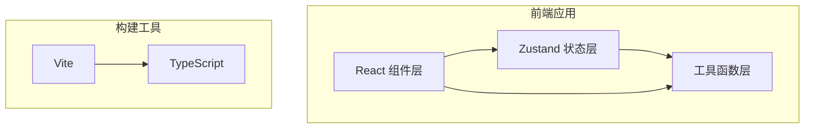

## 1. 架构设计



## 2. 技术描述

- **前端框架**：React 18 + TypeScript
- **构建工具**：Vite + @vitejs/plugin-react
- **状态管理**：Zustand
- **唯一ID生成**：uuid
- **样式方案**：纯 CSS（CSS Variables + Keyframes）
- **项目初始化**：vite-init react-ts 模板

## 3. 文件结构

| 文件路径 | 职责 | 调用关系 |
|----------|------|----------|
| `src/main.tsx` | 应用入口 | 渲染 App 组件 |
| `src/App.tsx` | 根组件，布局容器 | 组合 CardEditor + BattleSimulator |
| `src/components/CardEditor.tsx` | 卡牌编辑组件 | 从 gameStore 读取，调用 updateCard 方法 |
| `src/components/BattleSimulator.tsx` | 对战模拟组件 | 从 gameStore 读取数据，调用 battleEngine，渲染动画 |
| `src/store/gameStore.ts` | Zustand 状态仓库 | 存储卡牌数据、对战状态、日志，提供更新/重置方法 |
| `src/utils/battleEngine.ts` | 对战引擎 | 接收两张卡牌，计算回合结果数组 |
| `src/styles.css` | 全局样式 | 定义主题变量、动画关键帧 |
| `vite.config.js` | Vite 配置 | 构建配置 |
| `tsconfig.json` | TypeScript 配置 | 严格模式 |

## 4. 数据模型

### 4.1 卡牌类型

```typescript
interface Card {
  id: string;
  name: string;
  hp: number;
  maxHp: number;
  attack: number;
  skill: SkillType;
  side: 'red' | 'blue';
}

type SkillType = 'none' | 'combo' | 'lifesteal' | 'shield' | 'burn';
```

### 4.2 对战回合类型

```typescript
interface BattleRound {
  round: number;
  attacker: 'red' | 'blue';
  attackerName: string;
  defenderName: string;
  damage: number;
  defenderHpBefore: number;
  defenderHpAfter: number;
  skillTriggered?: SkillType;
  skillEffect?: string;
}
```

### 4.3 游戏状态

```typescript
interface GameState {
  redCard: Card;
  blueCard: Card;
  battleLogs: BattleRound[];
  isBattling: boolean;
  currentRound: number;
  winner: 'red' | 'blue' | null;
  updateCard: (side: 'red' | 'blue', updates: Partial<Card>) => void;
  startBattle: () => void;
  resetBattle: () => void;
  clearLogs: () => void;
}
```

## 5. 数据流向

1. **编辑阶段**：用户在 CardEditor 输入 → 调用 gameStore.updateCard() → 更新 state 中的卡牌数据 → CardEditor 重新渲染显示最新值
2. **对战阶段**：点击开始 → gameStore.startBattle() → 调用 battleEngine.simulate() → 生成回合结果数组 → 逐回合更新 state → BattleSimulator 播放动画 → 日志逐条添加
3. **重置阶段**：点击重置 → gameStore.resetBattle() → 恢复卡牌初始值、清空日志和状态 → 组件播放重置动画

## 6. 性能保障

- 数值变化使用 CSS 动画过渡，不阻塞主线程
- 粒子爆炸使用 Canvas 2D 绘制，通过 requestAnimationFrame 驱动
- 状态更新粒度小，避免不必要的重渲染
- 对战日志使用虚拟列表概念（固定高度容器 + 内部滚动）
