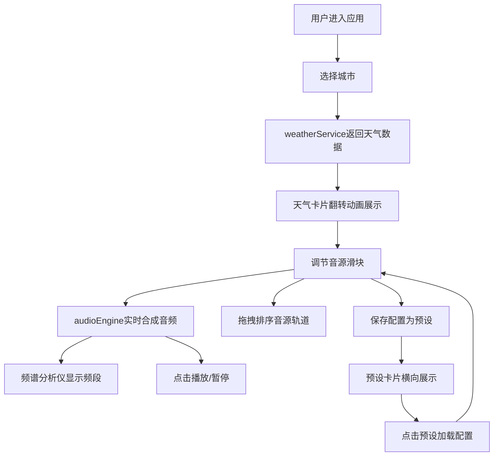

## 1. 产品概述

城市声音景观混音应用是一款基于用户地理位置和实时天气数据生成个性化环境音频的Web应用。用户可选择不同城市，根据模拟天气数据调节环境音源（雨声、风声、车流、鸟鸣、城市嗡鸣），实时混合成独特的音频片段并保存配置。

- 主要目的：为用户提供沉浸式的城市环境声音体验，通过可视化的音频合成界面创造个性化声音景观
- 目标用户：需要白噪音、环境音乐辅助工作或放松的用户，音频爱好者，城市文化探索者

## 2. 核心功能

### 2.1 功能模块

1. **主控制面板**：城市选择器、天气数据展示、播放控制、频谱可视化
2. **音源混音区**：五个环境音源轨道、垂直滑块音量调节、拖拽排序
3. **预设管理**：保存/加载混音配置、横向滚动预设卡片组

### 2.2 页面详情

| 页面名称 | 模块名称 | 功能描述 |
|-----------|-------------|---------------------|
| 主页面 | 城市选择器 | 输入城市名（预设5个城市），选择后展示天气数据卡片，翻转动画400ms |
| 主页面 | 天气数据卡片 | 毛玻璃效果展示温度、湿度、风速、天气类型 |
| 主页面 | 音源混音区 | 5个音源轨道（雨声/风声/车流/鸟鸣/城市嗡鸣），垂直滑块0-100%调节音量，渐变发光轨道，数字动画显示音量 |
| 主页面 | 频谱分析仪 | 实时显示混合音频频段分布（FFT=256），刷新率≥25fps |
| 主页面 | 拖拽排序 | 音源卡片可拖拽重排，半透明跟随鼠标，目标位置高亮蓝色边框，弹性动画落位 |
| 主页面 | 播放控制 | 圆环进度指示器，播放时旋转，停止时复位，图标平滑切换动画200ms |
| 主页面 | 预设管理 | 最多保存6个预设（城市+滑块值+轨道顺序），横向滚动卡片，加载时滑块0→目标值缓动过渡800ms |

## 3. 核心流程

用户进入应用 → 选择城市 → 系统返回模拟天气数据 → 展示天气卡片（翻转动画）→ 用户调节各音源滑块 → 实时音频合成与频谱显示 → 可拖拽排序音源轨道 → 点击播放/暂停 → 可保存当前配置为预设 → 点击预设卡片快速加载配置

## 4. 用户界面设计

### 4.1 设计风格

- **主色调**：深色主题 #0D1117（背景），各音源对应象征色（雨声-蓝、风声-青、车流-橙、鸟鸣-绿、城市嗡鸣-紫）
- **视觉效果**：毛玻璃卡片、渐变发光滑块、半透明渐变卡片背景、呼吸式亮度变化、上浮阴影悬停效果
- **字体**：现代无衬线字体，数字动画显示音量值
- **布局**：主面板16:9居中，三列布局（左：城市选择 | 中：音源混音 | 右：频谱分析）

### 4.2 页面设计概览

| 页面名称 | 模块名称 | UI元素 |
|-----------|-------------|-------------|
| 主页面 | 城市选择器 | 下拉输入框，预设列表，毛玻璃天气卡片，400ms翻转动画 |
| 主页面 | 音源混音区 | 5个垂直轨道卡片，渐变发光滑块，数字音量显示，可拖拽排序 |
| 主页面 | 频谱分析仪 | 右侧竖条频谱（FFT=256），25fps+刷新率 |
| 主页面 | 播放控制 | 圆环进度按钮，图标旋转+缩放动画200ms |
| 主页面 | 预设管理 | 底部横向可滚动卡片组，最多6个，800ms缓入加载动画 |

### 4.3 响应式设计

- **桌面端（≥768px）**：三列布局，音源滑块垂直显示
- **移动端（<768px）**：单列垂直排列，音源滑块横向显示，频谱缩小为底部横条

### 4.4 动画与交互

- 城市卡片切换：400ms翻转动画
- 播放按钮：图标旋转+缩放 200ms
- 预设加载：滑块值缓出过渡 800ms
- 音源卡片：悬停上浮阴影+微光脉冲，播放时根据频谱峰值呼吸式亮度变化
- 拖拽排序：半透明跟随，目标位置蓝色边框高亮，弹性动画落位
