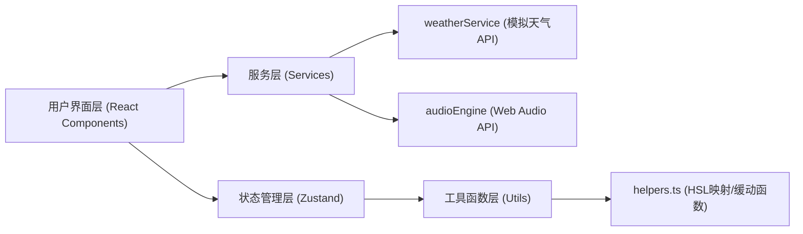

## 1. 架构设计



## 2. 技术描述

- **前端框架**：React 18 + TypeScript
- **构建工具**：Vite 5 + @vitejs/plugin-react
- **状态管理**：Zustand
- **音频处理**：Web Audio API（原生）
- **唯一ID生成**：uuid
- **样式方案**：原生CSS（CSS变量 + 关键帧动画）

## 3. 文件结构

| 文件路径 | 职责说明 |
|----------|----------|
| `/package.json` | 项目依赖与启动脚本配置 |
| `/index.html` | Vite入口HTML页面 |
| `/tsconfig.json` | TypeScript严格模式配置 |
| `/vite.config.js` | Vite构建配置（含React插件） |
| `/src/main.tsx` | React应用入口 |
| `/src/App.tsx` | 根组件，挂载MainPanel |
| `/src/modules/weather/weatherService.ts` | 模拟天气数据获取，返回温度/湿度/风速/天气类型 |
| `/src/modules/audio/audioEngine.ts` | Web Audio API封装，创建音源/连接音频链/调节音量滤波器 |
| `/src/components/MainPanel.tsx` | 主界面面板，城市选择+天气展示+音源混音+播放控制+频谱+预设 |
| `/src/components/SoundMixer.tsx` | 音源混音组件，滑块+音量显示+拖拽排序 |
| `/src/utils/helpers.ts` | HSL色值映射、缓动动画计算等工具函数 |
| `/src/styles/main.css` | 全局样式：深色主题、渐变背景、动画关键帧 |

## 4. 核心类型定义

```typescript
// 天气数据
interface WeatherData {
  city: string;
  temperature: number;
  humidity: number;
  windSpeed: number;
  weatherType: 'sunny' | 'cloudy' | 'rainy' | 'windy' | 'foggy';
}

// 音源类型
type SoundSourceType = 'rain' | 'wind' | 'traffic' | 'birds' | 'hum';

interface SoundTrack {
  id: string;
  type: SoundSourceType;
  name: string;
  volume: number;
  color: string;
}

// 预设配置
interface Preset {
  id: string;
  name: string;
  city: string;
  tracks: SoundTrack[];
  createdAt: number;
}

// 应用状态
interface AppState {
  currentCity: string;
  weatherData: WeatherData | null;
  tracks: SoundTrack[];
  isPlaying: boolean;
  presets: Preset[];
  selectedPresetId: string | null;
}
```

## 5. 数据流向

### 5.1 天气数据流向
```
MainPanel.tsx → 调用 weatherService.getWeather(city) 
    → 返回 WeatherData 
    → 更新 Zustand state 
    → MainPanel 渲染天气卡片（翻转动画）
```

### 5.2 音频数据流向
```
SoundMixer.tsx (滑块调节/拖拽排序)
    → 更新 Zustand tracks state
    → MainPanel.tsx 监听 tracks 变化
    → 调用 audioEngine.setVolume / audioEngine.setPan
    → Web Audio API 实时处理
    → 输出到音频设备 + AnalyserNode (频谱分析)
```

### 5.3 预设保存/加载流向
```
保存：MainPanel 点击保存按钮
    → 收集 city + tracks + trackOrder
    → 生成 Preset (uuid)
    → 存入 presets 数组（最多6个）
    → 底部预设卡片组渲染

加载：点击预设卡片
    → 获取预设配置
    → 城市切换 → weatherService 获取数据
    → 滑块值从0缓出过渡到目标值（800ms）
    → 音频参数同步更新
```

## 6. 性能优化策略

| 优化点 | 方案 |
|--------|------|
| 音频延迟 | 使用 Web Audio API 的 AudioParam 线性/指数过渡，确保响应延迟 < 50ms |
| FFT帧率 | requestAnimationFrame 驱动 AnalyserNode.getByteFrequencyData，目标 30fps+ |
| UI帧率 | CSS transform/opacity 动画，避免重排；滑块使用 onInput 即时响应 |
| 拖拽性能 | 使用 Pointer Events，位置更新走 transform，避免频繁 setState |
| 状态更新 | Zustand 选择器精确订阅，避免不必要的重渲染 |

## 7. 音频合成方案

- **雨声**：白噪声 → 低通滤波器（动态截止频率）→ GainNode
- **风声**：粉噪声 → 带通滤波器（动态Q值）→ GainNode
- **车流**：棕色噪声 → 低通滤波器 → 周期性振幅调制 → GainNode
- **鸟鸣**：正弦波振荡器 → 频率包络（随机跳变）→ GainNode
- **城市嗡鸣**：多个低频振荡器叠加 → 低通滤波器 → GainNode
- **主输出链**：各音源 GainNode → 声道分配（PanNode，按轨道顺序）→ 主 GainNode → AnalyserNode → Destination
