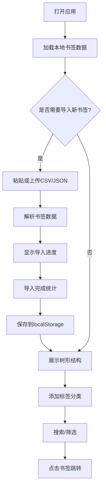

## 1. 产品概述

书签管理器是一个帮助用户统一管理多浏览器书签的Web应用，解决书签分散在Chrome、Firefox、Safari中难以集中管理和高效检索的痛点。

- 主要目标：提供统一的书签导入、分类、搜索和分享功能
- 目标用户：经常使用多个浏览器、需要高效管理大量书签的用户
- 市场价值：提升书签管理效率，避免重复收藏，快速定位所需网页

## 2. 核心功能

### 2.1 用户角色
| 角色 | 注册方式 | 核心权限 |
|------|----------|----------|
| 普通用户 | 无需注册，本地存储 | 导入、管理、搜索、分类书签 |

### 2.2 功能模块
1. **导入模块**：支持粘贴导入或CSV/JSON文件上传，自动解析书签数据
2. **展示模块**：树形结构展示文件夹层级，卡片/列表双视图切换
3. **标签模块**：为书签和文件夹添加标签，支持按标签筛选
4. **搜索模块**：全文本搜索，实时搜索建议，关键词高亮
5. **存储模块**：本地localStorage持久化存储

### 2.3 页面详情
| 页面名称 | 模块名称 | 功能描述 |
|----------|----------|----------|
| 主页面 | 导入区域 | 支持粘贴导入和文件上传，显示导入进度条和统计模态窗 |
| 主页面 | 左侧侧边栏 | 展示文件夹树形结构和标签列表，支持筛选 |
| 主页面 | 主内容区 | 书签卡片网格/列表视图，支持拖拽归类 |
| 主页面 | 顶部搜索栏 | 实时搜索，显示搜索建议，关键词高亮 |

## 3. 核心流程

用户打开应用 → 从浏览器导出书签文件 → 粘贴或上传导入 → 系统解析并展示 → 用户添加标签分类 → 搜索或筛选查找 → 点击跳转目标网页

## 4. 用户界面设计

### 4.1 设计风格
- **主色调**：深靛蓝背景 (#1a1a2e)，浅蓝点缀 (#4a90d9)，金色强调 (#f0a500)
- **主题**：深色模式，科技感，毛玻璃效果
- **字体**：现代无衬线字体，清晰易读
- **布局**：左侧25%侧边栏 + 右侧75%主内容区
- **圆角**：卡片圆角12px，标签圆角
- **阴影**：细微阴影，悬停时加深上浮
- **动画**：所有交互300ms CSS过渡，平滑流畅

### 4.2 页面设计概述
| 页面名称 | 模块名称 | UI元素 |
|----------|----------|--------|
| 主页面 | 进度条 | 渐变蓝色填充，百分比显示 |
| 主页面 | 导入模态窗 | 毛玻璃效果，缩放淡出动画 |
| 主页面 | 树形节点 | 展开/折叠三角图标，180度旋转动画 |
| 主页面 | 书签卡片 | favicon、标题、域名、日期，悬停上移2px |
| 主页面 | 标签 | 圆角彩色方块，哈希生成HSL颜色 |
| 主页面 | 搜索框 | 顶部居中，实时搜索建议，关键词高亮 |
| 主页面 | 视图切换 | 网格/列表平滑过渡动画 |

### 4.3 响应式设计
- **桌面端**（≥768px）：左侧25%侧边栏 + 右侧75%主内容区，网格默认每行4个卡片
- **移动端**（<768px）：侧边栏折叠为汉堡菜单，点击从左侧滑出，半透明遮罩覆盖主内容区
- **触摸优化**：增大点击区域，支持触摸滑动手势

### 4.4 动画细节
- 导入进度条：渐变蓝色从左到右填充
- 模态窗关闭：缩放0.9 + 淡出
- 树形展开：三角图标180度旋转
- 卡片悬停：背景浅灰 + 上移2px + 阴影加深
- 筛选动画：从右向左滑动过渡
- 搜索结果：淡入动画显示
- 视图切换：网格卡片平滑过渡为列表行
