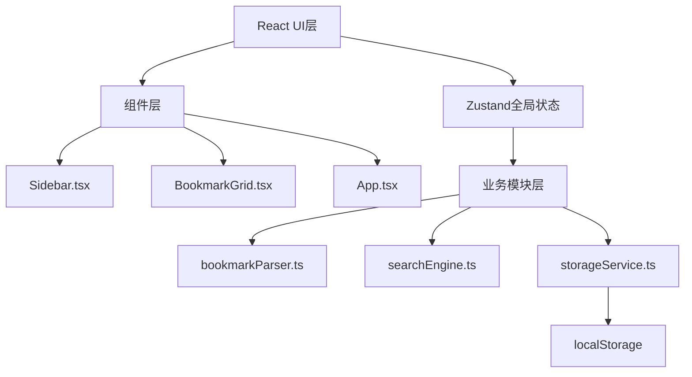
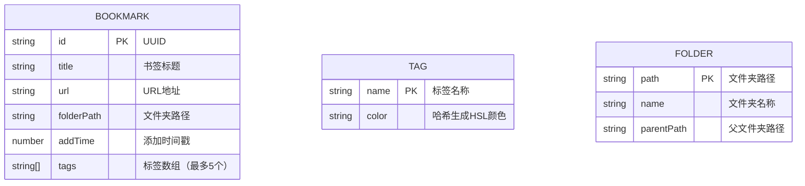

## 1. 架构设计



## 2. 技术描述

- **前端框架**：React 18 + TypeScript
- **构建工具**：Vite + @vitejs/plugin-react
- **状态管理**：Zustand
- **唯一ID生成**：uuid
- **数据存储**：浏览器localStorage
- **样式方案**：CSS Modules / 内联样式（CSS变量定义主题）

## 3. 项目结构

```
auto43/
├── package.json
├── index.html
├── tsconfig.json
├── vite.config.js
└── src/
    ├── App.tsx
    ├── store.ts
    ├── modules/
    │   ├── parser/
    │   │   └── bookmarkParser.ts
    │   ├── search/
    │   │   └── searchEngine.ts
    │   └── storage/
    │       └── storageService.ts
    └── components/
        ├── Sidebar.tsx
        └── BookmarkGrid.tsx
```

## 4. 数据模型

### 4.1 书签数据结构



### 4.2 TypeScript 类型定义

```typescript
interface Bookmark {
  id: string;
  title: string;
  url: string;
  folderPath: string;
  addTime: number;
  tags: string[];
}

interface Tag {
  name: string;
  color: string;
}

interface FilterState {
  folderPath: string | null;
  tagName: string | null;
  searchQuery: string;
}

interface AppState {
  bookmarks: Bookmark[];
  tags: Tag[];
  filter: FilterState;
  viewMode: 'grid' | 'list';
}
```

## 5. 模块职责

### 5.1 bookmarkParser.ts
- `parseBookmarksCSV(content: string): Bookmark[]` - 解析CSV格式书签
- `parseBookmarksJSON(content: string): Bookmark[]` - 解析JSON格式书签
- 自动提取标题、URL、添加时间、文件夹路径
- 标准化数据格式，生成唯一ID

### 5.2 searchEngine.ts
- `buildIndex(bookmarks: Bookmark[]): void` - 构建倒排索引
- `search(query: string): string[]` - 搜索并返回相关书签ID列表
- 关键词分词 + 前缀匹配
- 按相关度排序

### 5.3 storageService.ts
- `saveBookmarks(bookmarks: Bookmark[]): void` - 保存书签到localStorage
- `loadBookmarks(): Bookmark[]` - 从localStorage加载书签
- `saveTags(tags: Tag[]): void` - 保存标签
- `loadTags(): Tag[]` - 加载标签
- 调用parser模块解析导入数据

### 5.4 store.ts (Zustand)
- 状态：bookmarks, tags, filter, searchQuery, viewMode
- 方法：setFilter, setSearch, toggleView, addBookmarks, updateBookmark

### 5.5 Sidebar.tsx
- 渲染文件夹树形结构（可折叠）
- 渲染标签列表
- 触发筛选事件，通过props回调传递筛选条件
- 汉堡菜单（移动端）

### 5.6 BookmarkGrid.tsx
- 渲染书签卡片网格或列表视图
- 拖拽排序和归类
- 每个卡片显示favicon、标题、域名、日期、标签
- 视图切换动画

### 5.7 App.tsx
- 主应用组件
- 初始化加载storage数据
- 管理筛选和搜索状态
- 组合Sidebar和BookmarkGrid
- 导入功能（粘贴/文件上传）
- 进度条和导入统计模态窗

## 6. 性能指标

| 指标 | 目标 |
|------|------|
| 搜索响应（5000条内） | ≤ 100ms |
| 树结构渲染（500节点内） | ≤ 500ms |
| 拖拽帧率 | ≥ 50fps |
| 动画过渡 | 300ms CSS transition |

## 7. 性能优化策略

1. **搜索优化**：倒排索引 + 前缀匹配 + 记忆化搜索结果
2. **渲染优化**：React.memo + 虚拟滚动（大数据量）
3. **状态优化**：Zustand选择性订阅避免不必要重渲染
4. **动画优化**：CSS transform + opacity 硬件加速
5. **存储优化**：分片存储，增量更新
