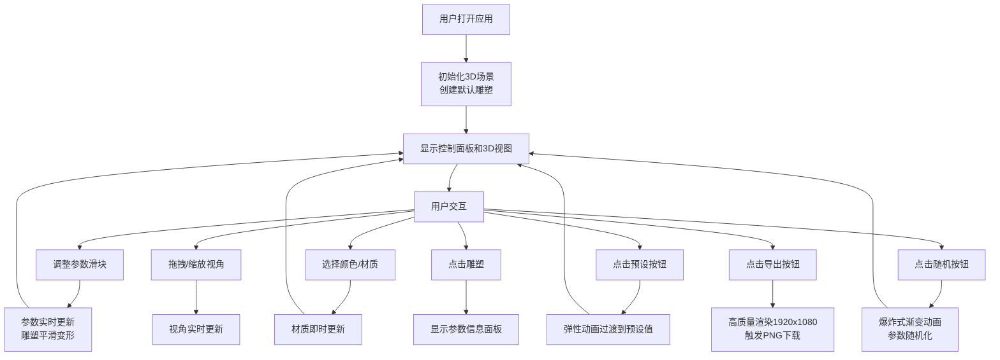

## 1. 产品概述

参数化3D雕塑生成与交互展示应用，为数字艺术家和创意工作者提供在浏览器中通过调整参数实时生成和变换抽象3D雕塑的能力。用户可以通过直观的滑块和色彩选择器控制几何体的形态、材质和光线，在3D场景中实时预览效果，并导出高质量的创作成果。

- 主要用途：为3D艺术创作提供参数化设计工具，降低3D建模门槛
- 目标用户：数字艺术家、设计师、创意爱好者、教育工作者
- 市场价值：填补浏览器端实时参数化3D雕塑工具的空白，提供流畅的创作体验

## 2. 核心功能

### 2.1 用户角色
| 角色 | 注册方式 | 核心权限 |
|------|----------|----------|
| 普通用户 | 无需注册 | 使用所有创作功能、导出图片 |

### 2.2 功能模块
1. **主界面**：左侧控制面板 + 右侧3D视图
2. **雕塑参数控制**：6个形态参数滑块（细分程度、扭曲强度、扩张半径、垂直拉伸、顶部收缩、旋转偏移）
3. **材质与色彩控制**：颜色选择器、金属质感滑块、粗糙度滑块
4. **光照系统**：环境光与点光源动态切换
5. **视角控制**：鼠标拖拽旋转、滚轮缩放（OrbitControls）
6. **预设与随机化**：4个预设形态按钮 + 随机生成按钮
7. **信息面板**：点击雕塑显示所有参数的毛玻璃面板
8. **导出功能**：1920x1080分辨率PNG图片导出

### 2.3 页面详情
| 页面名称 | 模块名称 | 功能描述 |
|----------|----------|----------|
| 主界面 | 控制面板 | 左侧320px宽深色半透明毛玻璃面板，包含所有控制元素，支持滚动 |
| 主界面 | 3D视图区 | 右侧全屏Three.js渲染画布，实时显示雕塑 |
| 主界面 | 信息弹出层 | 点击雕塑时显示所有参数数值的毛玻璃面板 |
| 主界面 | 工具栏 | 预设按钮、随机按钮、导出按钮 |

## 3. 核心流程

## 4. 用户界面设计

### 4.1 设计风格
- **主色调**：深色主题，背景#1a1a2e，卡片背景rgba(255,255,255,0.1)
- **强调色**：滑块轨道从蓝到紫渐变，预设按钮青色(#00d4ff)，随机按钮橙色(#ff6b35)
- **文字颜色**：淡灰色(#e0e0e0)，保证对比度
- **按钮样式**：圆角设计，悬停时缩放1.05倍并改变透明度，200ms缓动过渡
- **字体**：使用Space Grotesk作为标题字体，Inter作为正文字体
- **布局风格**：左右分栏，卡片式分组，毛玻璃效果（backdrop-filter: blur）
- **图标**：使用lucide-react图标库，线性风格

### 4.2 页面设计概述
| 页面名称 | 模块名称 | UI元素 |
|----------|----------|----------|
| 主界面 | 控制面板 | 深色半透明毛玻璃背景，320px宽度，内部分组卡片，圆角+微弱投影 |
| 主界面 | 滑块组件 | 渐变色轨道（蓝→紫），圆形拖拽手柄带发光环，实时数值显示 |
| 主界面 | 颜色选择器 | 圆形色轮设计 |
| 主界面 | 预设按钮 | 青色主题，不同图标，悬停缩放动画 |
| 主界面 | 随机按钮 | 橙色主题，特殊图标，悬停缩放动画 |
| 主界面 | 导出按钮 | 按压反馈动画，带下载图标 |
| 主界面 | 信息面板 | 毛玻璃效果，显示所有参数数值 |
| 主界面 | 3D视图区 | 全屏画布，深色背景，雕塑居中 |

### 4.3 响应式设计
- **桌面优先**：默认左右分栏布局
- **小屏适配**：控制面板折叠为可展开侧栏（宽度<768px时）
- **触摸优化**：滑块和按钮增加触摸区域，支持触摸手势控制视角
- **滚动支持**：控制面板内部垂直滚动，适配内容超出高度的情况

### 4.4 3D场景指南
- **环境与氛围**：深色太空感背景，点缀微弱星点，营造沉浸式创作环境
- **光照设置**：环境光(AmbientLight)提供基础照明，两个点光源(PointLight)从不同角度照射，支持动态开关
- **相机设置**：PerspectiveCamera，初始位置距离雕塑3个单位，fov=60度
- **相机运动**：OrbitControls支持拖拽旋转、滚轮缩放，禁用平移，限制俯仰角范围
- **构图与焦点**：雕塑始终位于场景中心，使用网格辅助线可选显示
- **交互与动画**：参数变化时雕塑平滑插值过渡（lerp），随机按钮触发爆炸式粒子效果，预设切换使用弹性缓动
- **后期处理**：可选的抗锯齿(MSAA)，导出时启用超采样提高质量
- **性能预算**：几何体顶点数控制在10000-50000之间，确保30fps以上帧率
