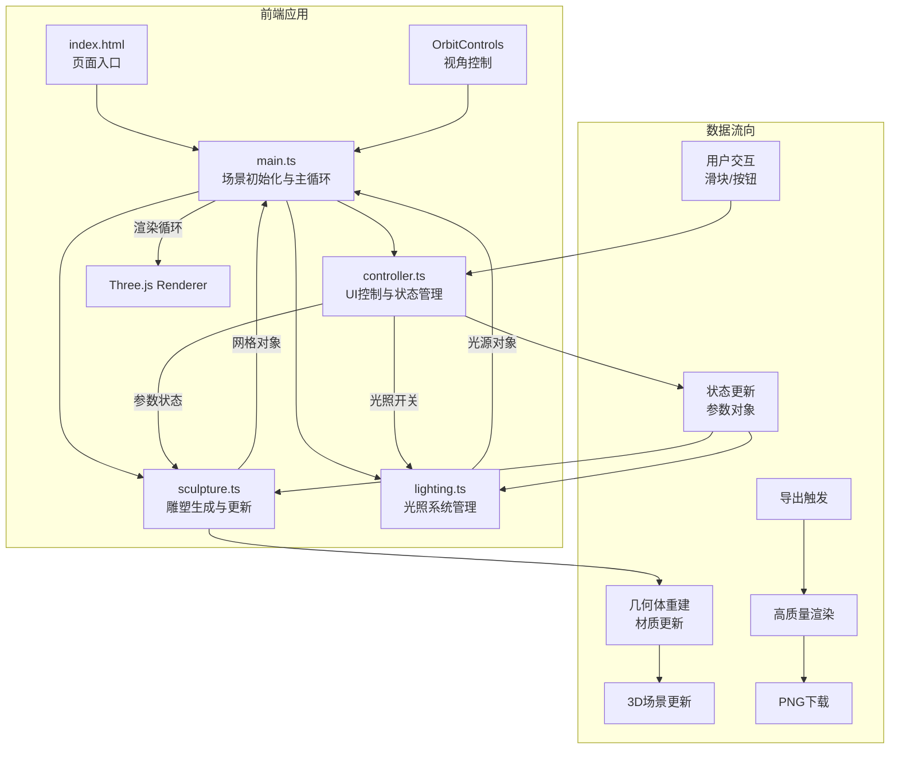

## 1. 架构设计



## 2. 技术描述

- **前端框架**：原生TypeScript + Three.js（无需React/Vue，按用户需求）
- **构建工具**：Vite 5.x
- **3D引擎**：Three.js 0.160.x + @types/three
- **类型系统**：TypeScript 5.x，严格模式
- **样式方案**：原生CSS + CSS变量，毛玻璃效果使用backdrop-filter
- **图标库**：lucide-react（通过CDN或内联SVG）
- **状态管理**：自定义事件系统 + 观察者模式，controller.ts作为状态源
- **动画系统**：requestAnimationFrame驱动，使用lerp进行平滑插值

## 3. 路由定义
| 路由 | 用途 |
|------|------|
| / | 主应用页面（单页应用，无多路由） |

## 4. 数据模型

### 4.1 雕塑参数类型定义
```typescript
interface SculptureParams {
  // 形态参数
  subdivision: number;      // 细分程度 (8-64)
  twistIntensity: number;   // 扭曲强度 (0-3)
  expansionRadius: number;  // 扩张半径 (0.5-3)
  verticalStretch: number;  // 垂直拉伸 (0.5-3)
  topContraction: number;   // 顶部收缩 (0-1)
  rotationOffset: number;   // 旋转偏移 (0-360度)
  
  // 材质参数
  baseColor: string;        // 基础颜色 (hex)
  metalness: number;        // 金属质感 (0-1)
  roughness: number;        // 粗糙度 (0-1)
  
  // 光照参数
  ambientLightOn: boolean;  // 环境光开关
  pointLightOn: boolean;    // 点光源开关
}
```

### 4.2 预设形态数据
```typescript
interface Preset {
  id: string;
  name: string;
  icon: string;
  color: string;
  params: Partial<SculptureParams>;
}

const presets: Preset[] = [
  { id: 'spiral', name: '螺旋塔', icon: '🌀', color: '#00d4ff', params: { ... } },
  { id: 'ripple', name: '波纹球', icon: '🔮', color: '#00d4ff', params: { ... } },
  { id: 'twist', name: '扭曲环', icon: '💫', color: '#00d4ff', params: { ... } },
  { id: 'nebula', name: '星云簇', icon: '✨', color: '#00d4ff', params: { ... } },
];
```

## 5. 文件结构与调用关系

```
d:\P\tasks\auto44\
├── package.json
├── vite.config.js
├── tsconfig.json
├── index.html
└── src/
    ├── main.ts          # 主入口：初始化场景→加载控制器→加载雕塑→启动渲染循环
    │                   # 调用关系：import controller, sculpture, lighting
    │                   # 数据流向：controller.state → sculpture.update()
    ├── controller.ts    # UI控制器：监听DOM事件→维护状态→通知订阅者
    │                   # 调用关系：被main.ts导入，无内部模块依赖
    │                   # 数据流向：用户交互 → 状态更新 → 回调通知main.ts
    ├── sculpture.ts     # 雕塑生成器：根据参数创建/更新BufferGeometry和Mesh
    │                   # 调用关系：被main.ts导入，依赖Three.js
    │                   # 数据流向：接收参数 → 重建几何体 → 返回Mesh
    └── lighting.ts      # 光照管理器：创建和管理环境光、点光源
                        # 调用关系：被main.ts导入，依赖Three.js
                        # 数据流向：接收开关状态 → 更新光源可见性
```

## 6. 核心实现方案

### 6.1 雕塑生成算法
- 使用Three.js的IcosahedronGeometry或自定义参数化几何体
- 对顶点应用扭曲变换：`vertex.applyAxisAngle(upAxis, twistAmount * vertex.y)`
- 径向扩张：根据高度函数调整顶点到中心的距离
- 顶部收缩：使用指数函数控制顶部半径收缩
- 所有变换在Shader中实现或在CPU端更新BufferGeometry的position属性

### 6.2 性能优化策略
- 几何体复用：更新时只修改position属性，不重建整个Geometry
- 使用BufferGeometry而非Geometry
- 材质使用MeshStandardMaterial，启用flatShading可选
- 参数变化时使用lerp平滑过渡，避免每帧重建
- 限制几何体顶点数，细分程度最大64

### 6.3 动画系统
- 预设切换：使用自定义弹性缓动函数，持续时间800ms
- 随机动画：生成爆炸式粒子效果，使用临时Points对象
- 平滑变形：参数值使用lerp插值，每帧更新目标值的10%
- 所有动画基于requestAnimationFrame，与渲染循环同步

### 6.4 导出功能实现
- 临时设置渲染器尺寸为1920x1080
- 启用抗锯齿和更高的像素比
- 渲染一帧后将canvas转为dataURL
- 创建a标签触发下载
- 恢复原渲染器设置
