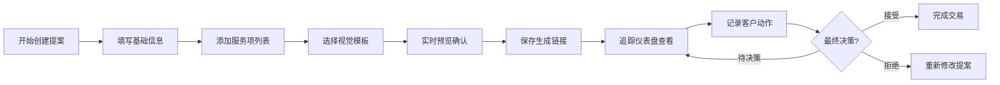

## 1. 产品概述
面向自由职业者的项目提案生成与客户沟通追踪应用，帮助自由职业者快速创建专业提案并追踪客户反馈决策流程。
- 解决问题：自由职业者缺乏专业提案工具，难以高效管理提案创建、客户沟通和状态追踪
- 目标用户：独立设计师、开发者、咨询师等自由职业者
- 产品价值：提升专业形象，简化提案制作流程，系统化客户沟通管理

## 2. 核心功能

### 2.1 用户角色
| 角色 | 注册方式 | 核心权限 |
|------|----------|----------|
| 自由职业者 | 无需注册（本地存储） | 创建/编辑提案，管理服务项，查看追踪仪表盘，记录客户动作 |

### 2.2 功能模块
1. **提案创建页**：提案表单、动态服务列表、实时预览、模板切换、分享链接生成
2. **追踪仪表盘**：提案卡片网格、搜索过滤、状态概览
3. **提案详情追踪页**：提案摘要、客户动作时间线、状态更新

### 2.3 页面详情
| 页面名称 | 模块名称 | 功能描述 |
|----------|----------|----------|
| 提案创建页 | 提案基础信息表单 | 标题、客户名称、模板选择输入 |
| 提案创建页 | 动态服务列表 | 最多10条服务项，增删带动画，自动计算小计与总价 |
| 提案创建页 | 实时预览卡片 | 跟随表单更新，模板切换带淡入淡出动画 |
| 提案创建页 | 分享链接模块 | 生成唯一链接，一键复制带反馈提示 |
| 追踪仪表盘 | 卡片网格 | 所有提案卡片展示，悬浮动效 |
| 追踪仪表盘 | 搜索过滤 | 按标题/客户搜索，按状态筛选 |
| 提案详情页 | 摘要区域 | 标题、金额、模板类型展示 |
| 提案详情页 | 时间线 | 客户动作倒序展示，节点高亮 |

## 3. 核心流程
用户创建新提案 → 填写基础信息 → 添加服务项目 → 选择视觉模板 → 实时预览确认 → 保存并生成分享链接 → 发送给客户 → 在追踪仪表盘查看状态 → 记录客户查看/反馈/决策 → 完成交易或重新修改提案

## 4. 用户界面设计

### 4.1 设计风格
- 主色：三模板切换（简约白/商务蓝/创意橙），整体采用毛玻璃质感
- 辅色：状态标签色（已发送灰蓝#64748b、已查看浅绿#10b981、已反馈琥珀#f59e0b、已决策靛蓝#6366f1）
- 按钮样式：圆角设计，悬停颜色加深+轻微上浮，点击内阴影下沉
- 字体：使用Playfair Display标题字 + Source Sans Pro正文字的精致组合
- 布局风格：顶部横条导航栏+毛玻璃背景，内容区左右20%留白，卡片式布局带阴影层次
- 图标风格：lucide-react线性图标，统一20px尺寸

### 4.2 页面设计概述
| 页面名称 | 模块名称 | UI元素 |
|----------|----------|--------|
| 提案创建页 | 表单区 | 毛玻璃输入框，焦点发光，校验失败颤动，40%宽度左栏 |
| 提案创建页 | 预览区 | 圆角阴影卡片，悬浮层次感，55%宽度右栏，模板淡入淡出400ms |
| 追踪仪表盘 | 卡片网格 | 悬浮上移4px+阴影加深，状态标签变色，响应式布局 |
| 提案详情页 | 时间线 | 竖线连接圆形节点，最新动作高亮，倒序排列 |

### 4.3 响应式
- 桌面优先设计，移动端（<768px）编辑页左右布局变上下堆叠
- 卡片网格在平板变为2列，移动端1列
- 导航栏在移动端汉堡菜单收缩

### 4.4 动画性能
- 服务项增删：弹性动画插入移除
- 总金额更新：计数器动画，帧率≥30fps
- 模板切换：预览区淡入淡出400ms
- 复制成功：底部提示条滑入渐出
