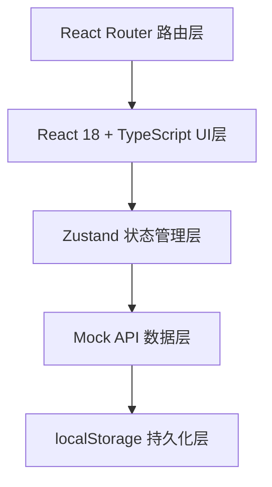
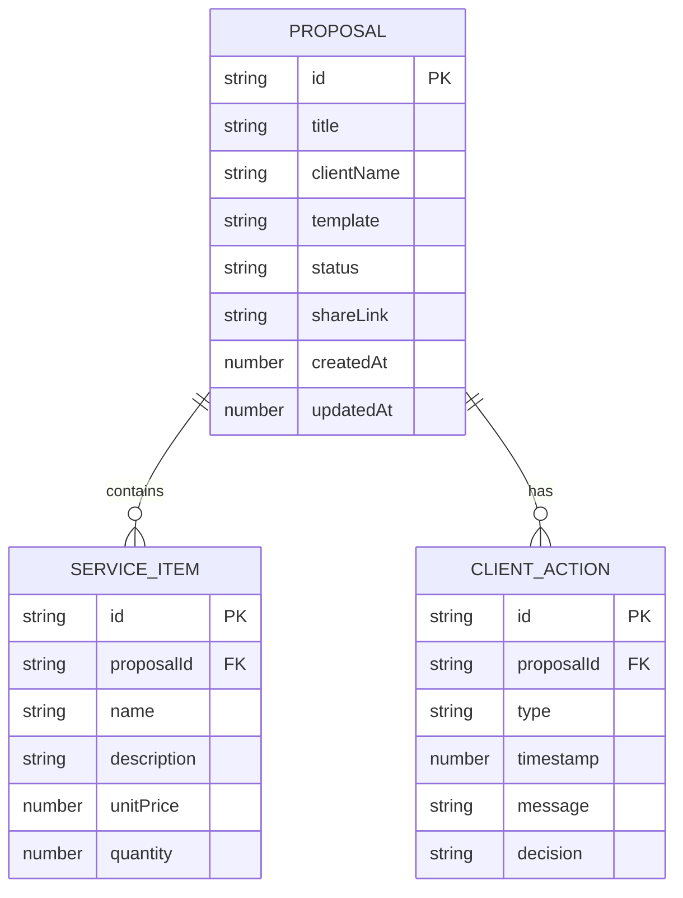

## 1. 架构设计



## 2. 技术说明
- 前端：React@18 + TypeScript@5 + Vite@5
- 路由：react-router-dom@6
- 状态管理：zustand@4
- 唯一ID：uuid@9
- 构建工具：Vite@5 + @vitejs/plugin-react
- 数据持久化：localStorage 模拟后端
- 样式：原生CSS + CSS Modules/全局样式，无UI框架

## 3. 路由定义
| 路由 | 用途 |
|------|------|
| / | 重定向至提案创建页 |
| /proposal | 提案创建与编辑主页面 |
| /proposal/:id | 编辑指定ID的提案 |
| /tracking | 客户沟通追踪仪表盘 |
| /tracking/:id | 指定提案的详情追踪页面 |

## 4. API 定义

### 4.1 核心类型
```typescript
type TemplateType = 'minimal' | 'business' | 'creative';
type ProposalStatus = 'sent' | 'viewed' | 'feedback' | 'decided';
type DecisionResult = 'accepted' | 'rejected' | 'pending';

interface ServiceItem {
  id: string;
  name: string;
  description: string;
  unitPrice: number;
  quantity: number;
}

interface ClientAction {
  id: string;
  type: 'view' | 'feedback' | 'decision';
  timestamp: number;
  message?: string;
  decision?: DecisionResult;
}

interface Proposal {
  id: string;
  title: string;
  clientName: string;
  template: TemplateType;
  services: ServiceItem[];
  status: ProposalStatus;
  shareLink: string;
  createdAt: number;
  updatedAt: number;
  actions: ClientAction[];
}
```

### 4.2 异步API函数
```typescript
// 提案CRUD
getProposals(): Promise<Proposal[]>
getProposalById(id: string): Promise<Proposal | null>
createProposal(data: Omit<Proposal, 'id' | 'createdAt' | 'updatedAt' | 'shareLink' | 'status' | 'actions'>): Promise<Proposal>
updateProposal(id: string, data: Partial<Proposal>): Promise<Proposal | null>
deleteProposal(id: string): Promise<boolean>

// 状态与反馈
updateProposalStatus(id: string, status: ProposalStatus): Promise<Proposal | null>
addClientAction(proposalId: string, action: Omit<ClientAction, 'id' | 'timestamp'>): Promise<Proposal | null>

// 搜索过滤
searchProposals(keyword: string, status?: ProposalStatus): Promise<Proposal[]>
```

## 5. 数据模型

### 5.1 ER图


### 5.2 localStorage存储结构
```json
{
  "proposals": [
    {
      "id": "uuid-string",
      "title": "提案标题",
      "clientName": "客户名称",
      "template": "minimal",
      "services": [
        {"id": "uuid", "name": "服务名", "description": "...", "unitPrice": 100, "quantity": 10}
      ],
      "status": "sent",
      "shareLink": "https://share.example.com/xxxxx",
      "createdAt": 1718764800000,
      "updatedAt": 1718764800000,
      "actions": [
        {"id": "uuid", "type": "view", "timestamp": 1718764900000}
      ]
    }
  ]
}
```

## 6. 项目文件结构
```
d:\P\tasks\auto45/
├── package.json
├── index.html
├── tsconfig.json
├── vite.config.js
└── src/
    ├── main.tsx
    ├── App.tsx
    ├── api/
    │   └── mockApi.ts
    ├── modules/
    │   ├── proposal/
    │   │   ├── types.ts
    │   │   ├── ProposalManager.tsx
    │   │   ├── ServiceItemForm.tsx
    │   │   ├── ProposalPreview.tsx
    │   │   └── TemplateSelector.tsx
    │   └── tracking/
    │       ├── TrackingDashboard.tsx
    │       ├── ProposalCard.tsx
    │       ├── ProposalDetail.tsx
    │       └── Timeline.tsx
    ├── hooks/
    │   ├── useAnimatedCounter.ts
    │   └── useToast.ts
    ├── store/
    │   └── useProposalStore.ts
    └── styles/
        └── globals.css
```
