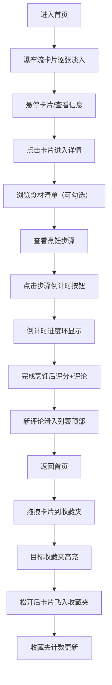

## 1. 产品概述

家庭食谱收藏与分享平台，让家人朋友可以上传拿手菜的详细做法、食材清单和烹饪步骤，支持打分点评并生成可分享的食谱卡片。

- 核心目的：建立家庭专属的美食知识库，传承家的味道
- 目标用户：家庭成员、亲密朋友、美食爱好者
- 产品价值：通过数字化方式保存和分享家庭食谱，增强家人间的情感连接

## 2. 核心功能

### 2.1 用户角色
| 角色 | 注册方式 | 核心权限 |
|------|----------|----------|
| 普通用户 | 无需注册，访客模式 | 浏览食谱、查看详情、添加评论、创建收藏夹、拖拽收藏 |

### 2.2 功能模块
1. **首页瀑布流**：食谱卡片网格展示、逐张淡入动画、悬停交互、点击进入详情
2. **食谱详情页**：大图展示、食材清单（可勾选）、烹饪步骤（带倒计时）、评论区（星级评分）
3. **收藏夹系统**：侧边抽屉、多收藏夹管理、拖拽收藏、飞入动画

### 2.3 页面详情
| 页面名称 | 模块名称 | 功能描述 |
|---------|----------|----------|
| 首页 | 瀑布流网格 | 展示所有公开食谱，卡片含缩略图、作者、星级、收藏数，支持拖拽起始 |
| 首页 | 顶部导航 | 品牌Logo、收藏夹切换按钮、搜索入口 |
| 首页 | 收藏夹抽屉 | 显示用户创建的收藏夹列表，支持拖拽放置目标高亮 |
| 详情页 | 大图占位区 | 展示食谱封面大图，支持返回首页 |
| 详情页 | 食材列表 | 显示所需食材，支持勾选核对已准备 |
| 详情页 | 烹饪步骤区 | 分步骤展示做法，每步带倒计时按钮和进度环 |
| 详情页 | 评论区域 | 星级评分输入、文字评论输入、评论列表滑动动画 |

## 3. 核心流程

用户浏览首页瀑布流 → 悬停卡片查看详情 → 点击进入食谱详情 → 浏览食材和步骤 → 使用倒计时辅助烹饪 → 打分并写评论 → 返回首页 → 拖拽卡片到侧边收藏夹 → 收藏成功

## 4. 用户界面设计

### 4.1 设计风格
- **主色调**：淡橙色（#FFB380）、米白色（#FFF8F0）
- **辅助色**：暖棕色（#8B5A2B）、浅灰色（#F5F0EB）
- **按钮风格**：圆润边角（16px）、柔和阴影、悬停微微上浮
- **卡片风格**：圆角20px、双层阴影、悬停阴影加深
- **字体**：标题使用手写体（Ma Shan Zheng），正文使用温暖无衬线字体（Noto Sans SC）
- **图标风格**：线性图标，暖色调填充

### 4.2 页面设计概述
| 页面名称 | 模块名称 | UI元素 |
|---------|----------|--------|
| 首页 | 瀑布流网格 | 多列布局、卡片逐张淡入延迟动画、悬停transform translateY(-4px)、阴影加深 |
| 首页 | 收藏夹抽屉 | 右侧滑出、半透明遮罩、收藏夹项圆角、拖拽时边框高亮橙色 |
| 详情页 | 食材列表 | 复选框自定义样式、勾选后文字删除线、食材项间距舒适 |
| 详情页 | 烹饪步骤 | 步骤序号圆形徽章、倒计时按钮圆环进度、按钮点击反馈 |
| 详情页 | 评论区 | 星星悬停变色（橙黄渐变）、点击填色动画、新评论从右侧滑入 |

### 4.3 响应式设计
- **桌面端（>1024px）**：瀑布流3-4列、侧边收藏夹固定显示
- **平板端（768-1024px）**：瀑布流2列、收藏夹抽屉式、触控友好
- **移动端（<768px）**：瀑布流1列、收藏夹底部抽屉、按钮尺寸增大、字体自适应
- **触控优化**：拖拽改为长按触发、点击区域≥44x44px

### 4.4 动画规范
- 所有交互切换动画时长：250ms-350ms
- 缓动函数：cubic-bezier(0.4, 0, 0.2, 1)
- 卡片入场：opacity 0→1, translateY 20px→0, 逐张延迟50ms
- 卡片悬停：translateY -4px, box-shadow 加深
- 拖拽中：opacity 0.6, scale 0.95
- 收藏飞入：scale 0.3, opacity 0, 过渡300ms
- 评论滑入：translateX 100%→0, opacity 0→1

## 5. 性能要求
- 瀑布流首次加载帧率≥55fps
- 图片懒加载优化
- 虚拟滚动处理大量数据
- CSS动画使用transform和opacity属性避免重排重绘
