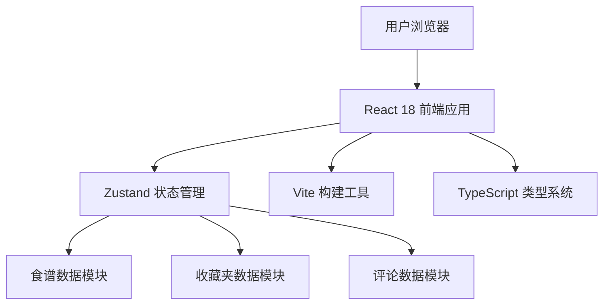

## 1. 架构设计



## 2. 技术描述

- **前端框架**：React 18 + TypeScript
- **构建工具**：Vite 5 + @vitejs/plugin-react
- **状态管理**：Zustand 4
- **唯一ID生成**：uuid 9
- **样式方案**：原生CSS + CSS Variables
- **路由方案**：React Router DOM 6
- **初始化方式**：手动创建项目结构

## 3. 目录结构

```
auto46/
├── src/
│   ├── components/
│   │   ├── RecipeCard.tsx        # 食谱卡片组件
│   │   ├── RecipeDetail.tsx      # 食谱详情组件
│   │   └── CommentItem.tsx       # 评论项组件
│   ├── store/
│   │   └── recipeStore.ts        # Zustand状态管理
│   ├── App.tsx                   # 主应用组件（含路由和布局）
│   └── main.tsx                  # 应用入口
├── index.html                    # HTML入口
├── package.json                  # 依赖配置
├── tsconfig.json                 # TypeScript配置
└── vite.config.ts                # Vite配置
```

## 4. 路由定义

| 路由 | 页面 | 组件 | 说明 |
|------|------|------|------|
| `/` | 首页 | App.tsx + RecipeCard | 瀑布流展示所有食谱 |
| `/recipe/:id` | 详情页 | RecipeDetail | 展示食谱详情、食材、步骤、评论 |

## 5. 数据模型

### 5.1 TypeScript 类型定义

```typescript
// 食谱类型
interface Recipe {
  id: string;
  title: string;
  coverImage: string;
  author: {
    id: string;
    name: string;
    avatar: string;
  };
  ingredients: Ingredient[];
  steps: CookingStep[];
  averageRating: number;
  totalRatings: number;
  favorites: number;
  createdAt: string;
}

// 食材类型
interface Ingredient {
  id: string;
  name: string;
  quantity: string;
  checked: boolean;
}

// 烹饪步骤类型
interface CookingStep {
  id: string;
  order: number;
  description: string;
  duration: number; // 秒
  tip?: string;
}

// 评论类型
interface Comment {
  id: string;
  recipeId: string;
  user: {
    id: string;
    name: string;
    avatar: string;
  };
  rating: number; // 1-5
  content: string;
  createdAt: string;
}

// 收藏夹类型
interface Collection {
  id: string;
  name: string;
  icon: string;
  recipeIds: string[];
  createdAt: string;
}

// Store 状态
interface RecipeState {
  recipes: Recipe[];
  collections: Collection[];
  comments: Comment[];
  activeCollectionId: string | null;
  isDragging: boolean;
  dragRecipeId: string | null;
  highlightCollectionId: string | null;
  // Actions
  addComment: (recipeId: string, rating: number, content: string) => void;
  updateIngredientChecked: (recipeId: string, ingredientId: string, checked: boolean) => void;
  toggleFavorite: (recipeId: string) => void;
  addCollection: (name: string, icon: string) => void;
  deleteCollection: (collectionId: string) => void;
  addRecipeToCollection: (recipeId: string, collectionId: string) => void;
  removeRecipeFromCollection: (recipeId: string, collectionId: string) => void;
  setActiveCollection: (collectionId: string | null) => void;
  setDragging: (isDragging: boolean, recipeId: string | null) => void;
  setHighlightCollection: (collectionId: string | null) => void;
  getRecipeById: (id: string) => Recipe | undefined;
  getCommentsByRecipeId: (recipeId: string) => Comment[];
}
```

### 5.2 Mock 数据

初始化数据包含8-12个示例食谱，涵盖家常菜、烘焙、汤品等类别，每个食谱包含完整的食材清单和烹饪步骤。

## 6. 核心技术实现要点

### 6.1 瀑布流布局
- 使用 CSS Grid + column-count 实现响应式瀑布流
- 卡片使用 break-inside: avoid 避免跨列断裂
- 入场动画使用 CSS animation + animation-delay 实现逐张淡入

### 6.2 拖拽收藏
- 使用原生 HTML5 Drag and Drop API
- 拖拽开始时设置 isDragging 和 dragRecipeId
- dragover 时高亮目标收藏夹
- drop 时执行飞入动画并更新状态

### 6.3 倒计时进度环
- 使用 SVG circle 的 stroke-dasharray 和 stroke-dashoffset 实现环形进度
- requestAnimationFrame 驱动倒计时更新
- 进度动画时长与步骤 duration 一致

### 6.4 星级评分
- 5个星星图标，使用 CSS hover 选择器实现悬停变色
- 点击时记录评分并填充星星
- 使用 transition 实现平滑填色动画

### 6.5 性能优化
- CSS 动画仅使用 transform 和 opacity
- 卡片使用 contain: layout paint; 提升渲染性能
- 图片使用 loading="lazy" 懒加载
- will-change: transform 优化动画性能

## 7. 依赖清单

```json
{
  "react": "^18.3.1",
  "react-dom": "^18.3.1",
  "react-router-dom": "^6.23.0",
  "uuid": "^9.0.1",
  "zustand": "^4.5.2",
  "@types/react": "^18.3.3",
  "@types/react-dom": "^18.3.0",
  "@types/uuid": "^9.0.8",
  "typescript": "^5.4.5",
  "vite": "^5.2.11",
  "@vitejs/plugin-react": "^4.3.0"
}
```
