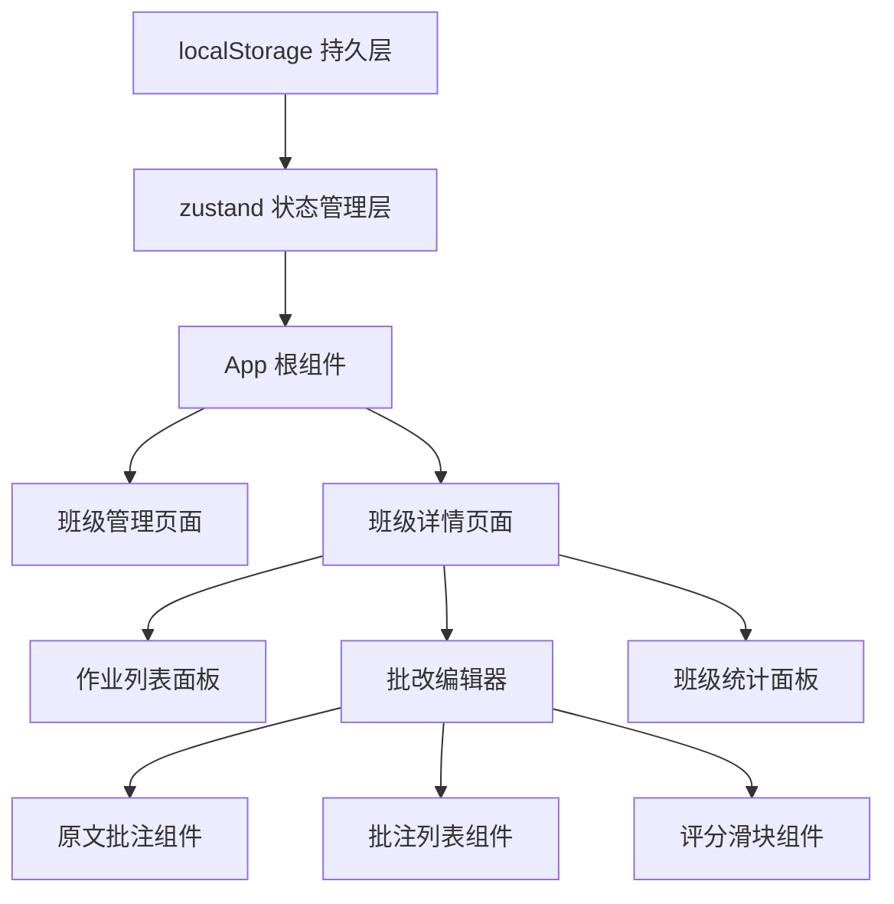
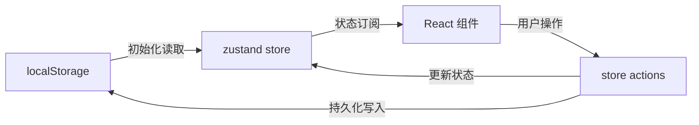

## 1. 架构设计



## 2. 技术描述

- **前端框架**：React 18 + TypeScript
- **构建工具**：Vite 5 + @vitejs/plugin-react
- **状态管理**：zustand
- **数据持久化**：localStorage
- **唯一ID生成**：uuid
- **图表绘制**：原生 HTML Canvas API
- **无后端**：纯前端应用，所有数据存储在浏览器 localStorage

## 3. 模块划分与文件结构

| 文件路径 | 职责说明 | 调用关系 |
|----------|----------|----------|
| `src/main.tsx` | 应用入口，渲染App组件 | 导入 App.tsx |
| `src/App.tsx` | 根组件，路由与全局布局 | 使用 zustand store，导入各页面组件 |
| `src/store/useStore.ts` | zustand全局状态管理 | 读写 localStorage，提供增删改接口 |
| `src/types/index.ts` | TypeScript 类型定义 | 被所有组件引用 |
| `src/components/ClassGrid.tsx` | 班级卡片网格组件 | 调用 store 的班级相关方法 |
| `src/components/ClassCard.tsx` | 单个班级卡片组件 | 被 ClassGrid 调用 |
| `src/components/CreateClassModal.tsx` | 创建班级弹窗 | 调用 store.addClass |
| `src/components/SubmissionList.tsx` | 作业列表面板 | 调用 store 读取作业列表 |
| `src/components/GradingEditor.tsx` | 批改编辑器主组件 | 调用 store.updateSubmission |
| `src/components/TextAnnotator.tsx` | 原文批注组件 | 被 GradingEditor 调用，处理选区与高亮 |
| `src/components/AnnotationList.tsx` | 批注列表组件 | 被 GradingEditor 调用 |
| `src/components/ScoreSlider.tsx` | 评分滑块组件 | 被 GradingEditor 调用 |
| `src/components/StatsPanel.tsx` | 班级统计面板 | 调用 store 读取数据，Canvas 绘图 |
| `src/components/AddSubmissionModal.tsx` | 添加作业弹窗 | 调用 store.addSubmission |
| `src/utils/storage.ts` | localStorage 工具函数 | 被 store 调用 |
| `src/utils/chart.ts` | Canvas 图表工具函数 | 被 StatsPanel 调用 |

## 4. 数据模型

### 4.1 类型定义

```typescript
interface ClassEntity {
  id: string;
  name: string;
  studentNames: string[];
  createdAt: number;
}

interface Annotation {
  id: string;
  startIndex: number;
  endIndex: number;
  text: string;
  content: string;
  createdAt: number;
}

interface Submission {
  id: string;
  classId: string;
  studentName: string;
  title: string;
  content: string;
  submittedAt: number;
  annotations: Annotation[];
  overallComment: string;
  score: number | null;
  gradedAt: number | null;
}

interface AppState {
  classes: ClassEntity[];
  submissions: Submission[];
  currentClassId: string | null;
  currentSubmissionId: string | null;
}
```

### 4.2 数据流向



## 5. 核心算法与实现要点

### 5.1 文本选区批注

- 使用 `window.getSelection()` 获取选中文本的位置
- 通过 Range API 计算字符偏移量（startIndex / endIndex）
- 渲染时将原文按批注区间切分为多个片段，高亮标注区间
- 使用 16ms 节流确保重绘性能

### 5.2 Canvas 折线图

- 原生 Canvas 2D API 绘制
- 贝塞尔曲线实现平滑折线
- `requestAnimationFrame` 实现数字递增动画
- 线性渐变填充区域（透明度 0.3）

### 5.3 历史作业切换动画

- 使用 CSS transform + transition 实现左右滑动过渡
- 双缓冲渲染：预加载历史作业内容，切换时仅触发重排

### 5.4 localStorage 持久化

- 初始化时从 localStorage 读取全部数据
- 每次状态变更后自动写入 localStorage（防抖 100ms）
- 数据以 JSON 格式序列化存储
