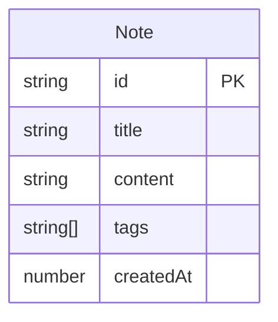

## 1. 架构设计

```mermaid
flowchart TD
    "前端-React应用" --> "状态管理-Zustand"
    "状态管理-Zustand" --> "笔记数据-内存存储"
    "前端-React应用" --> "组件层"
    "组件层" --> "App-主布局"
    "组件层" --> "NoteCard-笔记卡片"
    "组件层" --> "NoteEditor-笔记编辑器"
    "App-主布局" --> "搜索栏"
    "App-主布局" --> "标签过滤器"
    "App-主布局" --> "卡片网格"
    "App-主布局" --> "浮动新建按钮"
```

## 2. 技术说明

- **前端**：React 18 + TypeScript + Vite
- **初始化工具**：vite-init（react-ts模板）
- **样式方案**：CSS Modules + 内联样式（毛玻璃效果）
- **状态管理**：Zustand
- **Markdown渲染**：react-markdown + remark-gfm
- **唯一ID生成**：uuid
- **后端**：无（纯前端，数据存储在Zustand内存中）
- **数据库**：无

## 3. 路由定义

| 路由 | 用途 |
|------|------|
| `/` | 主页面-笔记卡片网格、搜索、过滤 |
| `/note/:id` | 笔记详情页-完整内容、编辑、删除 |

## 4. API定义

无后端API，所有数据操作通过Zustand store在内存中完成。

## 5. 数据模型

### 5.1 数据模型定义



### 5.2 数据定义

- **Note.id**: `string`，由uuid生成，主键
- **Note.title**: `string`，笔记标题
- **Note.content**: `string`，Markdown格式内容
- **Note.tags**: `string[]`，标签数组，最多5个
- **Note.createdAt**: `number`，时间戳（`Date.now()`）

## 6. 文件组织结构

```
├── package.json
├── vite.config.js
├── tsconfig.json
├── index.html
└── src/
    ├── types.ts          # Note接口定义
    ├── store.ts          # Zustand store
    ├── App.tsx           # 主布局
    ├── main.tsx          # 入口文件
    ├── components/
    │   ├── NoteCard.tsx  # 笔记卡片组件
    │   └── NoteEditor.tsx # 笔记编辑器组件
    └── index.css         # 全局样式
```
