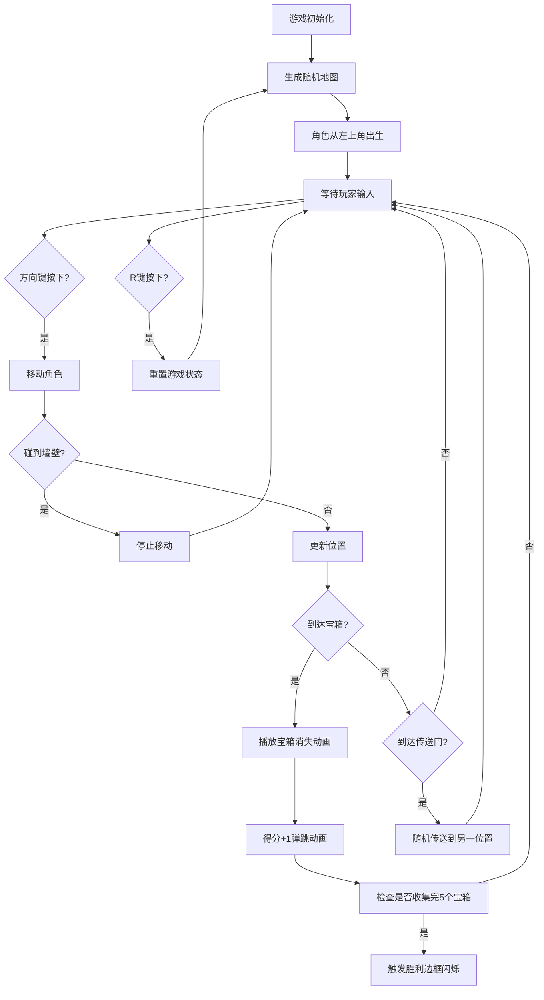

## 1. 产品概述

像素风格的2D网格探索游戏，玩家控制角色在随机生成的地图中收集宝箱，通过传送门快速移动，追求高分和完整收集体验。

- 核心玩法：键盘方向键控制角色在20x20网格地图上移动，收集宝箱增加得分
- 目标用户：休闲游戏玩家，像素风格爱好者
- 产品价值：提供轻松有趣的探索体验，考验玩家的地图记忆和策略选择

## 2. 核心功能

### 2.1 用户角色
| 角色 | 注册方式 | 核心权限 |
|------|----------|----------|
| 玩家 | 无需注册 | 完整游戏体验，包括移动、收集、重新开始 |

### 2.2 功能模块
1. **游戏主场景**：Canvas绘制20x20网格地图，包含草地、墙壁、宝箱、传送门
2. **角色控制系统**：键盘方向键控制，平滑移动，碰撞检测
3. **宝箱收集系统**：宝箱消失动画，得分弹跳动画
4. **传送门系统**：随机传送到地图另一位置
5. **HUD信息面板**：得分显示、宝箱收集进度、小地图缩略图
6. **重新开始功能**：R键重置游戏，地图波浪式渐显动画

### 2.3 页面详情
| 页面名称 | 模块名称 | 功能描述 |
|----------|----------|----------|
| 游戏主页面 | 地图渲染 | 20x20网格地图，32px每格，随机生成墙壁(20%)、宝箱(5个)、传送门(2个) |
| 游戏主页面 | 角色移动 | 方向键控制，每帧2像素平滑移动，不能穿墙 |
| 游戏主页面 | 宝箱交互 | 到达宝箱格子播放200ms缩放消失动画，得分+1弹跳动画 |
| 游戏主页面 | 传送门交互 | 到达传送门格子随机传送到另一位置 |
| 游戏主页面 | HUD面板 | 右侧信息面板，半透明毛玻璃效果，显示得分、宝箱进度、小地图 |
| 游戏主页面 | 胜利效果 | 得分达到5分时面板边框1Hz金色闪烁动画 |
| 游戏主页面 | 重新开始 | R键重置，地图从左到右从上到下波浪式渐显，每行延迟50ms |

## 3. 核心流程

## 4. 用户界面设计

### 4.1 设计风格
- 主色调：草地浅绿(#90EE90)、墙壁深灰(#4A4A4A)、宝箱金色(#FFD700)、传送门紫色(#9370DB)、角色蓝色(#4169E1)
- 像素风格，16x16像素角色精灵
- 右侧HUD面板：半透明深色毛玻璃效果(backdrop-filter: blur)
- 字体：像素风格等宽字体

### 4.2 页面设计概述
| 页面名称 | 模块名称 | UI元素 |
|----------|----------|--------|
| 游戏主页面 | 游戏区域 | 左侧640x640px Canvas地图，像素风格渲染 |
| 游戏主页面 | HUD面板 | 右侧固定宽度面板，毛玻璃背景，包含：得分数字、宝箱进度条/文字、80x80px小地图 |
| 游戏主页面 | 动画效果 | 宝箱缩放消失、得分弹跳、胜利边框脉冲闪烁、地图波浪式渐显 |

### 4.3 响应式
- 桌面端优先，固定布局，Canvas 640x640px + HUD面板 200px宽度
- 小地图4x4像素每格，总计80x80px

### 4.4 性能要求
- 60FPS稳定帧率
- 使用requestAnimationFrame驱动游戏循环
- 禁止使用setInterval
- 角色移动平滑无卡顿
