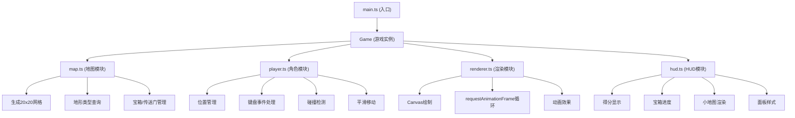

## 1. 架构设计



## 2. 技术描述

- **前端技术栈**：TypeScript + Vite
- **构建工具**：Vite 5.x
- **编程语言**：TypeScript 5.x（严格模式）
- **渲染方式**：HTML5 Canvas 2D API
- **动画驱动**：requestAnimationFrame
- **样式**：原生CSS + CSS变量

## 3. 目录结构

```
d:\P\tasks\auto52\
├── .trae\documents\
│   ├── prd.md
│   └── tech-architecture.md
├── src\
│   ├── main.ts          # 入口模块
│   ├── map.ts           # 地图模块
│   ├── player.ts        # 角色模块
│   ├── renderer.ts      # 渲染模块
│   └── hud.ts           # HUD模块
├── index.html           # 入口HTML
├── package.json         # 依赖配置
├── tsconfig.json        # TypeScript配置
└── vite.config.js       # Vite配置
```

## 4. 模块接口定义

### 4.1 map.ts 地图模块

```typescript
export type TileType = 'grass' | 'wall' | 'chest' | 'portal';

export interface Position {
  x: number;
  y: number;
}

export interface Tile {
  type: TileType;
  collected?: boolean;
}

export class GameMap {
  readonly width: number = 20;
  readonly height: number = 20;
  readonly tileSize: number = 32;
  private grid: Tile[][];
  private chestPositions: Position[];
  private portalPositions: Position[];

  generate(): void;
  getTile(x: number, y: number): Tile;
  isWall(x: number, y: number): boolean;
  collectChest(x: number, y: number): boolean;
  getRandomPortalPosition(currentX: number, currentY: number): Position;
  getRemainingChests(): number;
  getTotalChests(): number;
  reset(): void;
}
```

### 4.2 player.ts 角色模块

```typescript
export interface PlayerState {
  x: number;      // 像素位置
  y: number;      // 像素位置
  gridX: number;  // 网格位置
  gridY: number;  // 网格位置
  moving: boolean;
  direction: 'up' | 'down' | 'left' | 'right';
}

export class Player {
  readonly speed: number = 2;  // 每帧像素
  private state: PlayerState;
  private targetGridX: number;
  private targetGridY: number;

  constructor(startX: number, startY: number);
  handleKeyDown(e: KeyboardEvent): void;
  update(isWall: (x: number, y: number) => boolean): void;
  getState(): PlayerState;
  getGridPosition(): { x: number; y: number };
  setPosition(gridX: number, gridY: number): void;
  reset(): void;
}
```

### 4.3 renderer.ts 渲染模块

```typescript
export interface AnimationState {
  chestAnimations: Map<string, { startTime: number; duration: number }>;
  scorePopup: { value: number; startTime: number; gridX: number; gridY: number } | null;
  waveReveal: { startTime: number; rowDelay: number } | null;
}

export class Renderer {
  private canvas: HTMLCanvasElement;
  private ctx: CanvasRenderingContext2D;
  private gameMap: GameMap;
  private player: Player;
  private hud: HUD;
  private animationId: number | null;
  private lastTime: number;
  private animationState: AnimationState;

  constructor(canvas: HTMLCanvasElement, gameMap: GameMap, player: Player, hud: HUD);
  start(): void;
  stop(): void;
  triggerChestAnimation(gridX: number, gridY: number): void;
  triggerScorePopup(gridX: number, gridY: number): void;
  triggerWaveReveal(): void;
  private gameLoop(timestamp: number): void;
  private render(): void;
  private drawMap(): void;
  private drawPlayer(): void;
  private drawChestAnimations(): void;
  private drawScorePopup(): void;
}
```

### 4.4 hud.ts HUD模块

```typescript
export class HUD {
  private container: HTMLElement;
  private scoreElement: HTMLElement;
  private chestCountElement: HTMLElement;
  private minimapCanvas: HTMLCanvasElement;
  private minimapCtx: CanvasRenderingContext2D;
  private score: number;
  private chestsCollected: number;
  private totalChests: number;

  constructor(parentElement: HTMLElement, totalChests: number);
  updateScore(score: number): void;
  updateChestCount(collected: number, total: number): void;
  updateMinimap(gameMap: GameMap, playerGridX: number, playerGridY: number): void;
  triggerVictoryAnimation(): void;
  reset(): void;
  remove(): void;
}
```

## 5. 核心常量

```typescript
// 地图配置
const GRID_WIDTH = 20;
const GRID_HEIGHT = 20;
const TILE_SIZE = 32;
const WALL_RATIO = 0.2;
const CHEST_COUNT = 5;
const PORTAL_COUNT = 2;

// 颜色配置
const COLORS = {
  grass: '#90EE90',
  wall: '#4A4A4A',
  chest: '#FFD700',
  portal: '#9370DB',
  player: '#4169E1',
  grid: '#7CCD7C',
};

// 动画配置
const CHEST_ANIMATION_DURATION = 200;
const SCORE_POPUP_DURATION = 500;
const WAVE_ROW_DELAY = 50;
const VICTORY_BLINK_FREQ = 1000;

// 小地图配置
const MINIMAP_TILE_SIZE = 4;
```
