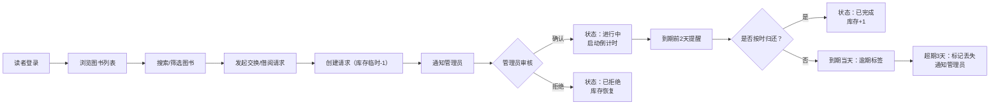

## 1. 产品概述
面向独立书店的在线图书交换与借阅管理应用，解决实体书店图书流转效率低、库存管理困难的问题。
- 主要目的：让书店管理员高效管理图书库存与交换规则，让读者便捷浏览和发起交换/借阅请求
- 目标用户：书店管理员（运营者）和书店会员/读者
- 产品价值：提升图书流通率，增强读者社群粘性，降低书店运营管理成本

## 2. 核心功能

### 2.1 用户角色
| 角色 | 注册方式 | 核心权限 |
|------|----------|----------|
| 管理员 | 密码登录 | 上架/编辑/删除图书、审核交换请求、查看全部历史记录、接收逾期通知 |
| 读者 | 输入名字进入 | 浏览图书、搜索筛选、发起交换/借阅请求、查看个人借阅历史、接收到期提醒 |

### 2.2 功能模块
1. **用户与认证模块**：管理员密码登录、读者昵称登录、当前用户信息展示、通知管理
2. **图书管理模块**：图书增删改查、库存管理、交换规则设定、借阅期限配置
3. **图书浏览模块**：图书列表展示、书名搜索、类别/状态筛选、卡片交互
4. **交换与借阅引擎**：交换请求创建、审核确认、借阅登记、倒计时跟踪、逾期处理
5. **历史记录模块**：交换/借阅全记录展示、状态流转、管理员审核操作
6. **个人中心模块**：读者个人记录分组查看、倒计时天数、逾期高亮

### 2.3 页面详情
| 页面名称 | 模块名称 | 功能描述 |
|----------|----------|----------|
| 图书浏览页 | 搜索筛选区 | 按书名关键字搜索（300ms防抖）、类别筛选、交换方式筛选、状态筛选 |
| 图书浏览页 | 图书卡片网格 | 3列响应式网格、封面占位（3:4比例）、书名作者、状态标签、操作按钮、悬停动画 |
| 图书管理页 | 上架表单 | 书名/作者/类别/ISBN/库存数量/交换方式/借阅期限输入、表单验证、提交动画 |
| 图书管理页 | 管理列表 | 已上架图书列表、编辑/删除操作、新书滑入动画 |
| 历史记录页 | 记录列表 | 图书名/发起方/接受方/状态/日期展示、管理员确认/拒绝操作、新记录淡入动画 |
| 个人中心 | 分组记录 | 按状态分组的个人记录、倒计时天数动画、逾期行背景高亮 |
| 登录面板 | 登录表单 | 管理员密码登录/读者昵称输入、登录按钮按压动画、失败抖动反馈 |
| 通知中心 | 通知列表 | 到期提醒、逾期警告、新请求通知、已读标记、自动清理 |

## 3. 核心流程

### 3.1 读者借阅流程
读者进入→浏览图书→搜索/筛选→点击"请求交换/借阅"→系统创建请求（库存临时-1）→通知管理员→管理员确认→状态变为"进行中"→启动借阅倒计时→到期前2天提醒→到期/逾期处理

### 3.2 管理员上架流程
管理员登录→进入图书管理→填写表单→表单验证→提交→新图书滑入列表→图书可被读者浏览

## 4. 用户界面设计

### 4.1 设计风格
- **主色调**：暖木色 #D2B48C（温暖、书店氛围）
- **背景色**：米白色 #FFF8DC（柔和阅读感）
- **强调色**：深棕色 #8B4513（木质沉稳感）
- **按钮风格**：圆角 8px，悬停上浮，按压反馈
- **字体**：使用衬线体 + 无衬线体组合，标题优雅、正文易读
- **布局风格**：顶部固定导航栏、卡片式布局、充足留白
- **图标风格**：线条简洁的线性图标，与暖色调统一

### 4.2 页面设计概览
| 页面名称 | 模块名称 | UI 元素 |
|----------|----------|---------|
| 图书浏览页 | 导航栏 | 暖木色背景、Logo居左、用户入口居右、深棕强调线 |
| 图书浏览页 | 筛选区 | 圆角输入框、下拉选择器、深棕按钮、标签式筛选 |
| 图书浏览页 | 图书卡片 | 12px圆角、3:4封面占位、悬停阴影加深0→8→24px、0.2s过渡 |
| 登录面板 | 弹窗 | 毛玻璃背景（backdrop-blur）、缩放淡入0.3s、表单居中 |
| 历史记录 | 列表行 | 新记录淡入顶部、状态标签颜色区分（待确认/进行中/已完成/逾期） |
| 通用组件 | 状态标签 | 圆角pill、背景色根据状态变化、逾期深红色+文字 |
| 通用组件 | 弹窗 | 毛玻璃效果、缩放淡入0.3s、关闭反向淡出 |

### 4.3 响应式
- **大屏（≥1200px）**：图书列表 3 列网格
- **中屏（768-1199px）**：图书列表 2 列网格，导航紧凑
- **小屏（<768px）**：图书列表 1 列网格，搜索筛选区折叠，汉堡菜单
- 所有卡片间距随屏幕尺寸自适应缩放，触控区域最小 44×44px

### 4.4 动画与交互
- 路由切换：内容区左平移 0.3s 进入
- 新书上架：从右侧滑入列表顶部
- 搜索结果：卡片依次 0.2s 渐入（staggered delay）
- 筛选变化：卡片弹性过渡重新排列
- 按钮按压：scale 0.95 → 1.0 反馈
- 输入错误：边框抖动 + 变红
- 倒计时数字：数字变化动画（翻牌/滚动效果）
- 通知弹出：顶部滑入，自动淡出
